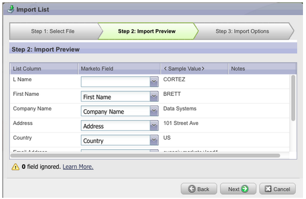
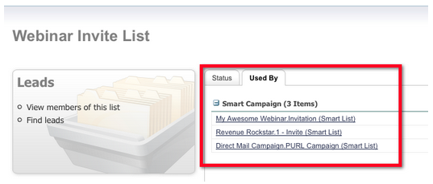

# リリースノート：2012年6月 {#release-notes-june}

## Marketo リード管理の機能強化 {#marketo-lead-management-enhancements}

### 名前変更 {#rename}

スマートリスト、静的リストおよびキャンペーンの名前を変更できます。これらのアセットをフィルター、トリガー、フローで使用している場合は、その名前も自動的に更新されます。電子メール、フォーム、フォルダーの名前は常に変更できます。

さらに、アセットの説明テキストの入力と表示が向上しました。

## フィールドマッピングのインポート {#import-field-mapping}

Marketo へのリストインポートがはるかに簡単になりました。インポート処理中に、Marketo フィールドの名前をインポートファイルの列ヘッダー名にマッピングできます。さらに、管理では、Marketo でフィールド名にマッピングされるエイリアス名を設定し、ユーザーが毎回正しいフィールドを選択するようにできます。

引き続きフィールドのインポートとマッピングを行うと、Marketo はインポート時にマッピングを記憶して表示するので、使いやすくなります。さらに、「サンプル値」ヘッダーをクリックすると、フィールドに入力される様々な値を確認できます。これは、毎回正しいフィールドをマッピングするのに役立ちます。

## スマートリストおよび静的リストの概要ページ {#summary-page-for-smart-lists-and-static-lists}

リストがどこに使われているのか、誰がリストを作成したのか、または誰が最後に変更したのだろうと思ったことはありますか？スマートリストおよび静的リストで使用できる新しい概要ページに、次の重要な詳細が表示されます。

既存のプログラムおよびキャンペーンの概要ページに、作成日／ユーザーおよび最終変更日／ユーザー情報も追加しました。

## アセットの使用者 {#used-by-for-assets}

アセットの概要ページに、「使用者」という新しいタブが追加されました。

例：静的リストの使用者

## ランディングページのグリッド線 {#landing-page-gridlines}

ランディングページのグリッド線を追加すると、ランディングページ上でテキスト、グラフィック、フォームを簡単に整列できます。任意のランディングページに対してオン／オフを切り替え、線間の幅も調整します。

## メーリングからブロックされたリード {#leads-blocked-from-mailings}

キャンペーンのスケジュールを設定するときに、リンクをクリックすると、メールからブロックされたリードのリストが表示されます。

## 待機ステップ - リードトークンとマイトークン {#wait-step-lead-token-and-my-token}

5 月のリリースでは、待機フローステップに高度なオプションが追加されました。これらの変更を使用して、営業日、日付、時刻を指定できます。このリリースでは、待機ステップでトークンを使用する機能が追加されました。例えば、`{{lead.Birthday}}` を使用して誕生日にメールを送信したり、`{{my.Event Date}}` を使用して最終的なウェビナーリマインダーを送信したりできます。

## Design Studio でサムネールとして表示 {#view-as-thumbnails-in-design-studio}

画像リストからサムネールビューに表示を切り替えます。

注意：このリリース時点では、スマートリストグリッドでの以前の並べ替えは、次に表示するスマートリストには適用されません。例えば、スマートリストを会社名で並べ替えた場合、同じフィールドで表示される次のスマートリストでは自動的に並べ替えられません。

注意：メール効果レポートのアップグレードが進行中です。

## Marketo 売上高サイクル分析の機能強化 {#marketo-revenue-cycle-analytics-enhancements}

### プログラム商談分析の新しい指標  {#new-metrics-in-program-opportunity-analysis}

商談が創出またはクローズされる前のマーケティングタッチの平均数と、マーケティングタッチの平均値に関するインサイトを取得できるようになりました。

## 複数グラフの表示 {#displaying-multi-charts}

複数グラフ機能を使用すると、1 つの売上高サイクルエクスプローラーレポートに複数のグラフを表示できます。例えば、異なる月に同じデータを表示する場合に、この機能を使用できます。また、この機能を使用すると、フィルターとレポートを個別に作成する必要がなくなります。

## ヒートグリッドグラフタイプ  {#heat-grid-chart-type}

ヒートグリッドを使用すると、データを視覚化でき、マーケティングパフォーマンスのパターンを識別できます。このビジュアライゼーションタイプでは、結果が色分けされるので、複雑なビジネス分析をわかりやすく視覚化できます。

## 散布図タイプ  {#scatter-chart-type}

散布図を使用すると、複数のディメンションのデータを 1 つのグラフで視覚化できます。このビジュアライゼーションタイプでは、使用されている属性に基づいて、グラフにバブルがプロットされます。その後、測定を使用してバブルに色分けしたり、測定を使用してバブルのサイズを指定したりできます。

