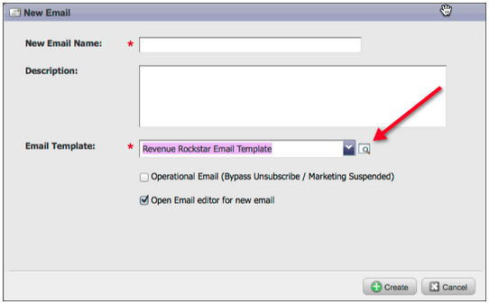

# リリースノート：2012年5月 {#release-notes-may}

>[!NOTE]
>
>**ディープダイブ**
>
>その他のリリースについては、 [リリースノート](http://docs.marketo.com/display/docs/release+notes) （詳細）を参照してください。

## 電子メールパフォーマンスレポートの再設計 {#email-performance-report-redesign}

注意：これは、5月のリリースから始まる、段階的なロールアウトとなります

電子メールのパフォーマンスレポートとキャンペーンの電子メールのパフォーマンスレポートの実行が速くなりました。 また、特定の指標の定義を改善し、「送信されたメッセージ」指標と「送信されたリード」指標を単一の指標「送信された」に統合しました。 「Messages Delived」と「Leads Delived」を「Delived」に結合しました。

## 待機手順の強化 {#wait-step-enhancements}

新しいアドバンス待機プロパティを使用すると、スマートキャンペーンフローアクションで待機ステップを設定して、特定の曜日、次の稼働日、特定の日時を「待機」できます。 これらの機能強化により、勤務時間中に受信トレイに電子メールが届くようになります。

図1. 稼働日に終了する待機ステップの指定

## アーカイブされたアセットを非表示 {#archived-assets-hidden}

アーカイブされたアセットは、自動提案、ドロップダウン、レポートから自動的にフィルタリングされ、探しているものを見つけやすくなります。

図2. アーカイブ済みの電子メールフィルターの例

## iPad用の新しいイベントチェックインアプリケーション {#new-event-check-in-app-for-ipad}

新しいiPadアプリケーションを使用して、イベントのチェックインプロセスを簡単にできます。 イベントのチェックインアプリは、Marketoプログラムと同期し、登録者をイベントに簡単にチェックでき、その場で新しいリードを追加できます。

iOS 5.1以降が必要iPadのみ。

図3. イベントチェックインホームページ

図4. イベントチェックイン：イベントを選択します。

図5. チェックイン

## ウェビナー確認URLの強化 {#enhanced-webinar-confirmation-url}

ON24とAdobe Connectで利用可能！ 新しいトークンを使用して、登録した各参加者の確認電子メールに一意のリンクを含め `{{member.webinar URL}}` ます。 Adobe Connectの機能強化には、ユーザーのログインIDとパスワードを含むAdobeアカウント情報電子メールのオン/オフを切り替える機能も含まれています。

図6. ウェビナーにユーザーを招待する

## テンプレートプレビュー {#template-preview}

電子メールやランディングページの作成中に、特定のテンプレートを探しているが、見た目が分からない場合 新しいテンプレートプレビュー機能を使用すると、新しいアセットを保存する前に、選択したテンプレートを検証できます。

図7. 選択したテンプレートのプレビュー

## 設定可能なフォームの事前入力 {#configurable-form-prefill}

購読レベルでフォームデータの事前入力を制御し、ランディングページレベルで上書きします。 事前入力を行わないと、リードが最新の情報を確実に提供できます。

図8. 管理でのフォームの事前入力の設定

図9. ランディングページ上のフォームの事前入力設定の編集

## マーケット宝箱 {#marketo-treasure-chest}

マーケティングエンジニアが開発した試験的な機能を利用して、ユーザー体験を高めます。 このリリースには、電子メールによる元に戻す機能に加え、ランディングページ上の他のユーザーとのコメントの入力や共同作業が可能です。

\

図10. 管理の財宝箱機能の管理

## Microsoft Dynamics® CRM統合 {#microsoft-dynamics-crm-integration}

新しい事前設計された統合を使用して、MarketoとMicrosoft Dynamics CRM Onlineの間でアカウント、連絡先、およびリードを同期します。

図11. Microsoft Dynamicsの構成

## Marketto Sales Insightの機能強化 {#marketo-sales-insight-enhancements}

**購読解除フッターオプション**

Sales Insight経由で送信される電子メールに対して、購読解除フッターを表示するタイミングと表示するタイミングを設定します。

図12. 管理者のSales Insight設定

## 販売用電子メールテンプレートのフォルダ {#folders-for-sales-email-templates}

Marketo Sales Insightと共有する電子メールテンプレートを指定されたフォルダに整理できるようになり、担当営業が適切な電子メールを見つけやすくなりました。

図13. 電子メール用のフォルダーを選択

## Sales InsightからOpportunity Analyzerにアクセス {#access-opportunity-analyzer-from-sales-insight}

Marketo Sales InsightのOpportunity Analyzerに直接アクセスして、マーケティングアクティビティが関与を促進しているインサイトをセールス担当者に提供します。 注意： Analyticsの売上サイクルのライセンスが必要です。

## 連絡先ステータスのカスタムフィールド {#custom-field-for-contact-status}

Salesforceのカスタムフィールドをマッピングして、[マイベストベット]、[マイチームのベストベット]、および[カスタム表示]の連絡先の[ステータス]フィールドにデータを入力できるようになりました。

図14. ユーザー設定フィールドを連絡先にマップする

匿名リードが訪問したページを参照

匿名ウェブアクティビティ表示の匿名リードが閲覧したページにドリルダウンします。

図15. 匿名Webアクティビティを参照

## リードと連絡先の登録の強化 {#enhanced-lead-and-contact-subscribe}

レコードの詳細ページの新しい「購読」ボタンを使用して、リードに従うか、いつでも連絡先に従います。

