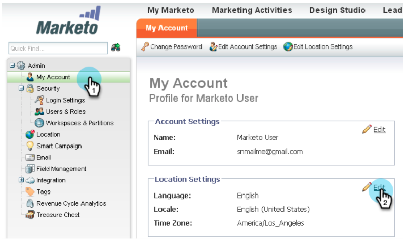

# リリースノート：2013年1月{#release-notes-january}

1月のリリースでは、**照会オファー**&#x200B;を使用したソーシャルオファーを拡張します。 さらに、マーケティング担当者のリード管理ユーザーは、タイムゾーン、言語およびロケールの環境設定を設定できます。 *の付いた機能は、Select Editionでのみ利用できます。

## 参照オファー{#referral-offers}

**照会オファー**&#x200B;は、リードに友達を照会するインセンティブを与えます。 照会を成功させるための目標と報酬を作成します。 ランディングページやWebサイト、さらにはFacebookでも使えます。

## タイムゾーンの環境設定{#time-zone-preference}

個人のマーケティング担当者アカウントのデフォルトタイムゾーンを変更できます。 例えば、購読のデフォルトが太平洋標準時であっても、独自のアカウントで東部標準時に変更できます。

## マーケティング担当者向けリード管理言語の選択{#select-your-marketo-lead-management-language}

Marketorユーザーアカウントのデフォルト言語を変更できます。 購読のデフォルトが英語である場合でも、独自に使用するためにドイツ語またはフランス語に変更できます。

## 多言語フォームのエラーメッセージ{#multi-lingual-form-error-messages}

リードがマーケティング担当者のフォームに入力すると、一部の検証メッセージが自動的に組み込まれます。 これらのエラーメッセージに対して別の表示言語を選択できます。 現在、英語、ドイツ語、フランス語をサポートしています。

フランス語形式の例を次に示します。

## Sales Insight言語（Salesforceのみ） {#select-your-sales-insight-language-salesforce-only}を選択します。

Salesforce言語設定がフランス語またはドイツ語のどちらかに設定されている場合、Marketo Sales Insightはこの設定を受け入れます。 最新のMSIパッケージをダウンロードして、この機能を入手してください（1月14日の週に公開）。

## フィールド表示名{#field-display-name}

フィールドの表示名では、様々な言語のテキストを表示できます（例：マルチバイト文字がサポートされています）。

## プログラムデータの変更{#change-program-data}

プログラムデータの変更フローステップを使用すると、キャンペーンを介して、プログラムメンバーの成功ステータスと成功日を手動で変更できます。 このフロー手順を使用して、誤りを修正したり、意図したとおりにプログラムに参加していない可能性のあるメンバを手動で変更したりできます。

