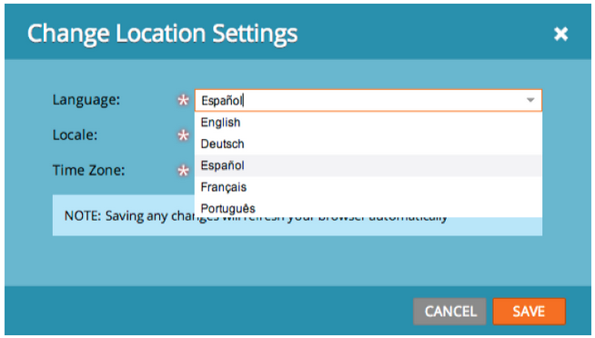

# リリースノート：2013年6月 {#release-notes-june}

6 月のリリースには、次の機能が含まれています。

## その他のユーザー言語 {#additional-user-languages}

希望の言語で Marketo リード管理インターフェイスを表示できます。スペイン語とポルトガル語がサポートされました。

## Cobalt ユーザーインターフェイス {#cobalt-user-interface}

向こう数か月のうちに、アプリケーションの様々な部分の新規テーマが公開され、例えばモーダルウィンドウに影響を与えることになります。

## サブフォルダーの複製 {#subfolder-cloning}

アセットをサブフォルダーに複製します。

## 複数のモデル {#multiple-models}

コミュニティの売上高サイクル分析（RCA）の主なアイデアです。この機能を使用すると、複数のモデルを作成して、製品ライン、事業部門、地域ごとに売上高ファネルをより詳細に把握できます。売上高ステージ別のリード、成功パスアナライザー、プログラムアナライザーおよび売上高エクスプローラーのレポートでこの機能がサポートされ、レポート用の特定のモデルを選択できるようになりました。

デフォルトでは、Select SMB Edition では 2 つのモデル、Enterprise Edition では 15 モデルを使用できます。また、追加のモデルを購入することもできます。

