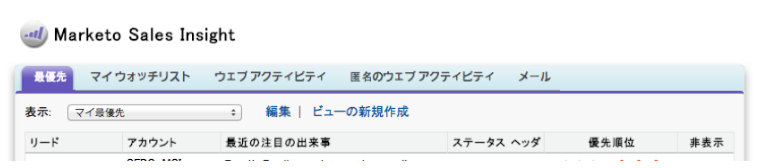

# リリースノート：2014年5月 {#release-notes-may}

2014年5月リリースには、次の機能が含まれています。お客様のご契約により、制限やオプションの契約が必要なものがあります。詳細は担当の営業にお問い合わせください。リリース後は、各機能に関するナレッジベースの詳細記事へのリンクを必ず参照してください。

## ワークスペースの削除 {#delete-workspace}

[未使用のワークスペースを削除](/help/marketo/product-docs/administration/workspaces-and-person-partitions/delete-a-workspace.md)できるようになりました。ワークスペースを削除する前に、必ずすべてのアセットを別のワークスペースに移動してください。

## 最初のキャストのスケジュール {#schedule-first-cast}

エンゲージメントプログラムでは、[最初のキャストで実行する](/help/marketo/product-docs/email-marketing/drip-nurturing/engagement-program-streams/set-stream-cadence.md)日付をスケジュールできます。例えば、2 週間ごとにサイクルを指定し、最初のキャストの日付を選択します。

## エンゲージメントプログラムの強化機能 {#enhanced-engagement-programs}

すべての人が複数のプログラムやストリーム通信制限を取得できるようになりました.

## テキストメールでのリンクトラッキング {#link-tracking-in-text-emails}

テキスト版の電子メールに[二重角括弧で囲まれた URL を追加](/help/marketo/product-docs/email-marketing/general/functions-in-the-editor/add-tracked-links-to-a-text-email.md)して、リンクをリダイレクト Marketo トラッキングリンクに変換するタイミングを示します

>[!NOTE]
>
>**例**
>
>`[[https://www.marketo.com]]`

デフォルトでは、テキスト版の電子メールではリンクはトラックされません。リンクをトラッキングリンクに変換するタイミングを示す新しい構文を追加します。HTML リンクの動作は変わりません。トラック対象のリンクをメールに追加するには：

* **HTML 版：**&#x200B;リンクを挿入するだけです。デフォルトでトラックされます。
* **テキスト版：** URL を角括弧で囲んで入力します。

トラック対象外のリンクをメールに追加するには：

* **HTML 版：**&#x200B;リンクを挿入し、「mktNoTrack」クラスをリンクに追加します。
* **テキスト版：** URL を入力します。デフォルトではトラックされません。

## サンプルメールでのリンクマークアップ {#link-markup-in-sample-emails}

メール内でのリンクの動作を事前に確認します。サンプルメールに、リードに対して表示されるリンクが正確に表示されるようになりました。トラッキングリンクに変換されたリンクをプレビューし、受信者に対する実際のメッセージ表示をより詳しく把握できます。

## キャンペーンの中止 {#abort-campaign}

パニックを起こす必要はありません。間違いが見つかった場合は、新しい「[キャンペーンの中止](/help/marketo/product-docs/core-marketo-concepts/smart-campaigns/using-smart-campaigns/abort-a-smart-campaign.md)」ボタンを使用して、キャンペーンのトラックを直ちに停止します。キャンペーンを停止したときに、各フローステップで保留中のリード数を示す通知が届きます。

## 日本語、ポルトガル語、スペイン語の Sales Insight {#sales-insight-in-japanese-portuguese-and-spanish}

日本語、ポルトガル語およびスペイン語を母語とする販売員が希望の言語で Sales Insight を表示できるように、AppExchange から最新の Sales Insight をダウンロードします。

## プログラムメンバーシップ分析のプログラムステータスと成功期間 {#program-status-and-success-timeframe-in-program-membership-analysis}

[各プログラムステータスに含まれるメンバー](/help/marketo/product-docs/reporting/revenue-cycle-analytics/program-analytics/build-a-program-membership-analysis-report-that-lists-leads.md)の数、各ステータスに変更された日時（プログラム成功に到達した日付など）を表示します。

## メール分析での A/B テストメール {#a-b-test-emails-in-email-analysis}

メール分析で、[A/B テストメールの各バリエーション](/help/marketo/product-docs/reporting/revenue-cycle-analytics/email-analysis/build-an-email-analysis-report-that-shows-program-information.md)に関するレポートを作成します。

## 分析パッケージの変更点 {#analytics-packaging-changes}

売上高サイクルモデラーと成功パスアナライザーが、MA Standard Edition に含まれるようになりました。

## モバイルプラットフォーム情報 {#mobile-platform-info}

[リードのセグメントとトリガーオフ](/help/marketo/product-docs/reporting/basic-reporting/report-activity/build-a-people-performance-report-with-mobile-platform-columns.md)：モバイル機器からのメール開封とクリック。
