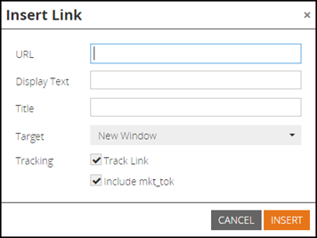

# リリースノート：2015年7月 {#release-notes-july}

## マーケティングの場面 {#marketo-moments}

昼食時に外出するが、メールのスケジュールを変更する必要があるか。 App StoreやGoogle Playから利用できるMarketo Momentsアプリを使用すると、電子メールやイベントのキャンペーンがリアルタイムでどのように動作しているか、および将来のiPhone、iPad、Androidのスマートフォンから何が起きるかを確認できます。

## リッチテキストエディタの更新 {#rich-text-editor-update}

合理化されたテキストの書式設定、画像の編集、リンクの挿入、HTMLの編集など、最新の外観と操作性を備えたテキストエディターが更新されました。 HTMLエディターに最小限の検証機能が追加され、コードの編集に制限を軽減できました。
`<iframe width="420" height="315" src="https://www.youtube.com/embed/LmmBN6IQrII" frameborder="0" allowfullscreen></iframe>` この更新は、7月のリリースから数日以内に自動的に公開されます。 その後、 **管理者/電子メール/エディター設定を編集から、新しいバージョンと従来のバージョンのエディターを切り替えることができます**。 新しいバージョンのテキストエディタで問題が発生した場合は、次の点を確認してください。 簡単な説明をに送ってくだ [`[email protected]`](http://docs.marketo.com/cdn-cgi/l/email-protection#d0bab3bfbfa0b5a2bdb1be90bdb1a2bbb5a4bffeb3bfbd)さい。

リンクと画像のダイアログが更新されました。

テキストエディタのバージョンを切り替える。

## 電子メールの配信品質シングルサインオン {#email-deliverability-single-sign-on}

電子メールの配信品質タイルをクリックすると、ログイン資格情報を入力する必要がなくなります。

## キャンペーンの優先順位 {#campaign-prioritization}

パーソナライズされたRTPキャンペーンをいくつか設定し、その一部が他のユーザーと重なり合う可能性があることに気付いたか。 先に進み、キャンペーンのRTPを他のユーザーより優先する優先度を設定します。

## 会社API {#company-api}

**REST APIを介した会社オブジェクトアクセス**:REST APIでは、Marketo会社（アカウントなど）オブジェクトへのアクセスが提供されるようになりました。 つまり、Marketing Targetで作成した会社オブジェクトを読み取り、更新および削除し、更新されたリードAPIを使用してリードをそのような会社に関連付けることができます。

詳し [くは](http://developers.marketo.com/documentation/company-api/) 、会社APIのリファレンスガイドを参照してください。

## 電子メールの配信品質にアクセス {#access-email-deliverability}

**電子メール配信品質ツールにアクセス：**この新しい権限により、管理者は電子メール配信品質ツールへのアクセス権をユーザーに付与できます。
