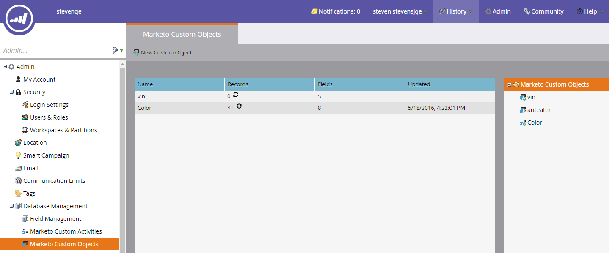

# リリースノート：春16 {#release-notes-spring}

Spring 16リリースには次の機能が含まれています。 タイトルリンクをクリックすると、各機能に関する表示の詳細記事が表示されます。

## [電子メールインサイト](http://docs.marketo.com/display/docs/email+insights) {#email-insights}

電子メールインサイトは、集計データの新しい電子メール分析エクスペリエンスです。プロジェクトオリオンの一部として、驚異的な高速パフォーマンスを実現するようにエンドツーエンドに再設計されました。 電子メールマーケティング担当者のニーズやワークフローに合わせて最適化された、完全に新しいユーザーインターフェイスデザインが特徴です。

>[!NOTE]
>
>6月3日から、顧客に対する電子メールインサイトをまとめて開始します。 我々の目標は、今後数カ月間にわたってこれを完成させることである。 有効になったら、電子メールでお知らせします。

## [電子メールテンプレート選択](/help/marketo/product-docs/email-marketing/general/email-editor-2/email-template-picker-overview.md) {#email-template-picker}

新しいスターターテンプレートを使用して美しい電子メールを作成できます。 また、ライブサムネールからテンプレートをすばやく見つけます。

>[!NOTE]
>
>電子メールエディター2.0（テンプレートピッカーを使用）は、6月3日から徐々にロールアウトされます。 6月30日までに展開を完了します。 電子メールインサイトとは異なり、アクセス権を持つと通知されません。 確認するには、 [この記事の手順に従ってください](https://docs.marketo.com/pages/viewpage.action?pageId=11373011)。

## [Eメール編集 —Re-imagined](/help/marketo/product-docs/email-marketing/general/email-editor-2/email-editor-v2-0-overview.md) {#email-editing-re-imagined}

そうだ、新しいEメール編集者だ！ 軽量のドラッグ&amp;ドロップ機能を使用して、コンテンツを追加したり並べ替えたりします。 画像、ビデオ、変数、モジュールなどの新しい要素は、必ず編集操作を強化します。 更新されたコードエディター、プレビューア、プレヘッダーのサポートも確認してください。

## [Mobileのアプリ内メッセージ](/help/marketo/product-docs/mobile-marketing/in-app-messages/understanding-in-app-messages.md) {#mobile-in-app-messages}

Marketo内でアプリ用の魅力的なアプリ内メッセージを作成できます。 アプリ内メッセージプログラムで、誰にいつ表示するかを正確に定義します。 プログラムダッシュボードを使用して、パフォーマンスを簡単に監視できます。

## [ドラフトスニペットなし](/help/marketo/product-docs/administration/users-and-roles/managing-user-roles-and-permissions/enable-no-draft-for-snippets.md) {#no-draft-snippets}

スニペットが更新されるたびにすべてを再承認する必要が生じる日はなくなりました。 ドラフトなしの場合、スニペットを使用するすべての電子メールおよびランディングページは、スニペットの更新を受け取り、以前のステータスを維持します。 スニペットを承認するたびに、「ドラフトなし」を実行してすべてを更新するか、ドラフトを作成するかを選択できます。 お前次第だ！ ドラフトなしは、すべてのお客様が利用でき、管理者の新しい権限で制御されます。

## [カスタムアクティビティ](http://docs.marketo.com/display/docs/marketo+custom+activities) {#custom-activities}

マーケティング担当者は、カスタムアクティビティ定義モデラーを使用して、カスタムアクティビティタイプを定義および管理できるようになりました。 Marketorカスタムオブジェクトモデラーと同様（および連携して）、管理者は、ビジネスニーズに合わせてデータモデルを拡張できるようになりました。 この機能の使用方法について詳しくは、マー [ケティング担当者のドキュメントサイトを参照してください](https://docs.marketo.com/display/public/DOCS/Marketo+Custom+Activities)。

## [ランディングページ、ランディングページテンプレート、フォームAPI](http://developers.marketo.com/blog/spring-2016-updates/) {#landing-page-landing-page-template-and-form-apis}

Marketo REST APIで、マーケティングランディングページ、ランディングページテンプレートおよびフォームの制御がサポートされるようになりました。 ユーザーは、Marketor REST APIを使用して、これらのアセットを直接作成、コンテンツの更新、承認および削除できるようになりました。

## [APIアクセスのIP許可リスト](/help/marketo/product-docs/administration/additional-integrations/create-an-allowlist-for-ip-based-api-access.md) {#ip-allowlisting-for-api-access}

MarketoユーザーログインのIP許可リスト機能と同様に、Marketorの管理者は、Marketo SOAPおよびREST APIにアクセスできるIPアドレスの許可リストを設定でき、許可されていないIPアドレスからのアクセスをブロックできるようになりました。 これにより、Marketoインスタンスのセキュリティが強化され、APIアクセスが組織のネットワーク内からのみ可能になります。 この設定方法の詳細については、 [マーケティングツールのドキュメントサイトを参照してください](https://docs.marketo.com/display/public/DOCS/Create+a+Whitelist+for+IP-Based+API+Access)。

## [新しい高速Microsoft Dynamics同期コネクタ](/help/marketo/product-docs/crm-sync/microsoft-dynamics-sync/microsoft-dynamics-sync-details/sync-status.md) {#new-high-speed-microsoft-dynamics-sync-connector}

Orionアーキテクチャ上に構築された新しい高速ダイナミクスコネクタは、初期同期では最大20倍、増分同期では最大5倍の速度を提供します。 新規のお客様はすべて、リリース日にこのコネクタに搭載され、夏のリリース期間中に既存のお客様に対して徐々に公開されます。

**新しいフィールドのデータを更新**:これで、新しい同期フィールドをいつでも有効にでき、そのフィールドのすべてのデータ値がDynamics CRMからMarketoに更新されます。 初回セットアップ時にすべてのフィールドを選択する必要が生じる心配はなくなりました。 既存の同期フィールドを無効にし、後で再度有効にした場合、そのフィールドのすべてのデータ値はDynamics CRMからMarketoに更新されます。

**リードを連絡先として同期**:「Microsoftへのリードを同期」フローアクションには、リードまたは連絡先として同期する新しいオプションが追加されました。

**同期エラーの「管理者」タブ**: 操作、方向、エラーコード、エラーメッセージなどの詳細との同期に失敗したリード（およびその他のオブジェクト）を参照、検索、エクスポートします。

**Microsoft Dynamics 2016**:コネクタは、Dynamics 2016オンラインおよびオンプレミスのバージョンで完全に認証されています。

**プラグインの更新に関するドキュメントが公開されました。** 詳しくは、 [プラグインのアップデートドキュメントの記事を参照してください](/help/marketo/product-docs/crm-sync/microsoft-dynamics-sync/marketo-plugin-releases-for-microsoft-dynamics.md)。

## [わかりやすいインスタンス名](/help/marketo/product-docs/administration/settings/edit-subscription-settings.md) {#friendly-instance-name}

現在、Marketoのインスタンス（サンドボックスインスタンスと実稼働インスタンスなど）を区別するのは困難です。 この機能を使用すると、現在作業中のインスタンスを確認できます。

## [購読のアクセス時間制限](/help/marketo/product-docs/administration/users-and-roles/managing-marketo-users.md) {#limited-time-access-for-subscriptions}

今日、ユーザーは無期限にマーケト購読に招待されます。 この機能を使用すると、管理者は、2週間や1か月など、限られた期間、購読にユーザーを招待できます。

## [カスタムオブジェクトグリッド](/help/marketo/product-docs/administration/marketo-custom-objects/understanding-marketo-custom-objects.md) {#custom-objects-grid}

これで、発行されたすべてのカスタムオブジェクトのレコード数とフィールド数を表示できます。

