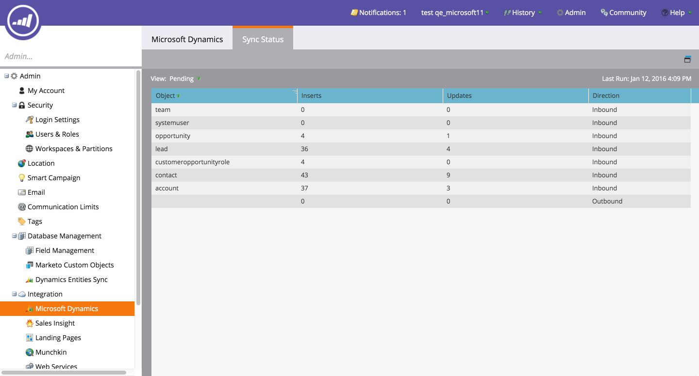

# リリースノート：冬&#39;16 {#release-notes-winter}

2016年冬のリリースには、次の機能が含まれています。 タイトルリンクをクリックすると、各機能に関する表示の詳細記事が表示されます。

## [匿名フィルター](../../product-docs/administration/additional-integrations/add-munchkin-tracking-code-to-your-website/next-generation-munchkin-tracking-faq.md) {#is-anonymous-filter}

スマートリストの匿名フィルターが削除されました。 詳しくは、[次世代マンチキントラッキングFAQ](../../product-docs/administration/additional-integrations/add-munchkin-tracking-code-to-your-website/next-generation-munchkin-tracking-faq.md)のドキュメントを参照してください。 この変更は、Webパーソナライゼーション(RTP)には影響しません。Web訪問者は匿名で既知のWeb訪問者を識別し、これらの訪問者にリアルタイムでコンテンツをパーソナライズします。

## [データベースダッシュボード](../../product-docs/core-marketo-concepts/smart-lists-and-static-lists/managing-people-in-smart-lists/database-dashboard.md)  {#database-dashboard}

リードデータベースには、合計人員データベースのサイズ、マーケティング可能なリード数、上位5つのソース別のリードの分類を含む、更新されたサマリダッシュボードが含まれています。

## [Microsoft Edge Browser](../../product-docs/administration/setup-administration/supported-browsers.md) {#microsoft-edge-browser}

Microsoft Edgeを、Marketoがサポートするブラウザー](https://docs.marketo.com/display/public/DOCS/Supported+Browsers)の[リストに追加しました。

## [Microsoft Outlook 2016](../../product-docs/marketo-sales-insight/msi-outlook-plugin/install-the-marketo-email-add-in-for-outlook-with-a-registration-code.md) {#microsoft-outlook}

[Microsoft Outlook 2016](../../product-docs/marketo-sales-insight/msi-outlook-plugin/install-the-marketo-email-add-in-for-outlook-with-a-registration-code.md) がサポートされるようになりました。

## [電子メールプログラムヘッド開始](../../product-docs/email-marketing/email-programs/email-program-actions/head-start-for-email-programs.md) {#email-program-head-start}

ヘッド開始を使用して、送信の処理を事前に行う必要があることを示します。 ヘッド開始は、リードの資格を特定し、プログラムの予定時刻に電子メールを準備する代わりに、これらのタスクが事前に行われていることを確認します。 これにより、オーディエンスは予定された時刻に電子メールを受信する開始になります。

この機能を使用するには、電子メールプログラムを12時間以上前にスケジュールする必要があり、スマートリストは送信の12時間前にロックされます。

>[!NOTE]
>
>この機能は、16年冬のリリース以降、1週間、徐々に展開される予定です。 スマートキャンペーンまたはAPIでは使用できません。

## [Mobile Marketingの機能強化](/help/marketo/product-docs/mobile-marketing/admin/add-a-mobile-app.md) {#mobile-marketing-enhancements}

**PhoneGapのサポート：モバイルアプリ** のPhoneGapのサポートをオファーしました。[詳細情報](http://developers.marketo.com/documentation/mobile/phonegap-plugin/)。

**Sandboxアプリのサポート**:

## [プログラムAPI](http://developers.marketo.com/documentation/programs/) {#program-api}

REST APIを使用して、プログラムを作成、更新およびコピーします。 プログラム内でのスマートリストとスマートキャンペーンの作成または更新は含まれません。

## [Microsoft Dynamicsの強化](../../product-docs/crm-sync/microsoft-dynamics-sync/microsoft-dynamics-sync-details/sync-status.md) {#microsoft-dynamics-enhancements}

** [同期ステータス](../../product-docs/crm-sync/microsoft-dynamics-sync/microsoft-dynamics-sync-details/sync-status.md):**同期プロセスの現在のスループットとバックログのタブを維持します。 挿入数とオブジェクト別の更新数で分割します。

** [通知](../../product-docs/core-marketo-concepts/miscellaneous/understanding-notifications/notification-types.md)**:共通の同期エラーと、そのエラーを持つリードのリストを通知します。

## [カスタムオブジェクトの拡張](../../product-docs/administration/marketo-custom-objects/create-marketo-custom-objects.md)  {#custom-objects-enhancements}

複数のリンクフィールドを持つ中間オブジェクトを使用して、リード/アカウントとカスタムオブジェクトとの間に多対多の関係を作成できるようになりました。

## [Facebookリード広告](../../product-docs/demand-generation/facebook/set-up-facebook-lead-ads.md) {#facebook-lead-ads}

[Facebookのリード](https://www.facebook.com/business/a/lead-ads) 広告は、ビジネスがFacebook上でリードジェネレーションキャンペーンを実行するためのより直接的な方法です。ユーザーは製品やサービスに対する関心を表すためにフォームに入力するので、ビジネスはそれらを追跡できます。 MarketorとFacebookのリード広告の統合は、リードがリード広告フォーム内で提供する情報を自動的に取り込みます。 その後、新しい「Facebookリード広告の入力」トリガーを使用して、フォローアップアクションと通知を自動化できます。

## [Web（リアルタイムパーソナライゼーション）キャンペーンスケジューラー](../../product-docs/web-personalization/working-with-web-campaigns/schedule-a-web-campaign.md) {#web-real-time-personalization-campaign-scheduler}

事前にキャンペーンのスケジュールを設定します。 パーソナライズされたWebコンテンツとリピートキャンペーンを特定の日時に表示するための開始と終了日を設定します。 Web訪問者の時間や選択したタイムゾーンに従ってキャンペーンを表示するように、スケジュールをパーソナライズします。

