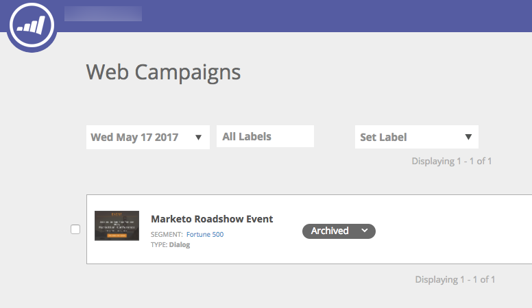

# リリースノート：春17 {#release-notes-spring}

Spring 17リリースには次の機能が含まれています。 Marketing Editionで機能が使用できるかどうかを確認します。

タイトルリンクをクリックすると、各機能に関する表示の詳細記事が表示されます。 **注意**:トピックに複数のサブ見出しが含まれる場合は、そこにリンクが配置されます。

## [LinkedInリードジェネレーションForms](https://docs.marketo.com/x/ngLG) {#linkedin-lead-gen-forms}

[LinkedInのリードジェネレーションForms](https://business.linkedin.com/marketing-solutions/native-advertising/lead-gen-ads) は、LinkedInでリードジェネレーションキャンペーンを実行するビジネスにとって、より直接的な方法です。 人々は製品やサービスに対する関心を表すフォームに記入し、その人の詳細を捕捉してマーケティング担当者と同期できます。マーケティング担当者との同期では、自動フォローアッププロセスとリードルーティングアクティビティが可能です。

LinkedInのリードジェネレーションFormsとのMarketoの統合により、リードジェネレーションフォーム内でリードが提供する情報が自動的に取得されます。 その後、新しい「 **Fill Out LinkedIn Lead Gen Form** 」トリガーとフィルターを使用して、フォローアップアクションと通知を自動化できます。

## [期限切れMSIテンプレート](https://docs.marketo.com/x/VgIt) {#expire-msi-template}

Sales Insightで古いテンプレートをクリーンアップする時代はなくなりました。 電子メールを公開する際に有効期限を設定します。有効期限が切れると、公開の取り消しが行われます。

>[!NOTE]
>
>有効期限を2017年5月31日に設定すると、17年5月31日に終了した時点で、Sales Insightからテンプレートが削除されます。

## [ユーザーとアクティビティ用の一括抽出API](https://developers.marketo.com/rest-api/bulk-extract/) {#bulk-extract-apis-for-people-and-activities}

大量の人やアクティビティデータをMarketoから外部システムに簡単に転送できます。

## ABMの強化 {#abm-enhancements}

** ABM名付きアカウントの [カスタムフィールド](https://docs.marketo.com/x/1wnG)**

Marketo ABMで、指定されたアカウントに最大10個のカスタムフィールドを作成できるようになりました。 これらのカスタムフィールドをCRMアカウントオブジェクトのフィールドにマップすると、Marketto ABMがデータを同期するので、ABM固有のアカウントを拡張して、マーケティングの促進に役立てることができます。

** ABM名前付きアカウントに対する [パーセンタイルスコアリング](http://docs.marketo.com/display/docs/assets/abmpercentiles.png)**

指定されたアカウントのスコアは大きく異なります。 Marketo ABMは、各スコアのパーセンタイルを自動的に計算するようになりました。これにより、他の名前付きアカウントの中で、名前付きアカウントがランク付けされた場所を一目で確認できます。

** [ABMアカウントリストAPI](http://developers.marketo.com/rest-api/lead-database/named-account-lists/)**

固有のアカウントリスト向けの拡張APIサポートにより、リッチで堅牢なABMパートナー統合を活用できます。

## ウェブパーソナライゼーションの強化 {#web-personalization-enhancements}

**スクロール時の [Webキャンペーン](https://docs.marketo.com/x/2grG)**

新しいWebキャンペーン効果により、Web訪問者に対して、よりパーソナライズされた体験を提供します。 パーソナライズしたWebキャンペーンーを、Web訪問者ーがWebページを下にスクロールしたときにのみ表示するように設定します。 スクロール時に表示するダイアログWebキャンペーンを設定できます。

* ページスクロールの割合
* ピクセルが達成されました
* ページの一重スクロール

**終了時の [Webキャンペーン](https://docs.marketo.com/x/2grG)**

ページを閉じる前に、訪問者の注意を引き付けます。 訪問者がページを離れることを示すマウスジェスチャを行った場合にのみ表示されるように、パーソナライズされたWebキャンペーンを設定します。

** [Webキャンペーンのアニメーション効果](https://docs.marketo.com/x/JgNI)**

ダイアログWebキャンペーンのアニメーション効果を設定して、Webページに入るときや出るときにキャンペーンがどのように表示されるかをカスタマイズします。 6つの異なる効果から選択し、ダイアログのタイミングと方向を制御できます。

** [ダイアログ閉じるボタンのカスタマイズ](https://docs.marketo.com/x/JgNI)**

ダイアログボックスの「閉じる」ボタンをカスタマイズします。 透明なダイアログスタイルのWebキャンペーンで使用する一連のオプションから選択します。 閉じるボタンのアイコン、色、位置を選択します。 独自のボタン画像を追加することもできます。

** [Archive Webキャンペーン](https://docs.marketo.com/x/_grG)**

アーカイブは、Webキャンペーンをアーカイブし、既定のWebキャンペーン表示で非表示にできる新しいWebキャンペーンステータスです。 これにより、最も関連性の高いアクティブなキャンペーンに焦点を当て、古いアーカイブされたキャンペーンを必要に応じて取り出すことができます。

** [ローカライゼーション](https://docs.marketo.com/x/YAIk)**

Webパーソナライゼーションは、マーケティング対応のすべての言語（英語、日本語、ドイツ語、スペイン語、フランス語、ポルトガル語）で提供されるようになりました。

## 予測の強化 {#predictive-enhancements}

** [ローカライゼーション](https://docs.marketo.com/x/YAIk)**

予測コンテンツは、マーケティング対応のすべての言語（英語、日本語、ドイツ語、スペイン語、フランス語、ポルトガル語）で提供されるようになりました。

## [レガシーリッチテキストエディターおよびフォームエディター1.0の廃止](https://nation.marketo.com/docs/DOC-4315) {#legacy-rich-text-editor-and-form-editor-deprecation}

2017年8月1日以降、お客様は従来のリッチテキストエディターとフォームエディター1.0を引き続き使用している場合、新しいエクスペリエンスに自動的に移行します。
