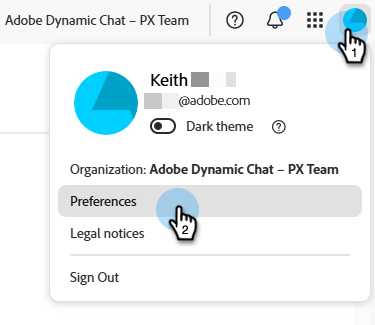
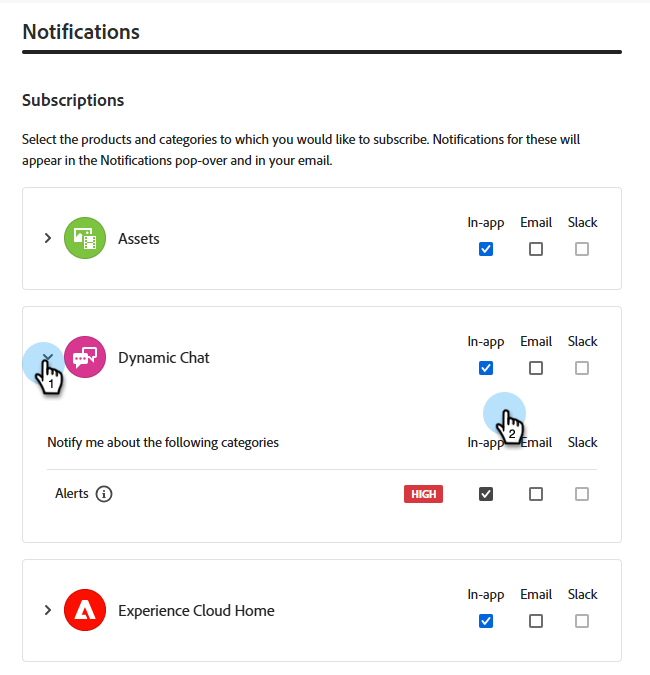

# Dynamic Chat リリースノート {#dynamic-chat-release}

Adobe Dynamic Chat リリースは、継続的な配信モデルに基づいて動作します。このモデルにより、機能のデプロイメントに対するより拡張性の高いアプローチが可能になります。 月に複数のリリースが行われる場合があるので、定期的に最新の情報を確認してください。

Marketo Engage の標準リリースノートページは[こちらを参照](/help/marketo/release-notes/current.md){target="_blank"}してください。

## 2025年6月リリース {#june-2025-release}

### ルーティングロジックの刷新 {#routing-logic-revamp}

Dynamic Chat のライブチャットルーティングロジックを刷新し、すべてのルーティングタイプ（アカウント、カスタム、チーム、ラウンドロビン）で、よりインテリジェントで予測可能なエンゲージメント動作を確保しました。 この新しいロジックにより、ルーティングフローが簡素化され、エージェントが使用できない場合のフォールバック処理が改善されます。

#### ルーティング動作の主な改善点

* **セッションあたり最多で 2 回のエンゲージメント試行**

   * システムは、最大2つのエージェント（最大）と接続しようとしますが、厳密にはプライマリルーティングルール内です。

   * エージェントが使用可能だが応答しない場合（チャットを拒否したり失敗したりなど）、システムは同じプールから別のエージェントに接続しようとします。

   * フォールバックロジック（ラウンドロビンなど）は、最初の解決中に適格なエージェントが見つからない場合にのみアクティブになり、エンゲージメントが失敗した後は再試行されません。

* **ルーティングルール固有の動作**

_&#x200B;**アカウントルーティング**&#x200B;_

訪問者のメールドメインが既知のアカウントにマッピングされている場合、マッピングされたエージェントは常に優先されます。

エージェントが対応可能な場合、チャットはそれらに直接ルーティングされます。

エージェントが使用できない場合、システムは次の処理を実行します。

* ラウンドロビンがフォールバックとして有効になっている場合でも、別のエージェントを試みない。

次のいずれかを実行します。

* マッピングされたエージェントのミーティングカレンダー（有効な場合）を表示します。または、
* デフォルトのメッセージにフォールバックします（最悪の場合）。

カードレベルのルーティングルール（チーム、カスタムなど）は、アカウントルーティングが対象外（一致するドメインやエージェントがない）の場合にのみ考慮されます。

_&#x200B;**カスタム/チームルーティング**&#x200B;_

これらのルールは、複数の適格なエージェントを返す場合があります。

最初に使用可能なエージェントがエンゲージしない場合、システムは同じリストからもう1人のエージェントを試します。

1 つのエージェントが応答しないというだけでは、ラウンドロビンのフォールバックはトリガーされません。

どちらのエージェントもエンゲージしない場合：

* システムに、最初に試行されたエージェントのカレンダー（有効な場合）が表示されます。
-or-
* デフォルトのフォールバックメッセージを表示します。

_&#x200B;**ラウンドロビンルーティング**&#x200B;_

プライマリルーティングルールとして使用する場合、システムは次の処理を実行します。

* ラウンドロビンプールから対応可能な最初のエージェントのエンゲージを試みます。

* 最初のエージェントが応答しない場合は、次に適格なエージェントで再試行されます。

ラウンドロビンがフォールバックとして使用される場合、プライマリルールからエージェントが解決されない場合にのみアクティブになります。

_&#x200B;**訪問者体験フロー**&#x200B;_

アカウントのルーティングが適用可能かどうかをシステムが確認します。

* アカウントのルーティングが適用可能でエージェントが対応可能な場合は、直ちに接続します。

* エージェントが適格でないか使用できない場合は、カードレベルのルーティングルールに進みます。

カードレベルのルーティングルール（カスタム、チーム、ラウンドロビン）が評価されます。

* 適格なエージェントの対応可能性（権限、ステータス）がチェックされます。

* システムは1人のエージェントをエンゲージし、必要に応じて、同じルールから2番目のエージェントを試行します。

* エンゲージメントが成功しない場合、フォールバックロジックが適用されます。

   * カレンダーのフォールバック（有効な場合）,
-or-
   * デフォルトのメッセージ。

ラウンドロビンのフォールバックが考慮されるのは、プライマリルーティングルールから適格なエージェントが見つからない場合のみです。個々のエージェントが応答できない場合は考慮されません。

##### ユースケース {#use-cases}

_&#x200B;**アカウントルーティング**&#x200B;_

<table><thead>
  <tr>
    <th>タイプ</th>
    <th>例</th>
    <th>結果</th>
  </tr></thead>
<tbody>
  <tr>
    <td>理想</td>
    <td>訪問者のドメインがアカウントにマッピングされます。マッピングされたエージェントはライブチャットが有効になっており、対応可能です</td>
    <td>チャットは、マッピングされたエージェントに直接接続します</td>
  </tr>
  <tr>
    <td>フォールバック（ラウンドロビン）</td>
    <td>マッピングされたエージェントを使用できません。ラウンドロビンフォールバックが有効になっています</td>
    <td>システムは、ラウンドロビンを介して1つの利用可能なエージェントを選択し、それらをエンゲージします </td>
  </tr>
  <tr>
    <td>フォールバックエージェントなし</td>
    <td>マッピングされたエージェントを使用できません。ラウンドロビンフォールバックがありません。会議予約が有効です</td>
    <td>マップされたエージェントのカレンダーが表示されるか、デフォルトのフォールバックメッセージが表示されます</td>
  </tr>
</tbody></table>

_&#x200B;**カスタムルーティング**&#x200B;_

<table><thead>
  <tr>
    <th>タイプ</th>
    <th>例</th>
    <th>結果</th>
  </tr></thead>
<tbody>
  <tr>
    <td>理想</td>
    <td>カスタムロジックは、エージェントのリストを解決します。最初のエージェントは対応可能で、チャットを受け入れます。</td>
    <td>チャットは最初のエージェントに接続します。</td>
  </tr>
  <tr>
    <td>フォールバック（ラウンドロビン）</td>
    <td>カスタムルールでは、エージェントは解決されません。 ラウンドロビンフォールバックが有効になっています。</td>
    <td>システムは、ラウンドロビンを介して1つの利用可能なエージェントを選択し、それらをエンゲージします。</td>
  </tr>
  <tr>
    <td>フォールバックエージェントなし</td>
    <td>2 つのエージェントが解決されました。どちらもチャットを受け入れず、会議カレンダーに設定されたフォールバックも受け入れません。</td>
    <td>最初に試したエージェントのカレンダーが表示されるか、デフォルトのフォールバックメッセージが表示されます。</td>
  </tr>
</tbody></table>

_&#x200B;**チームルーティング**&#x200B;_

<table><thead>
  <tr>
    <th>タイプ</th>
    <th>例</th>
    <th>結果</th>
  </tr></thead>
<tbody>
  <tr>
    <td>理想</td>
    <td>チームにライブチャットのエージェントが含まれます。最初に対応可能なエージェントがチャットを受け入れます。</td>
    <td>チャットはそのエージェントに接続します。</td>
  </tr>
  <tr>
    <td>フォールバック（ラウンドロビン）</td>
    <td>対応可能なチームエージェントがなく、ラウンドロビンフォールバックが有効になっています。</td>
    <td>システムは、ラウンドロビンプールから1人のエージェントを選択して接続します。</td>
  </tr>
  <tr>
    <td>フォールバックエージェントなし</td>
    <td>2 つのエージェントを使用できますが、どちらもエンゲージしません。カレンダーのフォールバックが有効になっています。</td>
    <td>最初に試したエージェントのカレンダーが表示されるか、フォールバックメッセージがトリガーされます。</td>
  </tr>
</tbody></table>

_&#x200B;**ラウンドロビンルーティング**&#x200B;_

<table><thead>
  <tr>
    <th>タイプ</th>
    <th>例</th>
    <th>結果</th>
  </tr></thead>
<tbody>
  <tr>
    <td>理想</td>
    <td>ラウンドロビンプールには複数のエージェントがあり、2番目のエージェントは最初のエージェントがチャットを受け入れなかった後にチャットを受け入れます。</td>
    <td>チャットは2番目のエージェントに接続されます。</td>
  </tr>
  <tr>
    <td>フォールバック（ラウンドロビン）</td>
    <td>ラウンドロビンプールに対応可能なエージェントがありません。会議カレンダーが有効になっています。</td>
    <td>リストの最初のエージェントに対してカレンダーが表示されるか（設定されている場合）、フォールバックメッセージが表示されます。</td>
  </tr>
  <tr>
    <td>フォールバックエージェントなし</td>
    <td>対応可能なエージェントがありません。フォールバックは無効になっています。</td>
    <td>静的フォールバックメッセージが訪問者に表示されます。</td>
  </tr>
</tbody></table>

### パルス通知 {#pulse-notification}

訪問者がエージェントとの接続をリクエストするたびに、アプリ内のブラウザー通知をエージェントに提供します。 しかし、エージェントは時々これらのチャットを見逃します。

このリリースでは、新しい訪問者がチャットに興味を持った際に、ライブエージェントはメール、Slack、アプリ内およびブラウザー通知を受け取ることができます。

1. Adobe Experience Cloud ホームページで「アカウント」アイコンをクリックし、「**環境設定**」を選択します。

   

1. _通知_&#x200B;までスクロールし、好きな Dynamic Chat を選択します。

   

>[!NOTE]
>
>パルス通知のコンテンツは、アプリ内およびブラウザー通知に使用するコンテンツと同じにすることができます。
