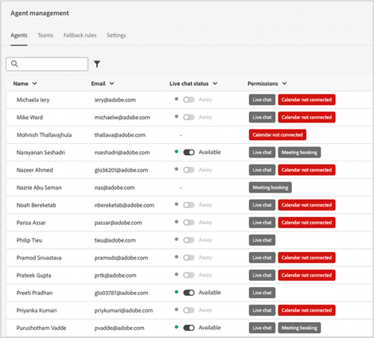

# Dynamic Chat リリースノート {#dynamic-chat-release}

Adobe Dynamic Chat リリースは、継続的な配信モデルに基づいて動作します。このモデルにより、機能のデプロイメントに対するより拡張性の高いアプローチが可能になります。月に複数のリリースが行われる場合があるので、定期的に最新の情報を確認してください。

Marketo Engage の標準リリースノートページは[こちらを参照](/help/marketo/release-notes/current.md){target="_blank"}してください。

## 2025年6月リリース {#june-2025-release}

**リリース日：2025年6月30日（PT）**

### ルーティングロジックの刷新 {#routing-logic-revamp}

Dynamic Chat のライブチャットルーティングロジックを刷新し、すべてのルーティングタイプ（アカウント、カスタム、チーム、ラウンドロビン）で、よりインテリジェントで予測可能なエンゲージメント動作を確保しました。この新しいロジックにより、ルーティングフローが簡素化され、エージェントが使用できない場合のフォールバック処理が改善されます。

#### ルーティング動作の主な改善点

* **セッションあたり最多で 2 回のエンゲージメント試行**

   * システムは、最多で 2 つのエージェントを使用して接続を試みますが、厳密にプライマリルーティングルールの範囲内です。

   * エージェントが対応可能でも応答しない場合（チャットを拒否したり切断したりするなど）、システムは同じプールから別のエージェントに接続しようと試みます。

   * フォールバックロジック（ラウンドロビンなど）は、最初の解決中に適格なエージェントが見つからない場合にのみアクティブになり、エンゲージメントが失敗した後は再試行されません。

* **ルーティングルール固有の動作**

##### —アカウントルーティング—

訪問者のメールドメインが既知のアカウントにマッピングされている場合、マッピングされたエージェントは常に優先されます。

エージェントが対応可能な場合、チャットはそれらに直接ルーティングされます。

エージェントが使用できない場合、システムは次の処理を実行します。

* ラウンドロビンがフォールバックとして有効になっている場合でも、別のエージェントを試みない。

* 代わりに、次のようになります。

   * マッピングされたエージェントの会議カレンダー（有効な場合）を表示します。
または
   * デフォルトのメッセージにフォールバックします（最悪の場合）。

カードレベルのルーティングルール（チーム、カスタムなど）は、アカウントルーティングが適格でない（一致するドメインまたはエージェントがない）場合にのみ考慮されます。

##### —カスタム／チームのルーティング—

これらのルールは、複数の適格なエージェントを返す場合があります。

対応可能な最初のエージェントがエンゲージしない場合、システムは同じリストからもう 1 つのエージェントを試します。

1 つのエージェントが応答しないというだけでは、ラウンドロビンのフォールバックはトリガーされません。

どちらのエージェントもエンゲージしない場合：

* 最初に試行されたエージェントのカレンダー（有効な場合）が表示されます。
または
* デフォルトのフォールバックメッセージを表示します。

##### —ラウンドロビンルーティング—

プライマリルーティングルールとして使用する場合、システムは次の処理を実行します。

* ラウンドロビンプールから対応可能な最初のエージェントのエンゲージを試みます。

* 最初のエージェントが応答しない場合は、次に適格なエージェントで再試行されます。

ラウンドロビンがフォールバックとして使用される場合、プライマリルールからエージェントが解決されない場合にのみアクティブになります。

##### 訪問者エクスペリエンスフロー

アカウントのルーティングが適用可能かどうかをシステムが確認します。

* アカウントのルーティングが適用可能でエージェントが対応可能な場合は、直ちに接続します。

* エージェントが適格でないか使用できない場合は、カードレベルのルーティングルールに進みます。

カードレベルのルーティングルール（カスタム、チーム、ラウンドロビン）が評価されます。

* 適格なエージェントの対応可能性（権限、ステータス）がチェックされます。

* システムは 1 つのエージェントをエンゲージし、必要に応じて、同じルールから 2 つ目のエージェントを試行します。

* エンゲージメントが成功しなかった場合は、フォールバックロジックが適用されます。

   * カレンダーのフォールバック（有効な場合）、
または
   * デフォルトのメッセージ。

ラウンドロビンのフォールバックが考慮されるのは、プライマリルーティングルールから適格なエージェントが見つからない場合のみです。個々のエージェントが応答できない場合は考慮されません。

##### ユースケース

_**アカウントルーティング**_

<table><thead>
  <tr>
    <th>タイプ</th>
    <th>例</th>
    <th>結果</th>
  </tr></thead>
<tbody>
  <tr>
    <td>理想</td>
    <td>訪問者のドメインがアカウントにマッピングされます。マッピングされたエージェントはライブチャットが有効になっており、対応可能です</td>
    <td>チャットは、マッピングされたエージェントに直接接続します</td>
  </tr>
  <tr>
    <td>フォールバック（ラウンドロビン）</td>
    <td>マッピングされたエージェントを使用できません。ラウンドロビンフォールバックが有効になっています</td>
    <td>システムは、ラウンドロビンを介して対応可能なエージェントを 1 つ選択し、それをエンゲージします </td>
  </tr>
  <tr>
    <td>フォールバックエージェントなし</td>
    <td>マッピングされたエージェントを使用できません。ラウンドロビンフォールバックがありません。会議予約が有効です</td>
    <td>システムは、マッピングされたエージェントのカレンダーまたはデフォルトのフォールバックメッセージを表示します</td>
  </tr>
</tbody></table>

_**カスタムルーティング**_

<table><thead>
  <tr>
    <th>タイプ</th>
    <th>例</th>
    <th>結果</th>
  </tr></thead>
<tbody>
  <tr>
    <td>理想</td>
    <td>カスタムロジックは、エージェントのリストを解決します。最初のエージェントは対応可能で、チャットを受け入れます。</td>
    <td>チャットは最初のエージェントに接続します。</td>
  </tr>
  <tr>
    <td>フォールバック（ラウンドロビン）</td>
    <td>カスタムルールはエージェントを解決しません。ラウンドロビンフォールバックが有効になっています。</td>
    <td>システムは、ラウンドロビンを介して対応可能なエージェントを 1 つ選択し、それをエンゲージします。</td>
  </tr>
  <tr>
    <td>フォールバックエージェントなし</td>
    <td>2 つのエージェントが解決されました。どちらもチャットを受け入れず、会議カレンダーに設定されたフォールバックも受け入れません。</td>
    <td>最初に試行されたエージェントのカレンダーが表示されるか、デフォルトのフォールバックメッセージが表示されます。</td>
  </tr>
</tbody></table>

_**チームルーティング**_

<table><thead>
  <tr>
    <th>タイプ</th>
    <th>例</th>
    <th>結果</th>
  </tr></thead>
<tbody>
  <tr>
    <td>理想</td>
    <td>チームにライブチャットのエージェントが含まれます。最初に対応可能なエージェントがチャットを受け入れます。</td>
    <td>チャットはそのエージェントに接続します。</td>
  </tr>
  <tr>
    <td>フォールバック（ラウンドロビン）</td>
    <td>対応可能なチームエージェントがなく、ラウンドロビンフォールバックが有効になっています。</td>
    <td>システムは、ラウンドロビンプールから 1 つのエージェントを選択して接続します。</td>
  </tr>
  <tr>
    <td>フォールバックエージェントなし</td>
    <td>2 つのエージェントを使用できますが、どちらもエンゲージしません。カレンダーのフォールバックが有効になっています。</td>
    <td>最初に試行されたエージェントのカレンダーが表示されるか、フォールバックメッセージがトリガーされます。</td>
  </tr>
</tbody></table>

_**ラウンドロビンルーティング**_

<table><thead>
  <tr>
    <th>タイプ</th>
    <th>例</th>
    <th>結果</th>
  </tr></thead>
<tbody>
  <tr>
    <td>理想</td>
    <td>ラウンドロビンプールには複数のエージェントがあり、最初のエージェントがチャットを受け入れないと、2 つ目のエージェントがチャットを受け入れます。</td>
    <td>チャットは 2 つ目のエージェントに接続します。</td>
  </tr>
  <tr>
    <td>フォールバック（ラウンドロビン）</td>
    <td>ラウンドロビンプールに対応可能なエージェントがありません。会議カレンダーが有効になっています。</td>
    <td>リストの最初のエージェント（設定されている場合）のカレンダーが表示されるか、フォールバックメッセージが表示されます。</td>
  </tr>
  <tr>
    <td>フォールバックエージェントなし</td>
    <td>対応可能なエージェントがありません。フォールバックは無効になっています。</td>
    <td>静的フォールバックメッセージが訪問者に表示されます。</td>
  </tr>
</tbody></table>

### パルス通知 {#pulse-notification}

訪問者がエージェントとの接続をリクエストするたびに、アプリ内およびブラウザー通知がエージェントに送信されます。しかし、エージェントは時々これらのチャットを見逃します。

このリリースでは、新しい訪問者がチャットに興味を持った際に、ライブエージェントはメール、Slack、アプリ内およびブラウザー通知を受け取ることができます。

1. Adobe Experience Cloud ホームページで「アカウント」アイコンをクリックし、「**環境設定**」を選択します。

   

1. _通知_&#x200B;までスクロールし、好きな Dynamic Chat を選択します。

   

>[!NOTE]
>
>パルス通知のコンテンツは、アプリ内およびブラウザー通知に使用するコンテンツと同じにすることができます。

## 2025年4月／5月リリース {#apr-may-25-release}

### メッセージ通知音 {#message-notification-sound}

セッションでチャットボットがトリガーされるたびに、訪問者に通知する音を選択できるようになりました。選択できるサウンドは複数あります。

### モバイルでポークメッセージを有効にする {#enable-poke-messages-on-mobile}

訪問者がクリックしなくてもチャットアイコンの横に最初の質問を表示する「ポーク」は、モバイルデバイスを使用する訪問者に対して有効になるオプションになりました。

### デフォルトのフォールバック更新 {#default-fallback-update}

ライブチャットカードとしてのカスタムルール／チームの場合：対応できるエージェントがいない場合やチャットに接続できない場合は、対応可能なエージェント（ストリームに配置されたルーティングロジック／ルールに関係なく、その時点で対応可能なすべてのエージェント）に対してラウンドロビンでフォールバックします。

### Demandbase 統合 {#demandbase-integration}

Demandbase ユーザは、Dynamic Chat でのダイアログターゲティング、条件付きブランディング、カスタムルーティングに Demandbase の顧客属性を使用できます。

## 2024年9月／10月リリース {#sep-oct-release}

### ライブチャット分析の強化 {#enhanced-live-chat-analytics}

Analytics ダッシュボードには、次のような機能強化が行われています。

* リクエストされたライブチャット数の合計：「エージェントとのチャット」をリクエストした訪問者の数

* 接続されたライブチャットの合計：接続した訪問者の数と、「エージェントとのチャット」をリクエストした訪問者の合計の数

* 受け損ねたライブチャットリクエストの合計：不在訪問者の数と、「エージェントとのチャット」をリクエストした訪問者の合計の数

* 平均チャット時間（分）：訪問者とエージェントの間の「平均チャット時間」の分析

* エージェントの平均応答時間（秒）：エージェントがライブチャット Q&amp;A に応答するのにかかった「平均時間」の分析

* 毎日のダッシュボード：正常に接続されたライブチャットリクエスト、受け損ねたライブチャットリクエスト、最近のライブチャットアクティビティの並べ替えとフィルタリング

### 対話スコアリング {#conversation-scoring}

チャットインタラクションの質に基づいてリードを定量化し、その指標を Marketo Engage スマートキャンペーンのトリガー/フィルターとして使用します。次のアクティビティで新しい属性である&#x200B;_対話スコア_&#x200B;を使用します。

* ダイアログにエンゲージ済み
* 対話型フローでエンゲージ
* エージェントとエンゲージしました

**注意事項**

* スコア値は 0、1、2、3 のいずれかになります（デフォルト値は null）

* 対話が完了またはドロップされると、スコアリング値を編集できません

* スコアの設定：

   * エージェントインボックスでは、ライブチャット中に、エージェントが対話のスコアを更新または設定できます。これは、対話アクティビティに保存されます

   * ストリームデザイナーでは、目標カードで、ユーザーが対話のスコアを更新または設定できます

### 新しいリード作成ロジック {#new-lead-creation-logic}

リードがメール `abc@test.com` を使用してフォームに入力し、cookie が xyz として設定された場合、同じフォームにメール `def@test.com` を使用して入力すると、新しい顧客レコードが作成されます。ただし、cookie xyz は新しい顧客に関連付けられ、顧客 `abc@test.com` から削除されます。

そのため、cookie abc を持つ訪問者がページにアクセスし、`abc@test.com` のようなメール ID を提供した場合は、

<table><thead>
  <tr>
    <th>訪問者</th>
    <th>cookie</th>
    <th>提供されたメール</th>
    <th>予想される動作</th>
  </tr></thead>
<tbody>
  <tr>
    <td>匿名</td>
    <td>abc</td>
    <td>データベースに存在しません</td>
    <td>新しい顧客を作成</td>
  </tr>
  <tr>
    <td>匿名</td>
    <td>abc</td>
    <td>データベースに存在します</td>
    <td>顧客を結合</td>
  </tr>
  <tr>
    <td>匿名</td>
    <td>xyz</td>
    <td>データベースに存在します</td>
    <td>顧客を結合</td>
  </tr>
  <tr>
    <td>認識済み顧客</td>
    <td>abc</td>
    <td>既存の顧客と同じ</td>
    <td>顧客を更新</td>
  </tr>
  <tr>
    <td>認識済み顧客</td>
    <td>abc</td>
    <td>既存の顧客とは異なる</td>
    <td>認識済み顧客が既に存在する場合は、cookie を転送してプロファイルを解決します。このメールを使用する新しい顧客が存在しない場合は、新しい顧客レコードを作成し、cookie を転送します</td>
  </tr>
  <tr>
    <td>認識済み顧客</td>
    <td>xyz</td>
    <td>既存の顧客と同じ</td>
    <td>同じ顧客に新しい cookie を追加</td>
  </tr>
  <tr>
    <td>認識済み顧客</td>
    <td>xyz</td>
    <td>既存の顧客とは異なる</td>
    <td>このシナリオは、それが新しい cookie であるかのように使用することはできません   デフォルトで新しい匿名プロファイルと見なされます</td>
  </tr>
</tbody></table>

### フォントを継承するオプション {#option-to-inherit-font}

Dynamic Chat でブランドフォントを管理するのではなく、チャットボットがホストされている web ページからフォントを直接継承できるようになりました。このオプションを有効にすると、チャットボットはページの `<body>` タグで定義されたフォントを取得します。

### Demandbase と Dynamic Chat の統合 {#demandbase-integration-with-dynamic-chat}

Demandbase ユーザーは、Demandbase の独自のライセンスを持ち込み、統合を有効にすることができます。ダイアログターゲティング、条件付きブランディング、カスタムルーティングには、Demandbase の顧客属性を使用します。

顧客に対するこれらの属性値の解決はリアルタイムで行われ、それぞれの顧客プロファイルに保存されます。

### 最適化された対話型フロー読み込み時間 {#optimized-conversation-flow-load-time}

対話型フローの読み込み時に、空白スペースではなくシマーローダーが表示されるようになり、ユーザーエクスペリエンスが向上しました。

**前**

**後**

## 2024年8月リリース {#august-release}

**リリース日：2024年8月23日（PT）**

### 会話メッセージのカスタム形式 {#custom-format-conversation-messages}

ストリームデザイナーは、会話のルックアンドフィールをカスタマイズするために、[HTMLの挿入](/help/marketo/product-docs/demand-generation/dynamic-chat/automated-chat/stream-designer.md#create-a-stream){target="_blank"}をサポートするようになりました。

### チャットボットを下へスクロール {#chatbot-scroll-to-bottom}

Web 訪問者が最後のメッセージに直接ジャンプするためのアイコンがチャットボットに追加されました。これにより、訪問者はテキストをスクロールして会話にすばやく戻ることができます。

### コアパルス通知 {#core-pulse-notifications}

会議の予約やライブチャットが失敗すると、ユーザーに[メール通知](/help/marketo/product-docs/demand-generation/dynamic-chat/live-chat/live-chat-overview.md#failed-action-notifications){target="_blank"}が届くようになりました。

### 複数の会話のサポート {#support-for-multiple-conversations}

チャットボットは、複数の会話をサポートするようになりました。Web サイトの訪問者は、異なるページで異なる会話を同時に行うことができ、それらの間を切り替えることができます。

### コンテンツのデフォルトの並べ替え {#default-sorting-for-content}

デフォルトでは、会話ログ、未回答の質問および質問生成テーブルは、作成日（新しい順）で並べ替えられます。

### リアルタイムのリード解決 {#real-time-lead-resolution}

匿名のリードとの対話中にメール ID が指定された場合、そのメール ID を持つ既知のリードレコードが存在するかどうかを解決し、そのレコードをリアルタイムでパーソナライゼーションに使用します。複数のレコードが見つかった場合は、リアルタイムで結合します。この動作は、ダイアログと対話型フローの両方に実装されています。

### Cookie を使用しない Marketo Engage からのリードの同期 {#syncing-leads-without-cookies}

以前は、Marketo Engage 同期が有効化された場合、Dynamic Chat は、既知のリードと Marketo Engage の 1 つ以上の cookie ID のみを同期していました。これで、すべての既知のリード（cookie ID が存在するかどうかにかかわらず）が Dynamic Chat に同期され、会話のパーソナライズに使用できます。

### 追加の訪問者データを対話型フローに渡す {#pass-additional-visitor-data}

フォームやログインなどの他のチャネルを通じて訪問者の情報を取得している場合、この情報を Dynamic Chat に直接渡すことができるようになりました。

### 更新された推測データ {#refreshed-inferred-data}

Web サイト上の会話の大部分は匿名の訪問者との間で行われます。訪問者 IP に依存する推測データを通じて、引き続きターゲティングできます。IP とそれに対応する推測データのデータベースを更新し、サポートする IP を 4 倍に拡大しました。

### 音がエージェントブラウザー通知に追加されました {#sound-added-to-agent-browser-notification}

ライブチャットがエージェントに割り当てられると、ブラウザー通知が届きます。しかし、通知を見逃すことがあります。今後の通知の見逃しを防ぐために、[通知音](/help/marketo/product-docs/demand-generation/dynamic-chat/live-chat/live-chat-overview.md#when-a-live-chat-is-routed-to-an-agent){target="_blank"}を追加しました。

### ライブチャット中にリードプロファイルを更新する機能 {#update-lead-profile-during-live-chat}

ライブチャット中に、エージェントは訪問者に関する情報を取得し、それぞれのプロファイルを更新したいと考えます。リードおよび会社オブジェクトの属性値を更新するオプションが追加されました。

## 2024年6月リリース {#june-release}

**リリース日：2024年6月6日（PT）**

### 対話型フローカード {#conversational-flow-card}

対話型フローカードを使用して、ダイアログ内のフローの複数のステップを効率化します。

例：複数のダイアログを介してウェビナーの登録を促進することを目標としている場合は、その目標を持つすべてのダイアログで同じフローを再作成する必要があります。詳細を更新する必要がある場合は、個々のダイアログを 1 つずつ編集する必要があります。対話型フローカードのおかげで、もうその必要はありません。

複数のダイアログ間でのフローの再利用に加えて、同じトランジションフローを使用して、フォームやランディングページなど、他のチャネルを経由してトリガーできます。

### 使用制限 {#usage-limits}

使用制限ページでは、パッケージ詳細や使用制限ステータスなどの重要な情報が表示されます。

## 2024年5月リリース {#may-release}

**リリース日：2024年5月15日（PT）**

### 事前承認済み回答ライブラリ {#pre-approved-response-library}

AI によって生成された質問と回答の[マーケティング承認済みライブラリの作成](/help/marketo/product-docs/demand-generation/dynamic-chat/generative-ai/response-library.md){target="_blank"}を行うと、生成 AI チャットを数分で設定できます。

### 未回答の質問 {#unanswered-questions}

以前の会話の[未回答の質問のリポジトリを使用](/help/marketo/product-docs/demand-generation/dynamic-chat/generative-ai/unanswered-questions.md){target="_blank"}して、最新の情報を使用した回答ライブラリを維持しながら、新しい事前承認済み回答を生成します。

### 会話の概要 {#conversation-summaries}

会議に先立って主要な議論のトピックに関するインサイトを含む[会話の概要を営業担当者に提供](/help/marketo/product-docs/demand-generation/dynamic-chat/live-chat/agent-inbox.md#conversation-summary){target="_blank"}して、準備時間を短縮し、営業担当者が最新情報をうまく活用できるようにします。

### 生成 AI 営業ショートカット {#genai-sales-shortcuts}

[より迅速な方法でライブチャットエージェントを提供](/help/marketo/product-docs/demand-generation/dynamic-chat/live-chat/agent-inbox.md#shortcuts){target="_blank"}して、AI によって生成された回答にアクセスしたり、既存の生成された回答を編集したり、会話中に購入者に送信する追加のコンテンツを検索したりします。

### 会話アシスタント {#conversation-assist}

マーケティングチームが事前に承認した回答を使用して、営業担当者がライブの会話中に正確に対応できるようにします。

### 会話の促し {#conversation-nudges}

行動喚起により、web 訪問者を促して、会話を最後まで進めます。

## 2024年4月リリース {#april-release}

**リリース日：2024年4月23日**

### すべてのユーザーが対話型フローを利用できるようになりました {#conversational-flows-available-to-all-users}

すべての Dynamic Chat ユーザーが対話型フォームを完全に利用&#42;できるようになりました。資格のあるリードがフォームの送信後直ちに会議を予約したり、営業とチャットしたりできるようにすることで、フォームとランディングページの会話性を高め、セールスファネルを短縮します。

_&#42;以前は、100 件の全期間エンゲージメントを含む体験版機能として使用できました。対話型フローエンゲージメントは、選択パッケージのユーザーについて、エンゲージされた会話を 250 回の月間制限までカウントするようになりました。_

### コールバック機能 {#callback-functions}

[コールバック機能](/help/marketo/product-docs/demand-generation/dynamic-chat/setup-and-configuration/callback-functions.md){target="_blank"}を使用すると、訪問者が Dynamic Chat との会話にエンゲージする際に、Adobe Analytics や Google Analytics などの外部システムで Dynamic Chat 分析イベントを収集できます。イベントをリッスンする API をコールバックに登録することで、Dynamic Chat 分析イベントを有効にします。これにより、web トラフィックなど、他の主要なデータに関連する Dynamic Chat エンゲージメントの全体像を把握できます。

### 条件付き分岐に追加されたライブエージェントの可用性条件 {#live-agent-availability-conditional-branching}

ネイティブおよびカスタムの Marketo Engage フィールドに加えて、条件付き分岐を使用して、エージェントの可用性に基づいて分岐を作成できるようになりました。これは、ライブエージェントが利用可能な場合に、訪問者にライブエージェントと対話するオプションのみを提供したいときに役立ちます。

### 条件付き分岐に追加されたスマートリスト条件 {#smart-list-condition}

条件付き分岐に新しい Marketo Engage スマートリスト条件が追加されたことで、Dynamic Chat でオーディエンスの分岐条件を定義するのではなく、Marketo Engage で既に作成した既存のオーディエンスに基づいて分岐を作成できるようになりました。

### 対話型フローの条件付き分岐 {#conditional-branching-for-conversational-flows}

今年の初めにダイアログの条件付き分岐をリリースしましたが、対話型フローでも条件付き分岐を使用できるようになりました。条件付き分岐を使用すると、様々な条件に基づいてフローに分岐を作成できます。

### 対話型フローのライブチャット {#live-chat-for-conversational-flows}

ダイアログのライブチャット機能は 2023 年にリリースされましたが、対話型フローにもライブチャットのエンゲージメントを追加できるようになりました。Marketo Engage フォームで対話型フローを使用している場合、資格のある訪問者がフォーム送信後すぐにライブエージェントとチャットできるようになりました。

### エージェントインボックスでの最近の Marketo Engage アクティビティ {#recent-marketo-engage-activities-in-agent-inbox}

最近の Marketo Engage アクティビティをエージェントインボックスの「最近のアクティビティ」セクションに追加しました。これにより、サイト訪問者がエージェントとのチャットをリクエストした場合、エージェントは訪問者が以下の Marketo Engage アクティビティ（過去 25 件のアクティビティ）のいずれかにエンゲージしたかどうかをすばやく確認できます。

* メールを開封済み
* Web ページを訪問済み
* フォームに入力済み
* 過去に注目のアクションあり

### エージェント管理のカレンダー接続ステータス {#calendar-connection-status-in-agent-management}

管理者は、会議の予約権限を持つどのエージェントが Dynamic Chat のカレンダーに接続したかを簡単に確認できるようになりました。これにより、営業チーム全体が連携し、Dynamic Chat からの会議リクエストを受け入れる準備が整います。

### エージェントカレンダー設定の最小通知設定 {#minimum-notice-setting-in-agent-calendar-configuration}

web 訪問者は 10 分程度の事前通知でカレンダー上の会議を予約しているとユーザーから報告されたため、エージェントカレンダー設定に最小通知設定を導入し、デフォルトのリードタイムを 24 時間に設定しました。

### ユーザー動作の追加と削除を更新 {#add-remove-user-behavior-updated}

一部のユーザーから、Dynamic Chat でのエージェントの追加と削除に関する問題が指摘されたため、これらの問題に対応する変更を加えました。

ライブチャットまたは会議の予約権限を持つユーザーが Admin Console に追加されると、そのユーザーは直ちにエージェント管理リストに表示され、ダイアログ、対話型フロー、ルーティングルール、チームに追加できるようになります。

会議の予約またはライブチャットの権限を持つユーザーが Admin Console から削除されると、そのユーザーは直ちに Dynamic Chat から削除され、ライブチャットや会議のルーティングに使用できなくなり、ライセンス制限にもカウントされなくなります。

### 会話レベルのレポートのパフォーマンスの向上 {#improved-conversation-level-report-performance}

個々のダイアログおよび対話型フローレベルのレポートのパフォーマンスと精度が向上しました。以前は、ダイアログレポートの読み込みに数秒かかる場合があり、データがグローバルパフォーマンスレポートと一致しない場合がありました。今では、個々のダイアログレポートが瞬時に読み込まれ、データは常にグローバルレポートデータと一致するようになりました。

### 権限の更新 {#permission-updates}

権限管理をより直感的にするために、Adobe Admin Console の権限構造と命名を刷新しました。

* 「会話管理」カテゴリの名称が「会話」になりました
* 「会議」カテゴリの名称が「アクティビティ」になりました
* 「エージェント設定」カテゴリの名称が「エージェント」になりました
* 「管理者設定」カテゴリの名称が「設定」になりました
* 「ライブチャット」カテゴリが削除され、すべてのライブチャット権限がエージェントカテゴリに移動されました

### エージェントインボックスでのハイパーリンクのサポート {#support-for-hyperlinks-in-agent-inbox}

今では、ライブチャットエージェントがチャット内の訪問者と URL を共有すると、それらの URL はハイパーリンクされるので、訪問者は URL をコピーしてブラウザーに貼り付けるのではなく、単にクリックするだけでページに移動できます。

### エージェントインボックスで更新された Enter キー動作 {#enter-key-behavior-updated-in-agent-inbox}

エージェントインボックスでリターンキーの動作を切り替えたので、Return キーまたは Enter キーを押すとメッセージが送信され、Shift + Enter キーを押すと改行が作成されます。

### ラウンドロビンページの削除 {#round-robin-page-removed}

心配無用です。ラウンドロビンルーティングはまだ完全に機能しており、常に同じように動作します。ラウンドロビンルーティングキュー内のエージェントのリストとその順序が正確でないことが多いため、ページを削除しました。

2022年に Dynamic Chat をリリースした時点では、ライブチャットのサポートはなく、会議の予約のみがサポートされていましたが、ラウンドロビンルーティングページは、会議の予約のみを念頭に置いて設計されました。昨年のライブチャットの導入に伴い、ラウンドロビンページは、会議の予約とライブチャットの権限の両方を持つエージェント間のラウンドロビンルーティングのより複雑な性質を正確に反映していなかったため、廃止されました。これに対処するためのいくつかの異なるオプションを検討しましたが、最終的に、混乱を最小限に抑えるには、完全に削除することが最適なオプションであると判断しました。

## 2024年2月リリース {#february-release}

**リリース日：2024年2月22日（PT）**

### 会話ページ {#conversations-page}

新しい会話ページは、既知のリードと匿名のリードの両方から、インスタンスで発生したすべての会話（自動およびライブ）の文字起こしを表示するワンストップショップを提供し、顧客がダイアログ、対話型フロー、ライブエージェントとどのように関わっているかをより明確に把握できるようにします。

### グローバルダッシュボードの日付範囲が 90 日から 24 か月に増加 {#date-range-in-global-dashboard}

ユーザーからの要望に応えました。すべての Analytics ダッシュボードで、最長 2 年分の Dynamic Chat エンゲージメントデータを表示できるようになりました。

### ダイアログでの条件付き分岐 {#conditional-branching-in-dialogues}

条件付き分岐により、様々な条件に基づいて、ダイアログフローに分岐を作成できます。Marketo Engage のリードと会社の属性に基づいて、同じダイアログで異なる人物に様々なコンテンツを提示できるようになりました。

## 2024年1月リリース {#january-release}

**リリース日：2024年1月24日**

### エージェント管理の同時ライブチャット制限の設定 {#Concurrent-live-chat-limit-setting}

デフォルトでは、インスタンス内の各ライブチャットエージェントは、一度に最大 5 つのライブチャットセッションに参加できます。エージェント管理に新しい設定が導入され、この制限を 1 から 10 まで調整できるようになりました。

