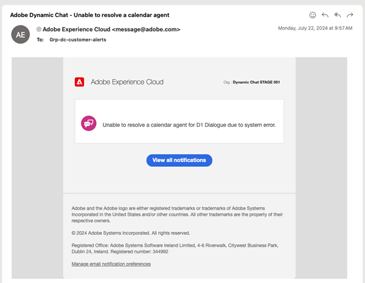

# Dynamic Chat リリースノート {#dynamic-chat-release}

Adobe Dynamic Chat リリースは、継続的な配信モデルに基づいて動作します。このモデルにより、機能のデプロイメントに対する、よりスケーラブルなアプローチが可能になります。 1 か月に複数のリリースがある場合があるので、定期的に最新の情報を確認してください。

Marketo Engageの標準リリースノートページ [ こちらを参照 ](/help/marketo/release-notes/current.md){target="_blank"} です。

## 2025年6月リリース {#june-2025-release}

**リリース日：2025年6月30日（PT）**

### ルーティングロジックの改善 {#routing-logic-revamp}

Dynamic Chatのライブチャットルーティングロジックを刷新し、すべてのルーティングタイプ（アカウント、カスタム、チーム、ラウンドロビン）でよりインテリジェントで予測可能なエンゲージメント動作を確保しました。 この新しいロジックにより、ルーティングフローが簡素化され、エージェントが使用できない場合のフォールバック処理が改善されます。

#### ルーティング動作の主な改善点

* **セッションあたり最大 2 回のエンゲージメント試行**

   * システムは、最大 2 つのエージェント（最大）を使用して接続を試みますが、厳密にはプライマリルーティングルール内です。

   * エージェントが利用可能でも応答しない場合（チャットを拒否したり切断したりするなど）、システムは同じプールから別のエージェントに接続しようとします。

   * フォールバックロジック（ラウンドロビンなど）は、最初の解決中に適格なエージェントが見つからなかった場合にのみアクティブになり、エンゲージメントが失敗した後は再試行されません。

* **ルーティングルール固有の動作**

#####  – アカウントのルーティング – 

訪問者のメールドメインが既知のアカウントにマッピングされている場合、マッピングされたエージェントは常に優先されます。

エージェントが利用可能な場合、チャットは直接それらにルーティングされます。

エージェントが使用できない場合、システムは次の処理を実行します。

* ラウンドロビンがフォールバックとして有効になっている場合でも、別のエージェントを試みない。

* 代わりに、次のようになります。

   * マップされたエージェントの会議カレンダー（有効な場合）を表示します。
 – または – 
   * デフォルトのメッセージにフォールバックします（最悪の場合）。

カードレベルのルーティングルール（チーム、カスタムなど）は、アカウントルーティングが適格でない（一致するドメインまたはエージェントがない）場合にのみ考慮されます。

#####  – カスタム/チームのルーティング – 

これらのルールは、複数の適格なエージェントを返す場合があります。

使用可能な最初のエージェントがエンゲージしない場合、システムは同じリストから 1 つ以上のエージェントを試します。

1 つのエージェントが応答しないというだけでは、ラウンドロビンのフォールバックがトリガーされない。

どちらのエージェントも関与しない場合：

* 最初に試行されたエージェントのカレンダー（有効な場合）が表示されます。
 – または – 
* デフォルトのフォールバックメッセージを表示します。

#####  – ラウンド ロビン ルーティング – 

プライマリルーティングルールとして使用する場合、システムは次の処理を実行します。

* ラウンドロビンプールから使用可能な最初のエージェントのエンゲージを試みます。

* 最初のエージェントが応答しない場合は、次に適格なエージェントで再試行されます。

ラウンドロビンがフォールバックとして使用される場合、プライマリルールからエージェントが解決されない場合にのみアクティブになります。

##### 訪問者エクスペリエンスフロー

アカウントのルーティングが適用可能かどうかをシステムが確認します。

* yes でエージェントが使用可能な場合は、直ちに接続します。

* エージェントが適格でないか使用不可の場合は、カードレベルのルーティングルールに進みます。

カードレベルのルーティングルール（カスタム、チーム、ラウンドロビン）が評価されます。

* 適格なエージェントの可用性（権限、ステータス）がチェックされます。

* システムは 1 つのエージェントを実行し、必要に応じて、同じルールから 2 つ目のエージェントを実行します。

* エンゲージメントが成功しなかった場合は、フォールバックロジックが適用されます。

   * カレンダーのフォールバック（有効な場合）、
 – または – 
   * デフォルトのメッセージ。

ラウンドロビンのフォールバックが考慮されるのは、プライマリルーティングルールから適格なエージェントが見つからない場合のみです。個々のエージェントが応答できない場合は考慮されません。

##### ユースケース

_**アカウントのルーティング**_

<table><thead>
  <tr>
    <th>タイプ</th>
    <th>例</th>
    <th>結果</th>
  </tr></thead>
<tbody>
  <tr>
    <td>理想</td>
    <td>訪問者のドメインがアカウントにマッピングされます。マッピングされたエージェントはライブチャットが有効になっており、使用可能です</td>
    <td>チャットは、マッピングされたエージェントに直接接続します</td>
  </tr>
  <tr>
    <td>フォールバック（ラウンドロビン）</td>
    <td>マッピングされたエージェントを使用できません。ラウンドロビン フォールバックが有効になっています</td>
    <td>システムはラウンドロビンを使用して使用可能なエージェントを 1 つ選択し、それらをエンゲージします </td>
  </tr>
  <tr>
    <td>フォールバックエージェントなし</td>
    <td>マッピングされたエージェントが使用できません。ラウンドロビン フォールバックがありません。会議予約が有効です</td>
    <td>マッピングされたエージェントのカレンダーまたはデフォルトのフォールバックメッセージが表示されます</td>
  </tr>
</tbody></table>

_**カスタムルーティング**_

<table><thead>
  <tr>
    <th>タイプ</th>
    <th>例</th>
    <th>結果</th>
  </tr></thead>
<tbody>
  <tr>
    <td>理想</td>
    <td>カスタムロジックは、エージェントのリストを解決します。最初のエージェントは使用可能で、チャットを受け入れます。</td>
    <td>チャットは最初のエージェントに接続します。</td>
  </tr>
  <tr>
    <td>フォールバック（ラウンドロビン）</td>
    <td>カスタムルールはエージェントを解決しません。ラウンドロビンのフォールバックが有効になっています。</td>
    <td>システムは、ラウンドロビンを介して使用可能なエージェントを 1 つ選択し、それらを取り込みます。</td>
  </tr>
  <tr>
    <td>フォールバックエージェントなし</td>
    <td>2 つのエージェントが解決されました。どちらもチャットを受け入れず、会議カレンダーに設定されたフォールバックも受け入れません。</td>
    <td>最初に試行されたエージェントのカレンダーが表示されるか、デフォルトのフォールバックメッセージが表示されます。</td>
  </tr>
</tbody></table>

_**チームルーティング**_

<table><thead>
  <tr>
    <th>タイプ</th>
    <th>例</th>
    <th>結果</th>
  </tr></thead>
<tbody>
  <tr>
    <td>理想</td>
    <td>チームにライブチャットのエージェントが含まれます。最初に使用可能なエージェントがチャットを受け入れます。</td>
    <td>チャットはそのエージェントに接続します。</td>
  </tr>
  <tr>
    <td>フォールバック（ラウンドロビン）</td>
    <td>使用できるチームエージェントがなく、ラウンドロビンのフォールバックが有効になっています。</td>
    <td>システムはラウンドロビンプールから 1 つのエージェントを選択して接続します。</td>
  </tr>
  <tr>
    <td>フォールバックエージェントなし</td>
    <td>2 つのエージェントを使用できますが、どちらも関与しません。カレンダーのフォールバックが有効です。</td>
    <td>最初に試行されたエージェントのカレンダーが表示されるか、フォールバックメッセージがトリガーされます。</td>
  </tr>
</tbody></table>

_**ラウンドロビンルーティング**_

<table><thead>
  <tr>
    <th>タイプ</th>
    <th>例</th>
    <th>結果</th>
  </tr></thead>
<tbody>
  <tr>
    <td>理想</td>
    <td>ラウンドロビンプールには複数のエージェントがあり、2 番目のエージェントは最初のエージェントがチャットを受け入れません。</td>
    <td>チャットは 2 番目のエージェントに接続します。</td>
  </tr>
  <tr>
    <td>フォールバック（ラウンドロビン）</td>
    <td>ラウンド ロビン プールに使用可能なエージェントがありません。会議カレンダーが有効になっています。</td>
    <td>リストの最初のエージェント（設定されている場合）またはフォールバックメッセージにカレンダーが表示されます。</td>
  </tr>
  <tr>
    <td>フォールバックエージェントなし</td>
    <td>使用可能なエージェントがありません。フォールバックは無効です。</td>
    <td>静的フォールバックメッセージが訪問者に表示されます。</td>
  </tr>
</tbody></table>

### パルス通知 {#pulse-notification}

訪問者がエージェントとの接続をリクエストするたびに、アプリ内のブラウザー通知がエージェントに提供されます。 しかし、エージェントは時々これらのチャットを見逃します。

このリリースでは、新しい訪問者がチャットに興味を持った際に、ライブエージェントはメール、Slack、アプリ内およびブラウザー通知を受け取ることができます。

1. Adobe Experience Cloud ホームページで「アカウント」アイコンをクリックし、「**環境設定**」を選択します。

   

1. _通知_ までスクロールし、必要なDynamic Chatを選択します。

   

>[!NOTE]
>
>Pulse 通知のコンテンツは、アプリ内のブラウザー通知に使用するコンテンツと同じにすることができます。

## 2025 年 4 月/5 月リリース {#apr-may-25-release}

### メッセージ通知サウンド {#message-notification-sound}

セッションでチャットボットがトリガーされるたびに訪問者に対してサウンドを有効にするオプションが追加されました。 選択できるサウンドは複数あります。

### モバイルでのポーク メッセージの有効化 {#enable-poke-messages-on-mobile}

訪問者がクリックしなくてもチャットアイコンの横に最初の質問を表示する「Poke」は、モバイルデバイスを使用する訪問者に対して有効になるオプションになりました。

### デフォルトのフォールバック更新 {#default-fallback-update}

ライブチャットカードとしてのカスタムルールやチームの場合、エージェントが使用できない（またはチャットが接続できない）場合は、使用可能なエージェントのラウンドロビン（ストリームに配置されたルーティングロジックやルールに関係なく、その時点で使用可能なすべてのエージェント）にフォールバックします。

### Demandbase の統合 {#demandbase-integration}

Demandbase ユーザは、Dynamic Chat でのダイアログターゲティング、条件付きブランディング、カスタムルーティングに Demandbase のユーザ属性を使用できます。

## 2024 年 9 月/10 月リリース {#sep-oct-release}

### ライブチャット分析の強化 {#enhanced-live-chat-analytics}

Analytics ダッシュボードには、次のような機能強化が行われています。

* リクエストされたライブチャット数の合計：「エージェントとのチャット」に対してリクエストされた訪問者の数

* 接続されたライブチャットの合計：接続した訪問者の数と、「エージェントとのチャット」でリクエストした合計

* 不在ライブチャットリクエストの合計：「エージェントとのチャット」でリクエストした合計訪問者数と無人訪問者数の比較

* 平均チャット長（分）：訪問者とエージェントの間の「平均チャット長」を分析します

* エージェントの平均応答時間（秒）：エージェントがライブチャット Q&amp;A に応答するまでにかかった平均時間を分析します

* 毎日のダッシュボード：正常に接続されたライブチャットリクエスト、不在のライブチャットリクエスト、最近のライブチャットアクティビティの並べ替えとフィルタリング

### 会話のスコアリング {#conversation-scoring}

チャットインタラクションの質に基づいてリードを定量化し、その指標をMarketo Engage スマートキャンペーンのトリガー/フィルターとして使用します。 次のアクティビティで新しい属性 _会話スコア_ を使用します。

* ダイアログにエンゲージ済み
* 会話フローに関与
* 代理人と関わり合う

**注意事項：**

* スコア値は 0、1、2、3 のいずれかになります（デフォルト値は null）

* 会話が完了またはドロップされると、スコアリング値を編集できません

* スコアの設定：

   * エージェントインボックスでは、ライブチャット中、エージェントは会話のスコアを更新または設定できます。これは、会話アクティビティに保存されます

   * ストリームデザイナーの – 目標カードでは、ユーザーは会話のスコアを更新または設定することができます

### 新しいリード作成ロジック {#new-lead-creation-logic}

リードがメール `abc@test.com` を使用してフォームに入力し、xyz として cookie 設定された後で、同じフォームにメール `def@test.com` を使用して入力した場合、新しい人物レコードが作成されますが、cookie xyz は新しい人物に関連付けられ、人物 `abc@test.com` から削除されます。

そのため、cookie abc を持つ訪問者がページにアクセスし、`abc@test.com` のようにメール ID を指定した場合は、

<table><thead>
  <tr>
    <th>Visitor</th>
    <th>cookie</th>
    <th>電子メールが提供されました</th>
    <th>予期される動作</th>
  </tr></thead>
<tbody>
  <tr>
    <td>匿名</td>
    <td>abc</td>
    <td>データベースに存在しない</td>
    <td>新しいユーザーを作成</td>
  </tr>
  <tr>
    <td>匿名</td>
    <td>abc</td>
    <td>データベースに存在</td>
    <td>人物を結合</td>
  </tr>
  <tr>
    <td>匿名</td>
    <td>xyz</td>
    <td>データベースに存在</td>
    <td>人物を結合</td>
  </tr>
  <tr>
    <td>知られている人物</td>
    <td>abc</td>
    <td>既存担当者と同じ</td>
    <td>人物を更新</td>
  </tr>
  <tr>
    <td>知られている人物</td>
    <td>abc</td>
    <td>既存のユーザーとは異なる</td>
    <td>既に既知のユーザーが存在する場合は、cookie を転送してプロファイルを解決します。 このメールを使用するユーザーが存在しない場合は、新しいユーザーレコードを作成し、Cookie を転送します</td>
  </tr>
  <tr>
    <td>知られている人物</td>
    <td>xyz</td>
    <td>既存担当者と同じ</td>
    <td>同じユーザーに対する新しい Cookie の追加</td>
  </tr>
  <tr>
    <td>知られている人物</td>
    <td>xyz</td>
    <td>既存のユーザーとは異なる</td>
    <td>このシナリオは、が新しい cookie であるかのように使用することはできません   新しい匿名プロファイルと見なされるデフォルト</td>
  </tr>
</tbody></table>

### フォントを継承するオプション {#option-to-inherit-font}

Dynamic Chatでブランドフォントを管理するのではなく、チャットボットがホストされている web ページからフォントを直接継承できるようになりました。 このオプションを有効にすると、チャットボットはページのタグで定義され `<body>` フォントを取得します。

### Demandbase とDynamic Chatの統合 {#demandbase-integration-with-dynamic-chat}

Demandbase ユーザーは、Demandbase の独自のライセンスを持ち込み、統合を有効にすることができます。 ダイアログターゲティング、条件付きブランディング、カスタムルーティングには、Demandbase の人物属性を使用します。

ユーザーに対するこれらの属性値の解決はリアルタイムで行われ、それぞれのユーザープロファイルに保存されます。

### 最適化された会話フロー読み込み時間 {#optimized-conversation-flow-load-time}

対話型フローの読み込み時に、空白スペースではなくシマーローダーが表示されるようになり、ユーザーエクスペリエンスが向上しました。

**前**

**後**

## 2024年8月リリース {#august-release}

**リリース日：2024年8月23日（PT）**

### 会話メッセージのカスタム形式 {#custom-format-conversation-messages}

ストリームデザイナーは、会話のルックアンドフィールをカスタマイズするために、[HTMLの挿入 ](/help/marketo/product-docs/demand-generation/dynamic-chat/automated-chat/stream-designer.md#create-a-stream){target="_blank"} をサポートするようになりました。

### チャットボットを下へスクロール {#chatbot-scroll-to-bottom}

Web 訪問者が最後のメッセージに直接ジャンプするためのアイコンがチャットボットに追加されました。 これにより、訪問者はテキストをスクロールして会話にすばやく戻ることができます。

### コアパルス通知 {#core-pulse-notifications}

ミーティングの予約やライブチャットが失敗した場合に、ユーザーに [ メール通知 ](/help/marketo/product-docs/demand-generation/dynamic-chat/live-chat/live-chat-overview.md#failed-action-notifications){target="_blank"} が届くようになりました。

### 複数の会話のサポート {#support-for-multiple-conversations}

チャットボットは、複数の会話をサポートするようになりました。 Web サイトの訪問者は、異なるページで異なる会話を同時に行うことができ、それらの間を切り替えることができます。

### コンテンツのデフォルトの並べ替え {#default-sorting-for-content}

デフォルトでは、会話ログ、未回答の質問および質問生成テーブルは、作成日（新しい順）で並べ替えられます。

### リアルタイムのリード解決 {#real-time-lead-resolution}

匿名のリードとの対話中にメール ID が指定された場合、そのメール ID を持つ既知のリードレコードが存在するかどうかを解決し、そのレコードをリアルタイムでパーソナライゼーションに使用します。複数のレコードが見つかった場合は、リアルタイムで結合します。この動作は、ダイアログと対話型フローの両方に実装されています。

### Cookie を使用しないMarketo Engageからのリードの同期 {#syncing-leads-without-cookies}

以前は、Marketo Engage同期が有効な場合、Dynamic Chatは、既知のリードとMarketo Engageの 1 つ以上の cookie ID のみを同期していました。 これで、すべての既知のリード（Cookie ID が存在するかどうかにかかわらず）がDynamic Chatに同期され、会話のパーソナライズに使用できます。

### 追加の訪問者データを会話フローに渡す {#pass-additional-visitor-data}

フォームやログインなどの他のチャネルを通じて訪問者の情報を取得している場合、この情報をDynamic Chatに直接渡すことができるようになりました。

### 推測されるデータを更新 {#refreshed-inferred-data}

Web サイト上の会話の大部分は匿名の訪問者との会話です。 引き続き、訪問者 IP に依存する推測データを通じてターゲット設定することもできます。 IP のデータベースと各推論データを更新し、4 倍の IP をサポートするようになりました。

### サウンドがエージェントブラウザー通知に追加されました {#sound-added-to-agent-browser-notification}

ライブチャットがエージェントに割り当てられると、ブラウザー通知が届きます。 しかし、時々彼らはそれらを見ません。 今後の通知の見逃しを防ぐために、[ 通知サウンド ](/help/marketo/product-docs/demand-generation/dynamic-chat/live-chat/live-chat-overview.md#when-a-live-chat-is-routed-to-an-agent){target="_blank"} を追加しました。

### ライブチャット中にリードプロファイルを更新する機能 {#update-lead-profile-during-live-chat}

ライブチャット中、エージェントは訪問者に関する情報を取り込み、それぞれのプロファイルを更新したいと考えます。 リードおよび会社オブジェクトの属性値を更新するオプションが追加されました。

## 2024年6月リリース {#june-release}

**リリース日：2024年6月6日（PT）**

### 対話型フローカード {#conversational-flow-card}

会話フローカードを活用して、ダイアログ内のフローの複数の手順を合理化します。

例：複数のダイアログを使用してウェビナーの登録を促進することを目標としている場合は、その目標を持つすべてのダイアログで同じフローを再作成する必要があります。 詳細を更新する必要がある場合は、個々のダイアログを 1 つずつ編集する必要があります。 会話フローカードのおかげで、それはもはや当てはまりません。

複数のダイアログ間でのフローの再利用に加えて、同じトランジションフローを使用して、フォームやランディングページなど、他のチャネルを経由したトリガーにも適用できます。

### 使用制限 {#usage-limits}

使用制限ページには、パッケージの詳細や使用制限ステータスなどの重要な情報が表示されます。

## 2024年5月リリース {#may-release}

**リリース日：2024年5月15日（PT）**

### 事前承認応答ライブラリ {#pre-approved-response-library}

AI で生成された質問と回答の [ マーケティング承認済みライブラリの作成 ](/help/marketo/product-docs/demand-generation/dynamic-chat/generative-ai/response-library.md){target="_blank"} を行うと、ジェネレーティブ AI チャットを数分で設定できます。

### 未回答の質問 {#unanswered-questions}

以前の会話の [ 未回答の質問のリポジトリを使用 ](/help/marketo/product-docs/demand-generation/dynamic-chat/generative-ai/unanswered-questions.md){target="_blank"} して、最新の情報を使用した応答ライブラリを維持しながら、新しい事前承認済み応答を生成します。

### 会話の概要 {#conversation-summaries}

[ 営業担当者に ](/help/marketo/product-docs/demand-generation/dynamic-chat/live-chat/agent-inbox.md#conversation-summary){target="_blank"} 会議に先立って主要なディスカッションのトピックに関するインサイトを含む会話をまとめ、準備時間を短縮し、最新の情報を使用してより優れた営業担当者を提供します。

### GenAI のセールスショートカット {#genai-sales-shortcuts}

[ より迅速な方法でライブチャットエージェントを提供 ](/help/marketo/product-docs/demand-generation/dynamic-chat/live-chat/agent-inbox.md#shortcuts){target="_blank"} して、AI が生成した応答にアクセスしたり、既存の生成された応答を編集したり、会話中に購入者に送信する追加のコンテンツを検索したりします。

### 会話アシスタント {#conversation-assist}

マーケティングチームが事前に承認した回答を使用して、セールスエージェントがライブの会話中に正確に対応できるようにします。

### 会話の微調整 {#conversation-nudges}

call-to-actionを使用して web 訪問者を微調整し、会話を最後まで進めます。

## 2024年4月リリース {#april-release}

**リリース日：2024年4月23日**

### すべてのユーザーが対話型フローを利用できるようになりました {#conversational-flows-available-to-all-users}

すべてのDynamic Chat ユーザーが Conversational Formsを完全に利用できるようになります。フォームとランディングページの会話性を高め、セールスファネルを短縮します。資格のあるリードがフォームの送信後直ちにミーティングを予約したり &#42; 営業とチャットしたりできるようにします。

_&#42;以前は、100 件のライフタイムエンゲージメントを含む体験版機能として利用できました。 会話フローエンゲージメントは、Select パッケージのユーザーに対して、エンゲージメントされた会話 250 回の月間制限にカウントされるようになりました。_

### コールバック関数 {#callback-functions}

[ コールバック関数 ](/help/marketo/product-docs/demand-generation/dynamic-chat/setup-and-configuration/callback-functions.md){target="_blank"} を使用すると、訪問者がDynamic Chatとの会話に関与する際に、Adobe AnalyticsやGoogle Analyticsなどの外部システムでDynamic Chat Analytics イベントを収集できます。 イベントをリッスンする API をコールバックに登録することで、Dynamic Chat Analytics イベントを有効にします。 これにより、web トラフィックなど、他の主要なデータに関連するDynamic Chatのエンゲージメントの全体像を把握できます。

### 条件付きブランチに追加されたライブエージェントの可用性条件 {#live-agent-availability-conditional-branching}

ネイティブおよびカスタムのMarketo Engage フィールドに加えて、条件付きブランチを使用して、エージェントの可用性に基づいてブランチを作成できるようになりました。 これは、ライブエージェントが使用可能な場合に、訪問者にライブエージェントと対話するオプションのみを提供したいときに役立ちます。

### スマートリスト条件が条件付きブランチに追加されました {#smart-list-condition}

条件付きブランチに新しいMarketo Engage スマートリスト条件が追加されたことで、Dynamic Chatでオーディエンスのブランチ条件を定義するのではなく、Marketo Engageで既に作成した既存のオーディエンスに基づいてブランチを作成できるようになりました。

### 対話型フローの条件付き分岐 {#conditional-branching-for-conversational-flows}

今年の初めにダイアログの条件付きブランチをリリースしましたが、会話フローでも条件付きブランチを利用できるようになりました。 条件付きブランチを使用すると、様々な条件に基づいてフローにブランチを作成できます。

### 対話型フローのためのライブチャット {#live-chat-for-conversational-flows}

Dialogs のライブチャット機能は 2023 年にリリースされましたが、会話フローにもライブチャットのエンゲージメントを追加できるようになりました。 Marketo Engage フォームで会話フローを使用している場合、資格のある訪問者がフォーム送信後すぐにライブエージェントとチャットできるようになりました。

### エージェントインボックスでの最近のMarketo Engage アクティビティ {#recent-marketo-engage-activities-in-agent-inbox}

最近のMarketo Engage アクティビティをエージェントインボックスの「最近のアクティビティ」セクションに追加しました。これにより、サイト訪問者がエージェントとのチャットをリクエストした場合、訪問者が以下のMarketo Engage アクティビティ（過去 25 件のアクティビティ）のいずれかに関与しているかどうかをすばやく確認できます。

* メール開封済み
* 訪問済みの web ページ
* フォーム入力完了
* 過去に注目のアクションあり

### エージェント管理のカレンダー接続ステータス {#calendar-connection-status-in-agent-management}

管理者は、どのミーティング予約権限を持つエージェントがDynamic Chatのカレンダーに接続したかを簡単に確認できるようになりました。 これにより、セールスチーム全体が連携し、Dynamic Chatからの会議出席依頼を受け入れる準備が整います。

### エージェントカレンダー設定の最小通知設定 {#minimum-notice-setting-in-agent-calendar-configuration}

ユーザーから、web 訪問者が 10 分程度の事前通知でカレンダー上の会議を予約していると報告されたため、エージェントカレンダー設定に最小通知設定を導入し、デフォルトのリードタイムを 24 時間に設定しました。

### ユーザー動作の追加と削除を更新しました {#add-remove-user-behavior-updated}

一部のユーザーは、Dynamic Chat でのエージェントの追加と削除に関する問題があることを示していたので、これらの問題に対処するために変更を加えました。

ライブチャットまたはミーティングの予約権限を持つユーザーがAdmin Consoleに追加されると、そのユーザーは直ちにエージェント管理リストに表示され、ダイアログ、会話フロー、ルーティングルール、チームに追加できるようになります。

会議の予約やライブチャットの権限を持つユーザーがAdmin Consoleから削除されると、それらは直ちにDynamic Chatから削除され、ライブチャットや会議のルーティングに使用できなくなり、ライセンス制限にもカウントされなくなります。

### 会話レベルのレポートのパフォーマンスの向上 {#improved-conversation-level-report-performance}

個々のダイアログおよび会話型フローレベルのレポートのパフォーマンスと精度が向上しました。 以前は、ダイアログレポートの読み込みに数秒かかる場合があり、データがグローバルパフォーマンスレポートと一致しない場合がありました。 これで、個々のダイアログレポートが瞬時に読み込まれ、データは常にグローバルレポートデータと連携します。

### 権限の更新 {#permission-updates}

権限管理をより直感的にするために、Adobe Admin Consoleの権限構造と名前をクリーンアップしました。

* 「会話管理」カテゴリは、「会話」になりました
* 「会議」カテゴリの名称が「アクティビティ」になりました
* 「エージェント設定」カテゴリは「エージェント」になりました
* 「管理者設定」カテゴリの名前が「設定」になりました
* 「ライブチャット」カテゴリが削除され、すべてのライブチャット権限がエージェントカテゴリに移動されました

### エージェントインボックスでのハイパーリンクのサポート {#support-for-hyperlinks-in-agent-inbox}

現在、ライブチャットエージェントがチャット内の訪問者と URL を共有すると、それらの URL はハイパーリンクされるので、訪問者は URL をコピーしてブラウザーに貼り付けるのではなく、単純にクリックしてページに移動できます。

### エージェントインボックスで更新された主な動作を入力 {#enter-key-behavior-updated-in-agent-inbox}

エージェントインボックスでリターンキーの動作を切り替えたので、Return キーまたは Enter キーを押すとメッセージが送信され、Shift + Enter キーを押すと改行が作成されます。

### ラウンドロビンページが削除されました {#round-robin-page-removed}

心配無用です。ラウンドロビンルーティングはまだ完全に機能しており、常に同じように動作します。 ラウンドロビンルーティングキュー内のエージェントのリストとその順序が不正確であることが多いページを削除しました。

2022 年にDynamic Chatをリリースした時点では、ライブチャットのサポートはなく、ミーティングの予約のみがサポートされていましたが、ラウンドロビンルーティングページは、ミーティングの予約のみを念頭に置いて設計されました。 昨年のライブチャットの導入に伴い、ラウンドロビンページは、ミーティングの予約とライブチャットの権限の両方を持つエージェント間のラウンドロビンルーティングのより複雑な性質を正確に反映していなかったため、廃止されました。 これに対処するためのいくつかの異なるオプションを検討しましたが、最終的には、混乱を最小限に抑えるには、完全に削除することが最適なオプションであると判断しました。

## 2024年2月リリース {#february-release}

**リリース日：2024年2月22日（PT）**

### 会話ページ {#conversations-page}

新しい会話ページは、既知のリードと匿名のリードの両方から、インスタンスで発生したすべての会話（自動およびライブ）のトランスクリプトを表示するワンストップショップを提供し、顧客がダイアログ、会話フロー、ライブエージェントとどのように関わっているかをより明確に把握できるようにします。

### グローバルダッシュボードの日付範囲が 90 日から 24 か月に増加 {#date-range-in-global-dashboard}

お願いして届けたんです。 すべての Analytics ダッシュボードで、最大 2 年間のDynamic Chat エンゲージメントデータを表示できるようになりました。

### ダイアログでの条件付きブランチ {#conditional-branching-in-dialogues}

条件付きブランチを使用すると、様々な条件に基づいてダイアログフローにブランチを作成できます。 Marketo Engageのリード属性と会社属性に基づいて、同じダイアログで異なるユーザーに異なるコンテンツを表示できるようになりました。

## 2024年1月リリース {#january-release}

**リリース日：2024年1月24日**

### エージェント管理の同時ライブチャット制限設定 {#Concurrent-live-chat-limit-setting}

デフォルトでは、インスタンス内の各ライブチャットエージェントは、一度に最大 5 つのライブチャットセッションに参加できます。 エージェント管理に新しい設定が導入され、この制限を 1 から 10 に調整できるようになりました。

