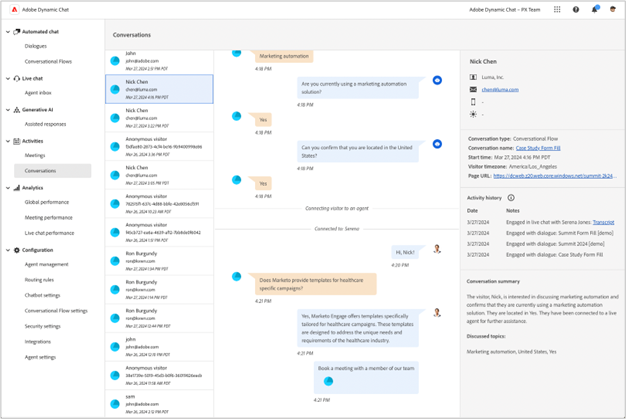

# Dynamic Chatリリースノート {#dynamic-chat-release}

Adobe Dynamic Chatリリースは、継続的な配信モデルに基づいて動作します。このモデルにより、機能のデプロイメントに対する、よりスケーラブルなアプローチが可能になります。 1 か月に複数のリリースがある場合があるので、定期的に最新の情報を確認してください。

Marketo Engageの標準リリースノートページ [ こちらを参照 ](/help/marketo/release-notes/current.md){target="_blank"} です。

## 2024 年 6 月リリース {#june-release}

**リリース日：2024 年 6 月 6 日**

### 対話型フローカード {#conversational-flow-card}

会話フローカードを活用して、ダイアログ内のフローの複数の手順を合理化します。

例：複数のダイアログを使用してウェビナーの登録を促進することを目標としている場合は、その目標を持つすべてのダイアログで同じフローを再作成する必要があります。 詳細を更新する必要がある場合は、個々のダイアログを 1 つずつ編集する必要があります。 会話フローカードのおかげで、それはもはや当てはまりません。

複数のダイアログ間でのフローの再利用に加えて、同じトランジションフローを使用して、フォームやランディングページなど、他のチャネルを経由したトリガーにも適用できます。

### 使用の制限 {#usage-limits}

使用制限ページには、パッケージの詳細や使用制限ステータスなどの重要な情報が表示されます。

## 2024 年 5 月リリース {#may-release}

**リリース日：2024 年 5 月 15 日**

### 事前承認応答ライブラリ {#pre-approved-response-library}

AI で生成された質問と回答の [ マーケティング承認済みライブラリの作成 ](/help/marketo/product-docs/demand-generation/dynamic-chat/generative-ai/response-library.md){target="_blank"} を行うと、ジェネレーティブ AI チャットを数分で設定できます。

### 未回答の質問 {#unanswered-questions}

以前の会話の [ 未回答の質問のリポジトリを使用 ](/help/marketo/product-docs/demand-generation/dynamic-chat/generative-ai/unanswered-questions.md){target="_blank"} して、最新の情報を使用した応答ライブラリを維持しながら、新しい事前承認済み応答を生成します。

### 会話の概要 {#conversation-summaries}

[ 営業担当者に ](/help/marketo/product-docs/demand-generation/dynamic-chat/live-chat/agent-inbox.md#conversation-summary){target="_blank"} 会議に先立って主要なディスカッションのトピックに関するインサイトを含む会話をまとめ、準備時間を短縮し、最新の情報を使用してより優れた営業担当者を提供します。

### GenAI のセールスショートカット {#genai-sales-shortcuts}

[ より迅速な方法でライブチャットエージェントを提供 ](/help/marketo/product-docs/demand-generation/dynamic-chat/live-chat/agent-inbox.md#shortcuts){target="_blank"} して、AI が生成した応答にアクセスしたり、既存の生成された応答を編集したり、会話中に購入者に送信する追加のコンテンツを検索したりします。

### 会話アシスタント {#conversation-assist}

マーケティングチームが事前に承認した回答を使用して、セールスエージェントがライブの会話中に正確に対応できるようにします。

### 会話の微調整 {#conversation-nudges}

コールトゥアクション（CTA）を使用して web 訪問者を微調整し、会話を最終的に進めます。

## 2024 年 4 月リリース {#april-release}

**リリース日：2024 年 4 月 23 日**

### すべてのユーザーが対話型フローを利用できるようになりました {#conversational-flows-available-to-all-users}

すべてのDynamic Chatユーザーが完全に利用できる Conversational Formsを使用すると、フォームの送信後すぐにミーティングや営業とのチャットを予約できる見込み客を許可することで &#42; フォームとランディングページの会話性を高め、営業ファネルを短縮できます。

_&#42;以前は、100 件のライフタイムエンゲージメントを含む体験版機能として利用できました。 会話フローエンゲージメントは、Select パッケージのユーザーに対して、エンゲージメントされた会話 250 回の月間制限にカウントされるようになりました。_

### コールバック関数 {#callback-functions}

[ コールバック関数 ](/help/marketo/product-docs/demand-generation/dynamic-chat/setup-and-configuration/callback-functions.md){target="_blank"} を使用すると、訪問者がDynamic Chat上の会話に関与したときに、Adobe AnalyticsやGoogle Analyticsなどの外部システムでDynamic Chat分析イベントを収集できます。 イベントをリッスンする API をコールバックに登録することで、Dynamic Chat分析イベントを有効にできます。 これにより、web トラフィックなど、他の主要なデータに関連するDynamic Chatエンゲージメントの全体像を把握できます。

### 条件付きブランチに追加されたライブエージェントの可用性条件 {#live-agent-availability-conditional-branching}

ネイティブおよびカスタムのMarketo Engageフィールドに加えて、条件付きブランチを使用して、エージェントの可用性に基づいてブランチを作成できるようになりました。 これは、ライブエージェントが使用可能な場合に、訪問者にライブエージェントと対話するオプションのみを提供したいときに役立ちます。

### スマートリスト条件が条件付きブランチに追加されました {#smart-list-condition}

条件付きブランチに新しいMarketo Engageスマートリスト条件が追加されたことで、Dynamic Chatでオーディエンスのブランチ条件を定義するのではなく、Marketo Engageで既に作成した既存のオーディエンスに基づいてブランチを作成できるようになりました。

### 対話型フローの条件付き分岐 {#conditional-branching-for-conversational-flows}

今年の初めにダイアログの条件付きブランチをリリースしましたが、会話フローでも条件付きブランチを利用できるようになりました。 条件付きブランチを使用すると、様々な条件に基づいてフローにブランチを作成できます。

### 対話型フローのためのライブチャット {#live-chat-for-conversational-flows}

Dialogs のライブチャット機能は 2023 年にリリースされましたが、会話フローにもライブチャットのエンゲージメントを追加できるようになりました。 Marketo Engageフォームで会話フローを使用している場合、資格のある訪問者がフォーム送信後すぐにライブエージェントとチャットできるようになりました。

### エージェントインボックス内の最近のMarketo Engageアクティビティ {#recent-marketo-engage-activities-in-agent-inbox}

最近のMarketo Engageアクティビティをエージェントインボックスの「最近のアクティビティ」セクションに追加しました。これにより、サイト訪問者がエージェントとのチャットをリクエストした場合、訪問者が最近（過去 25 件のアクティビティ）次のMarketo Engageアクティビティのいずれかに関与しているかどうかをすばやく確認できます。

* メール開封済み
* 訪問した web ページ
* フォーム入力完了
* 過去に注目のアクションあり

### エージェント管理のカレンダー接続ステータス {#calendar-connection-status-in-agent-management}

管理者は、どのミーティング予約権限を持つエージェントがDynamic Chatでカレンダーを接続したかを簡単に確認できるようになりました。 これにより、営業チーム全体が連携し、Dynamic Chatからの会議出席依頼を受け入れる準備が整います。

### エージェントカレンダー設定の最小通知設定 {#minimum-notice-setting-in-agent-calendar-configuration}

ユーザーから、web 訪問者が 10 分程度の事前通知でカレンダー上の会議を予約していると報告されたため、エージェントカレンダー設定に最小通知設定を導入し、デフォルトのリードタイムを 24 時間に設定しました。

### ユーザー動作の追加と削除を更新しました {#add-remove-user-behavior-updated}

一部のユーザーは、Dynamic Chat でのエージェントの追加と削除に関する問題があることを示していたので、これらの問題に対処するために変更を加えました。

ライブチャットまたはミーティングの予約権限を持つAdmin Consoleにユーザーが追加されると、そのユーザーは直ちにエージェント管理リストに表示され、ダイアログ、会話フロー、ルーティングルール、チームに追加できるようになります。

会議の予約またはライブチャットのアクセス許可を持つユーザーがAdmin Consoleから削除されると、そのユーザーは直ちにDynamic Chatから削除され、ライブチャットまたは会議のルーティングに使用できなくなります。また、ライセンス制限にカウントされなくなります。

### 会話レベルのレポートのパフォーマンスの向上 {#improved-conversation-level-report-performance}

個々のダイアログおよび会話型フローレベルのレポートのパフォーマンスと精度が向上しました。 以前は、ダイアログレポートの読み込みに数秒かかる場合があり、データがグローバルパフォーマンスレポートと一致しない場合がありました。 これで、個々のダイアログレポートが瞬時に読み込まれ、データは常にグローバルレポートデータと連携します。

### 権限の更新 {#permission-updates}

権限管理をより直感的にするために、Adobe Admin Consoleの権限構造と名前をクリーンアップしました。

* 「会話管理」カテゴリは、「会話」になりました
* 「会議」カテゴリの名称が「アクティビティ」になりました
* 「エージェント設定」カテゴリは「エージェント」になりました
* 「管理者設定」カテゴリの名前が「設定」になりました
* 「ライブチャット」カテゴリが削除され、すべてのライブチャット権限がエージェントカテゴリに移動されました

### エージェントインボックスでのハイパーリンクのサポート {#support-for-hyperlinks-in-agent-inbox}

現在、ライブチャットエージェントがチャット内の訪問者と URL を共有すると、それらの URL はハイパーリンクされるので、訪問者は URL をコピーしてブラウザーに貼り付けるのではなく、単純にクリックしてページに移動できます。

### エージェントインボックスで更新された主な動作を入力 {#enter-key-behavior-updated-in-agent-inbox}

エージェントインボックスでリターンキーの動作を切り替えたので、Return キーまたは Enter キーを押すとメッセージが送信され、Shift + Enter キーを押すと改行が作成されます。

### ラウンドロビンページが削除されました {#round-robin-page-removed}

心配無用です。ラウンドロビンルーティングはまだ完全に機能しており、常に同じように動作します。 ラウンドロビンルーティングキュー内のエージェントのリストとその順序が不正確であることが多いページを削除しました。

2022 年にDynamic Chatをリリースした時点では、ライブチャットのサポートはなく、ミーティングの予約のみをサポートしており、ラウンドロビンルーティングページは、ミーティングの予約のみを念頭に置いて設計されていました。 昨年のライブチャットの導入に伴い、ラウンドロビンページは、ミーティングの予約とライブチャットの権限の両方を持つエージェント間のラウンドロビンルーティングのより複雑な性質を正確に反映していなかったため、廃止されました。 これに対処するためのいくつかの異なるオプションを検討しましたが、最終的には、混乱を最小限に抑えるには、完全に削除することが最適なオプションであると判断しました。

## 2024 年 2 月リリース {#february-release}

**リリース日：2024 年 2 月 22 日**

### 会話ページ {#conversations-page}

新しい会話ページは、既知のリードと匿名のリードの両方から、インスタンスで発生したすべての会話（自動およびライブ）のトランスクリプトを表示するワンストップショップを提供し、顧客がダイアログ、会話フロー、ライブエージェントとどのように関わっているかをより明確に把握できるようにします。

### グローバルダッシュボードの日付範囲が 90 日から 24 か月に増加 {#date-range-in-global-dashboard}

お願いして届けたんです。 すべての Analytics ダッシュボードで、最大 2 年間のDynamic Chatエンゲージメントデータを確認できるようになりました。

### ダイアログでの条件付きブランチ {#conditional-branching-in-dialogues}

条件付きブランチを使用すると、様々な条件に基づいてダイアログフローにブランチを作成できます。 現在は、Marketo Engageにおけるリード属性と会社属性に基づいて、同じダイアログで異なるユーザーに異なるコンテンツを表示できます。

## 2024 年 1 月リリース {#january-release}

**リリース日：2024 年 1 月 24 日**

### エージェント管理の同時ライブチャット制限設定 {#Concurrent-live-chat-limit-setting}

デフォルトでは、インスタンス内の各ライブチャットエージェントは、一度に最大 5 つのライブチャットセッションに参加できます。 エージェント管理に新しい設定が導入され、この制限を 1 から 10 に調整できるようになりました。

