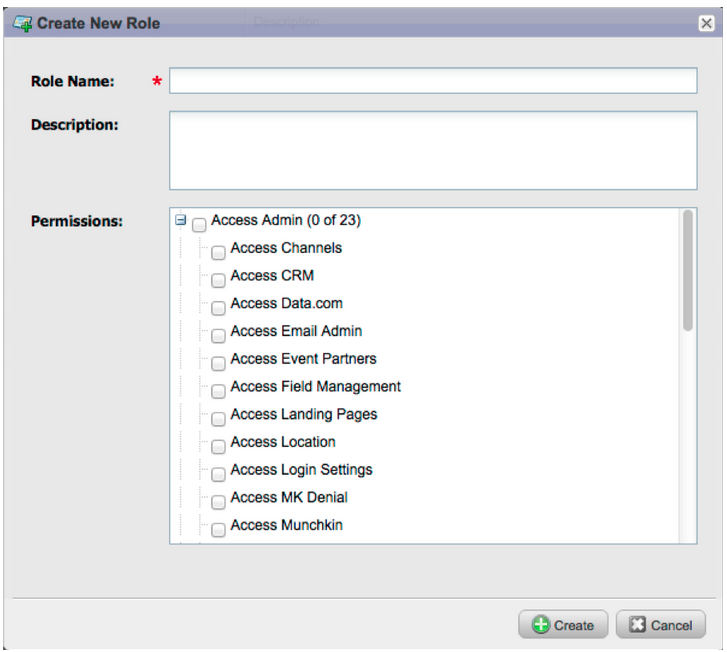

# リリースノート：2012年12月 {#release-notes-december}

12 月のリリースには、待望の&#x200B;**友だちに転送**&#x200B;機能のほか、いくつかの機能が含まれています。アスタリスク（&#42;）の付いた機能は、Select Edition と RCA （Revenue Cycle Analytics）でのみ使用できます。

## 友達に転送 {#forward-to-friend}

メールに「**友達に転送**」リンクを含めて、他のユーザーとのコンテンツの共有を有効にします。新しいフィルターとトリガーが追加されたことで、メールを転送したユーザーと転送されたメールを受信したユーザーを識別できるので、インフルエンサーを特定できます。

メールに&#x200B;**友だちに転送**&#x200B;の招待を含めるには、エディターでメールを開き、`{{system.forwardToFriendLink}}` トークンを挿入します。

対応するトリガーとフィルターを使用して、「**友達に転送**」リンクを使用したユーザーと、メールを受信したユーザーを特定します。

## 詳細な管理権限 {#granular-admin-permissions}

最新のリリースでは、Marketoの [!UICONTROL  管理者 ] エリアの様々な機能へのアクセスを役割ごとに制御することで、[!UICONTROL  管理者 ] の役割へのアクセスと制御を強化しています。 新しい役割を作成する際に、その役割がアクセスできる特定の [!UICONTROL  管理者 ] 機能を割り当てることができます。

>[!NOTE]
>
>デフォルトでは、「[!UICONTROL  管理者にアクセス ]」権限を持つ既存の役割は、変更されない限り、すべての [!UICONTROL  管理者 ] 機能にアクセスできます。

## [!UICONTROL BrightTALK] アダプター {#brighttalk-adapter}

Marketo[!UICONTROL BrightTALK] アダプタを使用すると、ライブまたはオンデマンドの Web キャストから出席情報をMarketoイベントに直接取り込むことができます。

## [!DNL Microsoft Dynamics] 用Marketo [!DNL Sales Insight] {#marketo-sales-insight-for-microsoft-dynamics}

[!DNL Microsoft Dynamics] のお客様が [!DNL Sales Insight] を利用できるようになりました。

## [!DNL Dynamics] 商談同期 {#dynamics-opportunity-sync}

Marketoと [!DNL Microsoft Dynamics] の間で商談データを同期します。

## マーケティング影響商談レポート &#42; {#marketing-influenced-opportunities-report}

マーケティングプログラムが企業のパイプラインや売上高に与えた影響の割合を表示します。**[!UICONTROL 売上高エクスプローラー]**&#x200B;で、商談分析の新しい「マーケティングが影響を与えた商談」の黄色いドットを使用してカスタムレポートを作成できるようになりました。次の 2 つのレポートを Standard フォルダーで使用することもできます。

* 創出された商談に対するマーケティングの影響
* 商談のクローズ成立に対するマーケティングの影響

## プログラム商談分析のカスタム商談フィールド &#42; {#custom-opportunity-fields-in-program-opportunity-analysis}

[!UICONTROL  収益エクスプローラー ] でカスタム商談フィールドを追加し、プログラム商談分析レポートを強化します。

## キャンペーンインスペクター {#campaign-inspector}

[!UICONTROL  スコアを変更 ] や [!UICONTROL  キャンペーンをリクエスト ] など、特定のフローアクションを使用しているキャンペーンを検討したことはありますか？ または、特定のフィルターがどこで使用されているのか疑問に思ったことはありますか？新しい [!UICONTROL  キャンペーンインスペクター ] （宝箱から入手できます）を使用すると、これらのキャンペーンに加えて、アクティブなキャンペーンやエラーが発生したキャンペーンを特定できます。

**[!UICONTROL 管理者]**／**[!UICONTROL アイデアスペース]**&#x200B;に移動して、**[!UICONTROL キャンペーンインスペクター]**&#x200B;を有効にします。

