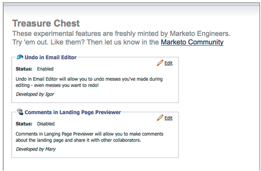

# リリースノート：2012年5月 {#release-notes-may}

## メール効果レポートのデザイン変更 {#email-performance-report-redesign}

注意：これは、5 月のリリースから始まる段階的なロールアウトです

メール効果レポートとキャンペーンメール効果レポートの実行をスピードアップしました。また、特定の指標の定義を改善し、「送信済みのメッセージ数」指標と「送信済みのリード数」指標を 1 つの指標「送信済み」に統合しました。「配信済みのメッセージ数」と「配信済みのリード数」を「配信済み」に結合しました。

## 待機ステップの強化 {#wait-step-enhancements}

新しい詳細な待機プロパティを使用すると、スマートキャンペーンフローアクションの待機手順を設定して、特定の曜日、次の営業日、特定の日時まで「待機」できます。これらの機能強化により、業務時間中にナーチャリングメールを確実に受信ボックスに届けることができます。

図 1.営業日に終了する待機ステップの指定

## 非表示のアーカイブ済みアセット {#archived-assets-hidden}

アーカイブされたアセットは、自動提案、ドロップダウン、レポートから自動的にフィルタリングされ、探しているものを見つけやすくなります。

図 2.アーカイブ済みメールフィルターの例

## iPad 用の新規イベントチェックインアプリ {#new-event-check-in-app-for-ipad}

新しい iPad アプリを使用して、イベントのチェックインプロセスを簡素化します。イベントチェックインアプリは、Marketo プログラムと同期し、イベントに登録者を簡単にチェックインし、その場で新しいリードを追加できます。

iOS 5.1 以降が必要。iPad のみ。

図 3.イベントチェックインホームページ

図 4.イベントチェックイン：イベントを選択します。

図 5.チェックイン

## オンラインセミナー確認 URL の機能強化 {#enhanced-webinar-confirmation-url}

ON24 と Adobe Connect で利用可能新しい `{{member.webinar URL}}` トークンを使用して、登録した各出席者の確認メールに一意のリンクを含めます。Adobe Connect の機能強化には、ユーザーのログイン ID とパスワードを含む Adobe アカウント情報メールのオン／オフを切り替える機能も含まれます。

図 6.ウェビナーにユーザーを招待する

## テンプレートのプレビュー {#template-preview}

電子メールまたはランディングページの作成中に特定のテンプレートを探しているが、どのように表示されるかわからない場合、新しいテンプレートプレビュー機能を使用すると、新しいアセットを保存する前に、選択したテンプレートを確認できます。

図 7.選択したテンプレートのプレビュー

## 設定可能なフォームの事前入力 {#configurable-form-prefill}

サブスクリプションレベルでフォームデータの事前入力を制御し、ランディングページレベルで上書きします。事前入力を設定しない場合、リードの最新情報を確実に取得できます。

図 8.管理でのフォーム事前入力設定

図 9.ランディングページのフォーム事前入力設定の編集

## Marketo アイデアスペース {#marketo-treasure-chest}

Marketo エンジニアが開発した実験機能にアクセスして、ユーザーエクスペリエンスを強化します。このリリースには、電子メールの取り消し機能に加え、ランディングページでのコメント入力や他のユーザーとの共同作業が含まれます。

\

図 10.管理でのマネージャーアイデアスペース機能

## Microsoft Dynamics® CRM 統合 {#microsoft-dynamics-crm-integration}

新しい事前定義済み統合機能を使用して、Marketo と Microsoft Dynamics CRM Online の間でアカウント、連絡先、リードを同期します。

図 11.Microsoft Dynamics の設定

## Marketo Sales Insight の機能強化 {#marketo-sales-insight-enhancements}

**登録解除フッターオプション**

Sales Insight を通じて送信される電子メールに対して、登録解除フッターを表示するかどうか、いつ表示するかを設定します。

図 12.管理の Sales Insight 設定

## セールスメールテンプレートのフォルダー {#folders-for-sales-email-templates}

Marketo Sales Insight と共有するメールテンプレートを指定したフォルダーに整理できるようになり、セールス担当が適切なメールを見つけやすくなりました。

図 13.メールのフォルダーを選択

## Sales Insight から商談アナライザーにアクセス {#access-opportunity-analyzer-from-sales-insight}

Marketo Sales Insight の商談アナライザーに直接アクセスして、マーケティングアクティビティがエンゲージメントを促しているインサイトをセールス担当に提供します。注意.売上高サイクル分析ライセンスが必要です。

## 連絡先ステータスのカスタムフィールド {#custom-field-for-contact-status}

Salesforce のカスタムフィールドをマッピングして、マイ最有望見込客、マイチーム最有望見込客、カスタムビューの連絡先の「ステータス」フィールドにデータを入力できるようになりました。

図 14.カスタムフィールドの連絡先へのマッピング

匿名リードが訪問したページを参照

匿名 web アクティビティビューから、匿名リードが閲覧したページにドリルダウンします。

図 15.匿名 web アクティビティを参照してください。

## リードと連絡先の購読の強化 {#enhanced-lead-and-contact-subscribe}

レコードの詳細ページの新しい「購読」ボタンを使用して、いつでもリードや連絡先をフォローできます。
