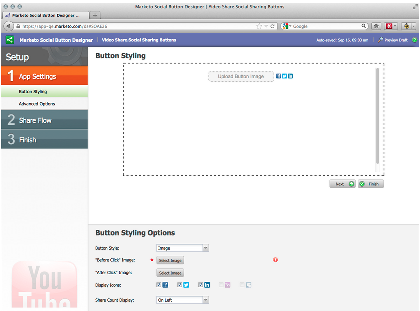
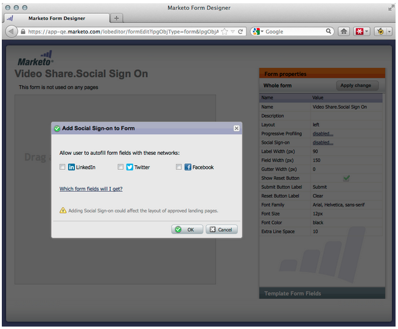

# リリースノート：2012年9月 {#release-notes-september}

このリリースには、待望の統合されたソーシャル機能とリード管理機能が含まれています。注意：ソーシャル機能は、アドオンとして、または選択したバンドルの一部として使用できます。

## ソーシャル共有を使用した YouTube ビデオの公開 {#publish-a-youtube-video-with-social-sharing}

ランディングページ上の新しいビデオ共有を使用して、訪問者がソーシャルメディアにビデオを共有するよう促すことで、ビデオのオーディエンスを増やします。

## 「共有」ボタンの追加 {#add-a-share-button}

共有メッセージと新しいソーシャル共有ボタンの外観を完全にカスタマイズできます。さらに、リードがコンテンツを共有するときに、ソーシャルプロファイルデータを取得できます。

## ソーシャルサインオン {#social-sign-on}

リードがソーシャルネットワークからの情報を事前に入力できるようにすることでインサイトを獲得し、リードのストレスを軽減します。

## ランディングページの Facebook への公開 {#publish-landing-pages-to-facebook}

ソーシャルアプリ、フォーム、Marketo のランディングページの機能をすべて備えたソーシャルアプリケーションを使用して Facebook に直接公開することで、ランディングページのリーチを拡大します。

## ReadyTalk イベントアダプター {#readytalk-event-adapter}

Marketo イベントを ReadyTalk ミーティングにシームレスに接続できます。Marketo フォームを使用して登録者を取り込み、ReadyTalk に自動的に登録します。双方向同期を使用すると、Marketo に出席情報を入力できます。

## Microsoft Dynamics オンプレミス {#microsoft-dynamics-on-premise}

Microsoft Dynamics 2011 オンプレミスとインターネットに接続する展開がサポートされるようになりました。

## Webhooks（アイデアスペース） {#webhooks-treasure-chest}

Webhook は、ユーザー定義の HTTP コールバックです。Marketo から他のサービスにデータをプッシュする優れた方法です。この機能は現在アイデアスペースで使用可能で、現時点ではトリガーキャンペーンでのみサポートされています。

Webhooks の使用例として、ユーザー名とパスワード情報を別のシステムに送信して体験版アカウントを作成したり、新しいリードを獲得したら SMS テキストメッセージを送信したりすることが考えられます。

## getMultipleLeads API のアップデート {#update-to-getmultipleleads-api}

getMultipleLeads API の呼び出しに新しいフィルター条件を追加しました。日付によるフィルターに加えて、次の条件が追加でサポートされるようになりました。

* 日付範囲
* 静的リスト名
* リードキーの配列
