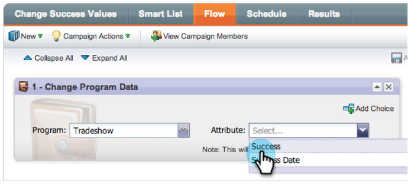

# リリースノート：2013年1月 {#release-notes-january}

1 月のリリースでは、ソーシャルオファーが&#x200B;**紹介オファー**&#x200B;で拡張されます。また、[!DNL Marketo Lead Management] のユーザは、自分のタイムゾーン、言語およびロケールの設定を行うことができます。&#42; が付いた機能は、Select Edition でのみ使用できます。

## 紹介オファー {#referral-offers}

**紹介オファー**&#x200B;は、リードに友達を紹介するインセンティブを与えるものです。成功した紹介に対して目標と報酬を作成します。ランディングページ、ウェブサイト、さらには Facebook でも使用できます。

## タイムゾーンの環境設定 {#time-zone-preference}

個人の Marketo アカウントのデフォルトのタイムゾーンを変更できます。例えば、サブスクリプションのデフォルトが「太平洋時間」の場合でも、独自のアカウントで「東部時間」に変更できます。

## [!DNL Marketo Lead Management] 言語の選択 {#select-your-marketo-lead-management-language}

Marketo ユーザーアカウントのデフォルト言語を変更できます。サブスクリプションのデフォルトが英語の場合でも、独自に使用するためにドイツ語またはフランス語に変更できます。

## 多言語フォームのエラーメッセージ {#multi-lingual-form-error-messages}

リードが Marketo フォームに入力すると、一部の検証メッセージが自動的に組み込まれます。これらのエラーメッセージに対して、別の表示言語を選択することもできます。現在、英語、ドイツ語、フランス語をサポートしています。

フランス語のフォームの例を次に示します。

## [!DNL Sales Insight] 言語の選択（[!DNL Salesforce] のみ） {#select-your-sales-insight-language-salesforce-only}

[!DNL Salesforce] の言語設定がフランス語またはドイツ語に設定されている場合は、Marketo [!DNL Sales Insight] はその設定に従います。この機能を入手するには、最新の MSI パッケージをダウンロードしてください（1月14日の週に入手可能）。

## フィールド表示名 {#field-display-name}

フィールド表示名は、異なる言語でテキストを表示できます（例：マルチバイト文字はサポートされています）。

## プログラムデータの変更 {#change-program-data}

[!UICONTROL プログラムデータの変更]フローステップを使用すると、キャンペーンを通じて、プログラムメンバーの[!UICONTROL 成功]ステータスと[!UICONTROL 成功日]を手動で変更できます。このフローステップを使用して、誤りを修正したり、意図したとおりにプログラムに参加していない可能性のあるメンバーを手動で変更したりできます。

