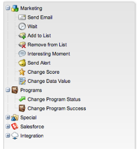
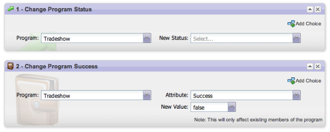

# リリースノート：2013年5月 {#release-notes-may}

5 月のリリースには、次の機能が含まれています。

## ランディングページのカレンダーファイル {#calendar-files-for-landing-pages}

ランディングページに追加できるマイトークンとしてカレンダーファイルを作成します。この統合カレンダーファイル（例：.ics ファイル）は、ローカルアセットのランディングページのマイトークンを含む、すべてのトークンをレンダリングします。

## 「モデルメンバーシップ」タブ {#model-membership-tab}

すべてのモデルメンバーデータをまとめて表示して、モデルメンバーを用意に監視し、トラブルシューティングを行います。新しい「[!UICONTROL メンバー]」タブは、承認済みの収益サイクルモデルを選択した場合に使用できる読み取り専用ビューです。

## フローアクションツリーの再編成 {#reorganized-flow-action-tree}

新しく再編成されたフローアクションツリーで、フローアクションを素早く見つけます。

## 名前が変更されたフローアクション {#renamed-flow-actions}

「進行状況のステータスを変更」が「[!UICONTROL プログラムステータスを変更]」に変わりました。「プログラムデータを変更」が「[!UICONTROL プログラムの成功を変更]」に変わりました。

