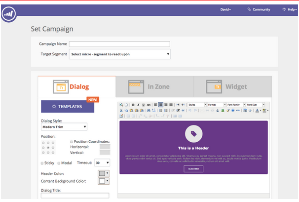

# リリースノート：2014年7月 {#release-notes-july}

2014年7月リリースには、次の機能が含まれています。利用可能な機能についてはお使いの Marketo のエディションをご確認ください。リリース後に、機能に関する詳細なドキュメントへのリンクを参照してください。

## マーケティングカレンダー {#marketing-calendar}

イベント、メール、プログラム全体のその他の項目が一目で確認できます。[ この新製品 ](/help/marketo/product-docs/core-marketo-concepts/marketing-calendar/understanding-the-calendar/navigating-the-marketing-calendar.md) は、[!DNL Marketo Lead Management] または Dialog ユーザーが 10 人以下のお客様が無料で利用できます。

マーケティングカレンダーのドキュメントは、リリース時に利用できます。

## 新しい外観と機能 {#new-look-and-feel}

[!DNL Marketo Lead Management] は、最新のスタイリッシュな新しいルックアンドフィールで更新され、ナビゲーションが更新されます。

## 日付演算子 {#date-operators}

[ 高度なフィルター ](/help/marketo/product-docs/core-marketo-concepts/smart-lists-and-static-lists/creating-a-smart-list/smart-list-filter-operators-glossary.md)、「[!UICONTROL &#x200B; 過去 &#x200B;]」、「[!UICONTROL &#x200B; 未来 &#x200B;]」、「[!UICONTROL &#x200B; 未来 &#x200B;]」用。 例えば、3 か月後に生年月日があるリードや、6 か月後に期限が切れる契約を検索します。

## プログラムスケジュールビュー {#program-schedule-view}

イベントとデフォルトプログラムを管理するマーケティングカレンダーに加えて、プログラムに関する新しいスケジュールビューが追加されました。

* すべての日付を一度に再スケジュール
* 新しい暫定的日付 - 予定の書き込み
* カスタムエントリの種類 - ToDo、プレスリリース、任意の項目

## REST API でのリスト操作 {#list-operations-in-the-rest-api}

ReST のリスト操作に関連する以下の呼び出しを追加しました。完全なドキュメントについては、[https://experienceleague.adobe.com/ja/docs/marketo-developer/marketo/rest/rest-api](https://experienceleague.adobe.com/ja/docs/marketo-developer/marketo/rest/rest-api) を参照してください。

* ID によるリストの取得
* 複数のリストの取得
* リストにインポート
* リストステータスへのインポートの取得

## 高速リストインポート {#fast-list-import}

**50 倍の速さで**、ファイルが Marketo にズームインします。従来の「通常」および「新規リード用に最適化」のインポートオプションは、「デフォルト（高速インポート）」に置き換えられました。

「新規リードと更新をスキップ」オプションは変更されません。

## 新たに向上した Munchkin {#new-improved-munchkin}

ロールアウトは 7 月中旬に開始し、今後数か月間続きます。

* 完全な互換性および将来の互換性のために、依存関係 [!DNL jQuery] を削除します
* サイト上の他の JavaScript との互換性の向上
* 過去 1 年間に多くのサイトで十分にテストされました。

## RTP：リアルタイムパーソナライゼーションキャンペーンテンプレート {#rtp-real-time-personalization-campaign-templates}

RTP 設定キャンペーンページに、[既製のテンプレートが含まれるようになりました](/help/marketo/product-docs/web-personalization/using-templates/using-templates-to-create-web-campaigns.md)。ウェビナー、ケーススタディ、ebook など、様々なスタイルから選択できます。

## RTP：JavaScript API の機能強化 {#rtp-javascript-api-enhancements}

組織、業界、場所、セグメントコードの一致など、リアルタイムの訪問者データを取得する、新しい RTP API 呼び出し。さらに、セグメントページでセグメント名の上にカーソルを置くと、セグメントコードを示すツールチップが表示されます。詳細なドキュメントについては、[開発者向けサイト](https://experienceleague.adobe.com/ja/docs/marketo-developer/marketo/javascriptapi/rich-media-recommendation)を参照してください。

## RTP：キャンペーンコンテンツエディターの HTML5 サポート {#rtp-html-support-in-campaign-content-editor}

キャンペーンを設定ページのコンテンツ WYSIWYG エディターが、HTML5 との完全な互換性を持つようになりました。エディター内の「HTML」アイコンをクリックして、HTML5 コードを挿入します。
