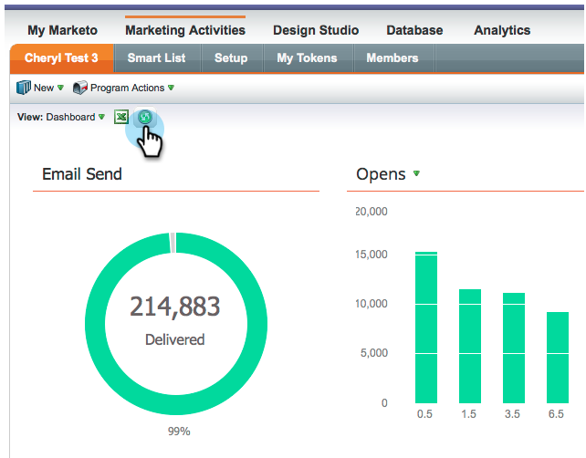

# リリースノート：2014年3月 {#release-notes-march}

2014年3月リリースには、次の機能が含まれています。お客様のご契約により、制限やオプションの契約が必要なものがあります。詳細は担当の営業にお問い合わせください。リリース後は、各機能に関するナレッジベース記事へのリンクを必ず参照してください。

## メールプログラムダッシュボードの更新ボタン {#email-program-dashboard-refresh-button}

[更新ボタン](/help/marketo/product-docs/email-marketing/email-programs/email-program-data/use-the-email-program-dashboard.md)を使用して、メール送信や AB テストに関するメール指標を即座に取得します。

## メールエディターとスニペットエディターでの取り消し／やり直し {#undo-redo-in-the-email-editor-and-snippet-editor}

現在のセッションに対して、最大 50 のアクションを[取り消しまたはやり直します](/help/marketo/product-docs/email-marketing/general/email-editor-2/edit-elements-in-an-email.md)。

## プログラム効果レポートのプログラムステータス列 {#program-status-columns-in-program-performance-report}

[プログラム効果レポート](/help/marketo/product-docs/core-marketo-concepts/programs/program-performance-report/add-program-status-columns-to-a-program-report.md)を使用しているときに、どのプログラムステータスにどのくらいのリードがいるのかを確認できるようになりました。

## 分析のためのプログラムの「包む」および「オペレーショナル」設定 {#inclusive-and-operational-programs-for-analytics}

プログラムチャネルを編集するときに、「分析動作」オプションを「包む」に設定することで、売上高エクスプローラーやアナライザーに[期間コストのかからないプログラムを含める](/help/marketo/product-docs/reporting/revenue-cycle-analytics/program-analytics/make-a-program-without-a-period-cost-available-in-revenue-explorer-and-analyzers.md)ことができるようになりました。また、「オペレーショナル」を選択することで、運用プログラムをすべてレポートから除外することもできます。

## リードコンバージョンのハイブリッドおよび暗黙的オプション {#hybrid-and-implicit-options-for-lead-conversion}

リード分析のリードコンバージョン指標で、Marketo が連絡先と商談を結び付ける方法を変更できます。[属性設定は、3 つの選択肢の中から 1 つに変更できます](/help/marketo/product-docs/administration/settings/change-attribution-settings-for-analytics.md)。この設定を変更しても、Marketo または CRM データは変更されません。単にレポートの実行方法が変更され、いつでも元に戻すことができます。

「明示」設定では、商談内の役割を持つ連絡先は、コンバージョンされたリードとしてのみ扱われます（デフォルトの動作）。「暗黙」設定では、役割に関係なく、商談のアカウントに関連付けられているすべての連絡先をコンバージョン済みとして扱います。ハイブリッドは、使用可能な場合、変換された役割を持つ連絡先を処理します。ない場合は、アカウント内のすべての連絡先はコンバージョン済みとして扱われます。

リマインダーとして、この設定はプログラムの属性指標も変更します。

## 追加のユーザー言語 {#additional-user-language}

[Marketo アプリケーションの言語](/help/marketo/product-docs/administration/settings/select-your-language-locale-and-time-zone.md)を選択します。希望の言語で Marketo リード管理インターフェイスを表示できます。日本語がサポートされました。

## Marketo デベロッパーブログ {#marketo-developer-blog}

[Marketo デベロッパーブログ](https://developers.marketo.com/blog/)は、近年のマーケターの急速に進化するニーズをサポートする、web 開発者やソフトウェアエンジニアを対象としています。配信登録して、新しい統合オプションや API バージョンの更新、コードサンプルを含む新しいハウツー記事、Marketo プラットフォームへの統合に関するベストプラクティスに関するお知らせをご確認ください。

このシリーズの[最初の記事](https://developers.marketo.com/blog/retrieving-customer-and-prospect-information-from-marketo-using-the-api/)では、API を使用して、Marketo 内に保存されている人々（顧客、連絡先、リード）の情報を効率的に取得する方法について説明します。
