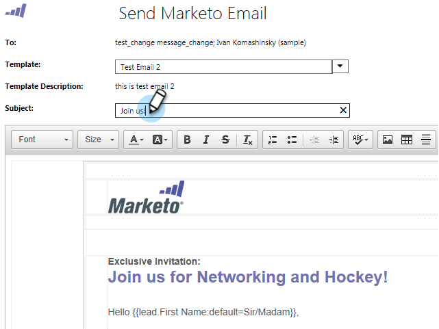

# リリースノート：2014年10月 {#release-notes-october}

利用可能な機能についてはお使いの Marketo のエディションをご確認ください。ドキュメントはリリース時に提供されます。

## マーケティングカレンダーのプログラムフォーカス {#program-focus-in-marketing-calendar}

マーケティングカレンダーから直接[エントリーを作成および編集します](/help/marketo/product-docs/core-marketo-concepts/marketing-calendar/understanding-the-calendar/understand-enable-program-focus.md)。

## 新規 REST API 呼び出し {#new-rest-api-calls}

API を使用して、リードへの新しいアクティビティや変更を抽出します。

* リードの変更の取得
* リードアクティビティの取得
* アクティビティタイプの取得
* ページトークンの取得

詳細は、リリース後に [https://experienceleague.adobe.com/ja/docs/marketo-developer/marketo/rest/rest-api](https://experienceleague.adobe.com/ja/docs/marketo-developer/marketo/rest/rest-api) で確認できます。

## MSI - [!DNL Microsoft Dynamics] への Marketo メールの送信 {#msi-send-marketo-email-for-microsoft-dynamics}

[!DNL Microsoft Dynamics] からリードと連絡先に[セールスメールを送信してトラック](/help/marketo/product-docs/marketo-sales-insight/msi-for-microsoft-dynamics/setting-up-and-using/send-a-marketo-sales-email-from-microsoft-dynamics.md)します。

## MSI - [!DNL Microsoft Dynamics] の Marketo キャンペーンに追加 {#msi-add-to-marketo-campaigns-for-microsoft-dynamics}

[!DNL Microsoft Dynamics] 内から直接 [Marketo スマートキャンペーンにリードと取引先責任者を追加](/help/marketo/product-docs/marketo-sales-insight/msi-for-microsoft-dynamics/setting-up-and-using/add-a-lead-contact-to-a-marketo-campaign-from-microsoft-dynamics.md)します。マーケティングでは、セールスが使用可能な Marketo キャンペーンを選択できます。

## [!DNL Microsoft Dynamics] Sync のカスタムエンティティサポート {#custom-entity-support-for-microsoft-dynamics-sync}

スマートリスト、スマートキャンペーン、プログラムでのフィルタリングとトリガーに、[!DNL Microsoft Dynamics] の[カスタムオブジェクトデータを使用](/help/marketo/product-docs/crm-sync/microsoft-dynamics-sync/microsoft-dynamics-sync-details/enable-sync-for-a-custom-entity.md)します。

## [!DNL Microsoft Dynamics] Sync の株主サポート {#shareholder-support-for-microsoft-dynamics-sync}

[!DNL Dynamics] から商談の株主データを同期します。また、「プライマリアカウント」フィールドを使用してアカウントに接続された商談と、「プライマリ連絡先」同期を使用して連絡を取る商談もサポートされます。

## RTP - ダッシュボードの機能強化 {#rtp-dashboard-enhancements}

ダッシュボードが強化され、一目でわかるデータがさらに含まれるようになりました。

* 組織訪問回数合計
* 上位 5 業種
* エンゲージした訪問者数合計

## RTP - キャンペーン用の新しいモバイルテンプレート {#rtp-new-mobile-templates-for-campaigns}

これらの新しいテンプレートを使用して、[モバイルキャンペーンを素早く簡単に作成できます](/help/marketo/product-docs/web-personalization/using-templates/using-templates-to-create-web-campaigns.md)。

## RTP - ユーザーコンテキスト API {#rtp-user-context-api}

訪問者の過去の訪問履歴をトラックする新しいコールを使用します。訪問者の以下の条件に基づいてキャンペーンをパーソナライズします。

* 過去に閲覧したページ
* 関心のある製品
* 閲覧した RTP キャンペーンの内容

詳しくは、[https://experienceleague.adobe.com/ja/docs/marketo-developer/marketo/javascriptapi/rich-media-recommendation](https://experienceleague.adobe.com/ja/docs/marketo-developer/marketo/javascriptapi/rich-media-recommendation) を参照してください。
