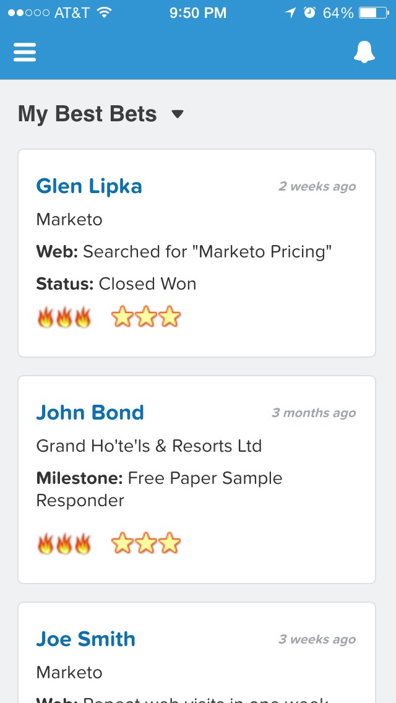

# リリースノート：2015 年 4 月 {#release-notes-april}

2015 年 4 月リリースには、次の機能が含まれています。お客様のご契約により、制限やオプションの契約が必要なものがあります。詳細は担当の営業にお問い合わせください。リリース後は、各機能に関する詳細な記事へのリンクを必ずご確認ください。

## 分析ホームの再設計

[分析ホームの再設計](/help/marketo/product-docs/reporting/basic-reporting/creating-reports/navigating-the-analytics-home-page.md)

>[!NOTE]
>
>この機能は、4 月 28 日（火）にリリースされます。

新しい[分析ホームページ](/help/marketo/product-docs/reporting/basic-reporting/creating-reports/navigating-the-analytics-home-page.md)では、使用可能なレポートタイプ間でアドホックレポートを実行するクイックアクセスが有効になります。

また、非公開または共有のレポート組織も使用できるようになりました。レポートを作成するかマイレポートフォルダーにドラッグして、他のユーザーによる表示、編集、削除を禁止します。グループレポートは、すべてのユーザーで共有されます。

## Marketo モバイルエンゲージメント {#marketo-mobile-engagement}

**Marketo モバイルエンゲージメント**

Marketo モバイルエンゲージメントを使用すれば、魅力的なモバイルエクスペリエンスを簡単に提供できます。アプリ開発チームに頼ることなく、パーソナライズされた高度にパーソナライズされたキャンペーンを作成し、説得力のあるコンテンツを提供します。新しいフィルターおよびトリガーを使用すると、プッシュ通知を通じてモバイルチャネルをリッスンし、応答できます。

## LinkedIn Lead Accelerator の統合

[LinkedIn Lead Accelerator の統合](/help/marketo/product-docs/demand-generation/social/social-functions/use-a-marketo-list-or-smart-list-as-a-linkedin-audience-segment.md)

リード育成戦略を有料ディスプレイ広告とソーシャル広告に拡張します。LinkedIn Lead Accelerator との[広告ネットワーク統合](/help/marketo/product-docs/demand-generation/ad-network-integrations/add-linkedin-matched-audiences-as-a-launchpoint-service.md)を使用すると、任意のスマートリストまたは静的リストのメンバーに基づいて、LinkedIn 内でオーディエンスセグメントを安全に作成できます。その後、LinkedIn のオーディエンスセグメント内のメンバーを、関連する一連の広告を使用して育成できます。

## Salesforce1 に関する Marketo Sales Insight  {#marketo-sales-insight-for-salesforce}

お気に入りの Sales Insight 機能（リードフィード、最有望見込客、注目のアクション、Marketo Campaign に追加）は、Salesforce1 アプリですべて利用できます。

 

## RTP - アカウントベースドマーケティング分析 {#rtp-account-based-marketing-analytics}

**RTP - アカウントベースドマーケティング分析**

アカウントリストの新しい効果グラフを使用して、購入サイクルの各段階に基づく主要アカウントリストの効果を即座に表示できます。グラフは、主要な組織からの訪問のステージを、訪問者数と訪問者のステータスに基づいて、意識から行動に移すまでのあらゆる段階で表示します。
