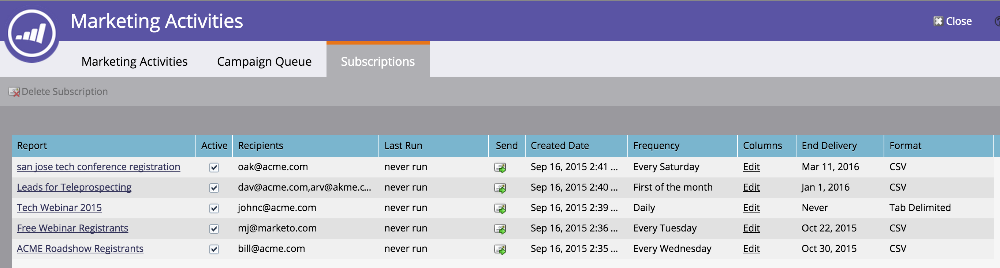

# リリースノート：2015年秋 {#release-notes-fall}

15年秋のリリースには、次の機能が含まれています。 お客様のご契約により、制限やオプションの契約が必要なものがあります。詳細は担当の営業にお問い合わせください。

## スマートリストの購読 {#subscribe-to-a-smart-list}

[スマートリストの購読](/help/marketo/product-docs/reporting/basic-reporting/report-subscriptions/subscribe-to-a-smart-list.md)

スマートリストを購読すると、マーケターはスマートリストを書き出し、Marketoを使用していない関係者（販売チームやテレマーケティングチームなど）に電子メールで送信できます。

エクスポートは、日別、週別、月別にスケジュールでき、配信終了日を設定でき、カスタマイズして列数を制限することができます。


スマートリストでは複数の購読を作成できます。 1つの購読、複数のワークスペース、1つのMarketoインスタンスに対して、100,000のリードを含む100の購読の制限があります。



## Marketo カスタムオブジェクト {#marketo-custom-objects}

[Marketo カスタムオブジェクト](/help/marketo/product-docs/administration/marketo-custom-objects/understanding-marketo-custom-objects.md)

Admin UIからカスタムオブジェクトを簡単に作成できます。 現在、Marketoで1:Nのカスタムオブジェクトを作成し、リードや会社に接続する機能をサポートしています。

>[!NOTE]
>
>Marketoカスタムオブジェクトは、Sparkでは使用できません。


## Google Chrome 対応 Marketo Insights {#marketo-insights-for-google-chrome}

[Google Chrome 対応 Marketo Insights](/help/marketo/product-docs/marketo-sales-insight/msi-chrome-plugin/using-marketo-insights-for-google-chrome.md)

アドビのGoogle Mail Sales Insight拡張機能の更新がリリースされました。 [Chrome Store](https://nation.marketo.com/external-link.jspa?url=https://chrome.google.com/webstore/detail/marketo-insights-for-goog/jjkfbhajlmoeegbjgjipliamplidmbjb)で表示します。

この更新には、次の新機能が含まれています。

* セールス担当者は、関与を引き起こす前に、役職、twitterのプロファイル、会社情報、写真など、見込み客に関する関連情報をGoogle Mail内で直接確認できます。
* 販売員は、開封またはクリックされた電子メール、オンラインイベント、出席した対面イベント、訪問されたWebページ、ダウンロードされたeBookなど、チャネルをまたいで見込み客がどのコンテンツに関与しているかをリアルタイムで確認できます。
* Googleメールで送信された電子メールは、Marketoにログインし、リアルタイムで追跡されます。 これにより、販売担当者は、見込み客がEメールを見ているタイミングを確認できるので、適切なタイミングでフォローアップできます。 Marketo Sales Insight for Google Mailは、マーケティングによって作成されたテンプレートを利用して、美しい招待やオファーなどのコンテンツを簡単に送信できます。


## Marketo Mobile Engagement — トークン、サンプルの送信およびプレビュー {#marketo-mobile-engagement-tokens-send-sample-preview}

* [トークン](/help/marketo/product-docs/mobile-marketing/push-notifications/configure-mobile-push-notification.md)
* [サンプルの送信](/help/marketo/product-docs/mobile-marketing/push-notifications/send-a-push-notification-sample.md)
* [プレビュー](/help/marketo/product-docs/mobile-marketing/push-notifications/preview-a-push-notification.md)

[トークン](/help/marketo/product-docs/mobile-marketing/push-notifications/configure-mobile-push-notification.md)を使用して、プッシュ通知を簡単にパーソナライズできます。


また、顧客にデプロイする前に、[プレビュー](/help/marketo/product-docs/mobile-marketing/push-notifications/preview-a-push-notification.md)や、[サンプル](/help/marketo/product-docs/mobile-marketing/push-notifications/send-a-push-notification-sample.md)プッシュ通知を送信することもできます。


##  Moments でのスマートキャンペーン {#smart-campaigns-in-moments}

[ Moments でのスマートキャンペーン](/help/marketo/product-docs/core-marketo-concepts/mobile-apps/marketo-moments/understanding-moments/understanding-smart-campaign-cards.md)

スマートキャンペーンを通じて送信されたEメールの統計を、Momentsで使用できるようになりました。 このアップグレードのその他の機能は次のとおりです。

* スワイプして完了 ストリームにカードが多すぎますか？ スワイプできる！
* プレビュー画面から直接サンプルを送信する
* 電子メールプログラムカードに追加されたスマートリストの詳細
* 電子メールプログラムの「中止」ステータスのサポートを追加しました。


## RTP — コンテンツ分析とRecommendations {#rtp-content-analytics-and-recommendations}

[コンテンツ](/help/marketo/product-docs/web-personalization/understanding-web-personalization/understanding-content-analytics.md) 分析とRecommendations

RTPコンテンツ分析は、通常のWeb訪問からのWebコンテンツアセットのパフォーマンスと、RTPのコンテンツレコメンデーションエンジンから生成された訪問を示します。

* 最もパフォーマンスが高く、最もリードが多いコンテンツを確認する
* RTPの予測コンテンツエンジンのコンテンツが、適切な訪問者に最適なコンテンツを自動的にレコメンデーションできるようにすることで、コンテンツ消費を増やします。
* 各コンテンツアセットを詳細に分析し、より詳細な指標、グラフ、パフォーマンスを確認

RTPのアセットページが、コンテンツ分析とコンテンツRecommendationsに分割されました。

* **コンテンツ分析：** 検出された定義済みのすべてのWebコンテンツのビュー数とダイレクトリード数を表示し、最もパフォーマンスの高いコンテンツの分析に役立ちます。
* **コンテンツRecommendations**:RTPの推奨コンテンツおよび関連するリードアトリビューションからのインプレッション数とクリック数を表示します。[bar](/help/marketo/product-docs/predictive-content/enabling-predictive-content/enable-the-content-recommendation-bar.md)および[リッチメディア](/help/marketo/product-docs/predictive-content/enabling-predictive-content/enable-predictive-content-for-web-rich-media.md)のレコメンデーションに関するコンテンツレコメンデーションは、このページで編集および有効化することもできます。

* これら2つのページのすべてのダイレクトリードデータは、今年の初め（2015年1月1日）以降遡って更新されています。

## RTP - RTPキャンペーンのクローン {#rtp-clone-an-rtp-campaign}

[RTP - RTPキャンペーンのクローン](/help/marketo/product-docs/web-personalization/working-with-web-campaigns/clone-a-web-campaign.md)

RTPキャンペーンをクローンすると、より迅速かつ効率的に、パーソナライズされたWebキャンペーンを作成できます。 RTPのキャンペーンページのクローン機能を使用して、キャンペーン設定をコピーし、分割テスト最適化用のコンテンツを変更するか、同じコンテンツを持つキャンペーンをコピーして、別のセグメントに向かってターゲット設定します。 数秒でキャンペーンを作成できます。


## リッチテキストエディターの改善点 {#rich-text-editor-improvements}

リッチテキストエディターに対して、いくつかの改善を加えています。 7月に更新されたエディターをリリースした後、大きなフィードバックを受け取り、このアップグレードに対してこれらの変更をおこなうことができました。 今後数ヶ月ではさらに多くのことが起こります 第4四半期の新機能のリストを次に示します。

* HTMLコード内でVMLがサポートされるようになりました。

```
<v:background xmlns:v="urn:schemas-microsoft-com:vml" fill="t">
<v:fill type="tile" src="<a href="https://i.imgur.com/YJOX1PC.png" rel="nofollow">https://i.imgur.com/YJOX1PC.png</a>" color="#7bceeb"/>
</v:background>
```

* 有効なHTMLコメントに何でも挿入できるようになりました（以下のような構文は以前に削除されていました）。

`<!--[if gte mso 9]> <![endif]-->`

* 空の表のセルを`&nbsp;`で埋め込まないでください

* HTMLソースエディターに追加される最大化/最小化ボタン
* 既存のテーブルプロパティが識別され、テーブルプロパティダイアログに表示されるようになりました
* ボタンの両方の行がデフォルトで表示されるようになりました。
* エディターは、任意の要素（非推奨または非標準の要素も含む）を受け入れるようになります。

`<myCustomElement>Hello World!</myCustomElement>`

* エディターは、次の属性（非推奨または非標準の属性も含む）を受け入れるようになります。

```
<myCustomElement myCustomAttribute="foo">Hello World!</myCustomElement>
<td background="someImage.png"> 
```

## Microsoft Dynamics — 同期の検証 {#microsoft-dynamics-validate-sync}

[Microsoft Dynamics — 同期の検証](/help/marketo/product-docs/crm-sync/microsoft-dynamics-sync/sync-setup/validate-microsoft-dynamics-sync.md)

この新しい管理ツールは、同期設定が正しく設定されているかどうかを確認するための一連のチェックを実行します。


## CRMカスタムオブジェクト同期へのフィールドの追加 {#add-fields-to-crm-custom-object-sync}

SalesforceおよびDynamicsから同期されたカスタムオブジェクトに新しいフィールドを簡単に追加できます。 カスタムオブジェクト全体を無効にして有効にすることなく、カスタムオブジェクト同期に新しいフィールドを追加できるようになりました。

## セキュリティ機能の変更 {#changes-to-security-features}

* パスワードの試行は5に制限されています。 5回目の試行の後、ユーザーはロックされます。
* 非アクティブなセッションタイムアウトをサブスクリプション用に設定できるようになりました。


## IE 11のサポート（およびIE 9のサポートの廃止） {#ie-support-and-deprecating-support-for-ie}

Microsoft Internet Explorer 11ブラウザーを正式にサポートするようになり、Microsoft Internet Explorer 9ブラウザーのサポートを削除する予定です。

## MSIのLightning UIのサポート {#lightning-ui-support-for-msi}

App Exchangeの最新のMSIパッケージは、Salesforce UIのLightningバージョンと旧バージョンの両方で動作します。

## 新しいDynamicsプラグイン {#new-dynamics-plug-in}

この新しいプラグインは、非同期モードで様々なアクションを実行し、パフォーマンスを向上させます。

## Design StudioのランディングページのURLで検索 {#search-by-url-of-landing-page-in-design-studio}

Design Studioのランディングページグリッドで、ページURLで検索してランディングページを検索できるようになりました。 これは書き出しも可能です。
