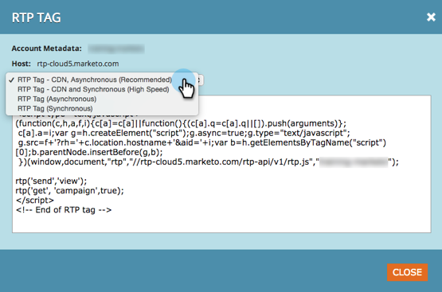

# リリースノート：2015 年 1 月 {#release-notes-january}

2015 年 1 月リリースには、次の機能が含まれています。お客様のご契約により、制限やオプションの契約が必要なものがあります。詳細は担当の営業にお問い合わせください。リリース後は、各機能に関する詳細な記事へのリンクを必ずご確認ください。

## マーケティング自動処理の更新 {#marketing-automation-updates}

**モバイル対応のランディングページ**

ランディングページエディターから[ランディングページ用のモバイルビューの作成](/help/marketo/product-docs/demand-generation/landing-pages/free-form-landing-pages/add-a-mobile-view-for-your-free-form-landing-page.md)をおこなうことができます。デバイスに関係なく効果的にメッセージを配信し、コンテンツを調整して、外出先で簡単に使えるようにすることで、エンゲージメントを高めます。この機能は、リリース後の週を通じて徐々に展開されます。

[- ランディングページのチュートリアルビデオ -](https://youtu.be/aPQHlG2X6c0)

**新規 ReST API 呼び出し**

リードおよびアクティビティ ReST API の 3 つの新しい呼び出し：

* リードの削除
* プログラム ID でリードを取得
* 削除済みリードの取得

また、「リードを同期」には、より高速な API 呼び出しでリード変更を非同期で書き込む新しいオプションが追加されました。詳細は、リリース後に [developers.marketo.com](https://developers.marketo.com) で確認できます

**メールスクリプトのカスタムオブジェクトサポート**

メールスクリプト内でアカウントオブジェクトに関連付けられたカスタムオブジェクトにアクセスできるようになりました

## リアルタイムパーソナライズ {#real-time-personalization}

**パーソナライズドリマーケティング（Google および Facebook）**

リマーケティングでは、ウェブサイトを訪問した人に広告を表示します。[Google](/help/marketo/product-docs/web-personalization/website-retargeting/personalized-remarketing-in-google.md) および [Facebook](/help/marketo/product-docs/web-personalization/website-retargeting/personalized-remarketing-in-facebook.md) でリアルタイムパーソナライゼーションのデータを使用してリマーケティングキャンペーンをパーソナライズできるようになりました。様々な業界のオーディエンス、アカウントリスト、企業規模、または既知のリードからの任意のデータにリマーケティングします。

[アカウントリストモジュール](/help/marketo/product-docs/web-personalization/account-based-web-marketing/create-a-new-account-list.md)

重点顧客モジュールの機能強化により、ユーザーの一致率と検証が向上します。次の追加が含まれます。

* リードのメールアドレスを使用してアカウントリストから組織を照合（RTP のみの顧客も対象）
* 顧客あたり最大 100,000 件のレコードをサポート
* 表示およびダウンロードする CSV ファイルテンプレート

**RTP タグオプションを更新しました**

「アカウント設定」の「RTP タグ」オプションが更新され、次の項目が含まれるようになりました。

1. CDN と非同期（推奨タグ）
1. CDN と同期（高速）
1. CDN を使用しない非同期タグ
1. CDN を使用しない同期タグ

最高のパフォーマンスを得るには、web ページのヘッダーの上部の、`<head>` の後にタグを配置することをお勧めします。すべてのタグで [RTP API](https://developers.marketo.com/documentation/websites/rtp-js-api/) を使用することができます。RTP タグの配備方法については、[こちら](/help/marketo/product-docs/web-personalization/rtp-tag-implementation/deploy-the-rtp-javascript.md)を参照してください。

