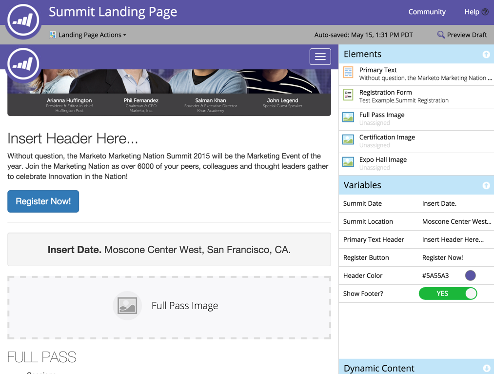

# リリースノート：2015年5月 {#release-notes-may}

2015年5月リリースには、次の機能が含まれています。 利用可能な機能についてはお使いの Marketo のエディションをご確認ください。 リリース後は、各機能に関する詳細な記事へのリンクを必ずご確認ください。

## 完全レスポンシブランディングページ

[完全レスポンシブランディングページ](/help/marketo/product-docs/demand-generation/landing-pages/guided-landing-pages/create-a-guided-landing-page.md)

新しいランディングページ編集モードとテンプレート構文がリリースされます。 アドビの「フリーフォーム」ランディングページエディターとは異なり、新しい「ガイド付き」ランディングページエディターは、完全レスポンシブランディングページを編集するための構造化された編集エクスペリエンスを提供します。

## メールプログラムの中止

[メールプログラムの中止](/help/marketo/product-docs/email-marketing/email-programs/email-program-actions/abort-email-program.md)

メールプログラムを開始する前に「送信」を押しましたか？ 新しい「メールプログラムを中止」ボタンを押してストップすることができます。 これは、実行中のメールプログラムを途中で停止するものです。

## メール配信  {#email-deliverability}

Marketo は、追加されたドメインに対して、自動化された [!DNL SPF] および [!DNL DKIM] チェックを毎週実行します。 通知を確認して、常にこの状態に保ちます。

## メールテンプレート動作の変更 {#email-template-behavior-change}

このリリース以降、新しいメールを作成する際に、有効な HTML コメントが許可され、削除されなくなりました。

## RTP：セグメントエディターのドラッグアンドドロップ {#rtp-drag-and-drop-segment-editor}

RTP：[セグメントエディターのドラッグアンドドロップ](/help/marketo/product-docs/web-personalization/using-web-segments/web-segments.md)

条件をセグメントビルダーにドラッグ&amp;ドロップし、値を定義すると、リアルタイムセグメントを作成する準備が整います。

## RTP：予想コンテンツのレコメンデーション {#rtp-predictive-content-recommendations}

[予想コンテンツのレコメンデーション](/help/marketo/product-docs/predictive-content/enabling-predictive-content/enable-predictive-content-for-web-rich-media.md)

RTP の機械学習および予測分析アルゴリズムを使用して、適切な見込み客に的確なコンテンツをレコメンデーションします。 画像とテキストの説明を使用してコンテンツアセットを視覚的に拡張し、複数のコンテンツアセットをレコメンデーションします。
