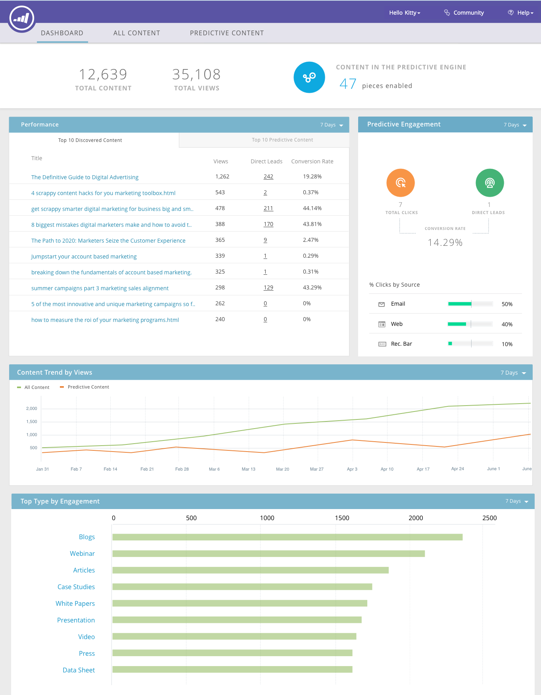
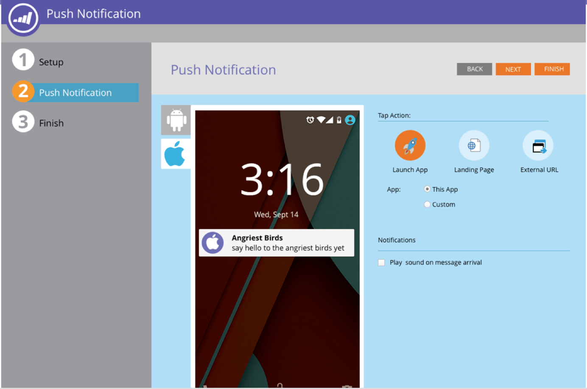

# リリースノート：2016年秋 {#release-notes-fall}

16年秋リリースには、次の機能が含まれています。 お客様のご契約により、制限やオプションの契約が必要なものがあります。詳細は担当の営業にお問い合わせください。 各機能の詳細な記事を表示するには、タイトルリンクをクリックしてください。

## メール用[!UICONTROL 予測コンテンツ] {#predictive-content-in-email}

[!UICONTROL 予測コンテンツ]アプリケーションでは、web チャネルやメールチャネルをまたいで機械学習や予測アルゴリズムを通じて、コンテンツを追跡、管理、提案する新しいユーザエクスペリエンスが提供されます。

>[!NOTE]
>
>予測モジュールを使用しているすべての顧客に対して 1月10日までに有効になります。

メールに予測コンテンツを追加できるようになりました。 受信者はメールを開くと関連する推奨コンテンツを自動的に受け取るため、コンテンツのエンゲージメントとコンバージョンを高めるのに役立ちます。

## [Facebook オフラインコンバージョン](/help/marketo/product-docs/demand-generation/facebook/understanding-facebook-offline-conversions.md) {#facebook-offline-conversions}

[!DNL Facebook] オフラインコンバージョン統合では、Marketo（リード広告リード用）のコンバージョンデータが [!DNL Facebook] に自動的に送り返されるので、広告チームが広告費用をより最適化できます。 この [!DNL Facebook] Ad Manager レポートでは、オフラインのコンバージョンが強調表示されます。

## ユニバーサル ID {#universal-id}

ユニバーサル ID を使用すると、1 回のログインで複数の Marketo 購読にアクセスし、すばやく購読を切り替えることができます。 1 つのコミュニティプロファイルを、すべてのサブスクリプションで使用できます。

>[!NOTE]
>
>この機能を有効にするには、Marketo サポートにお問い合わせください。

## Marketo アカウントベースドマーケティングの強化 {#marketo-account-based-marketing-enhancements}

アカウント所有者、営業開発担当者、事業開発担当者、顧客サクセスマネージャーなど、アカウントチームをアカウントベースドマーケティング（ABM）の重点顧客に割り当てることができるようになりました。 また、アカウント所有者固有のアカウントリストを作成し、パーソナライズされた週別の ABM レポートをアカウントチームに送信することもできます。

**REST API**

また、このリリースでは、Marketo REST API を使用して、ABM で重点顧客属性とアカウントスコアを管理することもできます。 API 操作の詳細については、[Marketo 開発者 web サイト](https://developers.marketo.com/rest-api/lead-database/named-accounts)にアクセスしてください。

## [監査記録の強化](/help/marketo/product-docs/administration/audit-trail/change-details-in-audit-trail.md) {#audit-trail-enhancements}

監査記録は、Marketo サブスクリプション内でおこなわれた変更の包括的な履歴を提供します。 プログラムの追跡機能を追加し、スマートキャンペーン、スマートリスト、ユーザおよびロールに加えられた変更に関する重要な変更の詳細を提示する機能を追加しました。

## 新しい権限

**メールをオペレーショナルメールにする**

登録解除したユーザに対してトランザクションメールが送信される心配がなくなりました。 どのユーザがメールをオペレーショナルメールにしたり、オペレーショナルメールを編集したりできるかを指定できるようになりました。

**キャンペーン制限の編集**

強制できない[キャンペーン制限](/help/marketo/product-docs/administration/email-setup/enable-person-restrictions-for-smart-campaigns.md)を設定する理由はありません。 キャンペーンの制限を設定して、1 つのキャンペーンでターゲットに設定できるユーザ数をデータベース内で制限する場合、キャンペーンをスケジュールする際に、これらの設定を上書きできるユーザを制限できるようになりました。

## [モバイルプッシュ通知のサウンド](/help/marketo/product-docs/mobile-marketing/push-notifications/configure-mobile-push-notification.md) {#sound-for-mobile-push-notifications}

サウンドを有効にして、iOS のプッシュ通知を充実させます。 この新機能を使用すると、モバイルデバイスにプッシュ通知が表示されたときにサウンドをトリガーできます。

>[!NOTE]
>
>* デバイスの所有者は、デバイス設定でサウンドが再生されるのを防ぐことを選択できます。また、アプリデベロッパーは、アプリ内でデバイスの所有者に対して、サウンドが再生されないようにするオプションを提供できます。
>* Android デバイスにプッシュ通知が表示されると、サウンドが自動的に再生されます。

## [Salesforce 暗号化と互換性のあるセールスインサイト](/help/marketo/product-docs/marketo-sales-insight/msi-for-salesforce/installation/install-marketo-sales-insight-package-in-salesforce-appexchange.md) {#sales-insight-compatible-with-salesforce-encryption}

Market [!DNL Sales Insight] は、[!DNL Salesforce] Shield Encryption と互換性を持つようになりました。 [!DNL Sales Insight] を使用中の顧客は、[&#x200B; [!DNL Appexchange] で利用可能な](https://appexchange.salesforce.com/listingDetail?listingId=a0N30000001SVZmEAO)最新の管理パッケージ（バージョン 1.4359.2）にアップグレードする必要があります。

## [重点顧客 API](https://developers.marketo.com/rest-api/lead-database/named-accounts/) {#named-accounts-apis}

このリリースでは、Marketo ABM ユーザは重点顧客 API を介して重点顧客を管理できます。 重点顧客の作成、更新、削除、ABM 重点顧客スコアの読み取りと更新が可能です。

## [メールエディター v2.0 API のサポート](https://developers.marketo.com/rest-api/assets/emails/) {#email-editor-v-api-support}

Marketo REST API を使用して、v2.0 形式のメールの変数とモジュールを管理します。

## [Marketo Salesforce 同期の変更](https://nation.marketo.com/docs/DOC-3840) {#changes-to-marketo-salesforce-sync}

Marketo の [!DNL Salesforce] 統合は進化し、Marketo フィールドを [!DNL Salesforce] と同期する方法が改善されています。 必要に応じて、大量のフィールドを同期する代わりに、含めるフィールドを選択して選択することができます。 詳細は、[https://nation.marketo.com/docs/DOC-3840](https://nation.marketo.com/docs/DOC-3840) でドキュメントをご覧ください。
