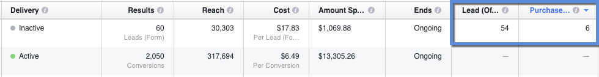

# リリースノート：16年秋 {#release-notes-fall}

Fall &#39;16リリースには、次の機能が含まれています。 お客様のご契約により、制限やオプションの契約が必要なものがあります。詳細は担当の営業にお問い合わせください。各機能の詳細な記事を表示するには、タイトルリンクをクリックしてください。

## Eメールの予測コンテンツ {#predictive-content-in-email}

Predictive Contentアプリケーションの新しいユーザーエクスペリエンスにより、WebチャネルやEメールチャネルの機械学習アルゴリズムと予測アルゴリズムを通じて、コンテンツを追跡、管理、レコメンデーションできます。

>[!NOTE]
>
>予測モジュールを使用しているすべてのお客様は、1月10日までに有効になります。

Eメールに予測コンテンツを追加できるようになりました。 Eメールを開くと、コンテンツのエンゲージメントとコンバージョンを高めるのに役立つ、関連性の高いレコメンデーションコンテンツを受信者が自動的に受け取ります。

## [Facebook オフラインコンバージョン](/help/marketo/product-docs/demand-generation/facebook/understanding-facebook-offline-conversions.md) {#facebook-offline-conversions}

facebook Offline Conversionsの統合により、Marketoのコンバージョンデータ（リード広告のリード用）は、広告チームが広告費用を最適化できるように、Facebookに自動的に送り返されます。 このFacebook Ad Managerレポートでは、オフラインコンバージョンが強調表示されます。

## [ユニバーサル ID](/help/marketo/product-docs/administration/settings/using-a-universal-id-for-subscription-login.md) {#universal-id}

ユニバーサルIDを使用すると、1回のログインで複数のMarketo購読にアクセスし、すばやく購読を切り替えることができます。 1つのコミュニティプロファイルをすべてのサブスクリプションに使用できます。

>[!NOTE]
>
>この機能を有効にするには、Marketoサポートにお問い合わせください。

## Marketo Account Based Marketingの機能強化 {#marketo-account-based-marketing-enhancements}

アカウントチームを、アカウント所有者、営業開発担当者、事業開発担当者、カスタマーサクセスマネージャーなど、アカウントベースマーケティング(ABM)の名前付きアカウントに割り当てることができるようになりました。 また、アカウント所有者固有のアカウントリストを作成し、パーソナライズされた週別ABMレポートをアカウントチームに送信することもできます。

**REST API**

また、このリリースでは、Marketo REST APIを使用して、ABMの名前付きアカウント属性とアカウントスコアを管理することもできます。 API操作の詳細については、[Marketo DevelopersのWebサイト](https://developers.marketo.com/rest-api/lead-database/named-accounts)を参照してください。

## [監査記録の強化](/help/marketo/product-docs/administration/audit-trail/change-details-in-audit-trail.md) {#audit-trail-enhancements}

監査証跡は、Marketoサブスクリプション内でおこなわれた変更の包括的な履歴を提供します。 プログラムの追跡機能を追加し、スマートキャンペーン、スマートリスト、ユーザーおよび役割に対する変更の重要な変更の詳細を提示しました。

## [新しく追加された権限](/help/marketo/product-docs/administration/users-and-roles/managing-user-roles-and-permissions/descriptions-of-role-permissions.md) {#new-permissions}

**メールをオペレーショナルメールにする**

データベース内の購読解除済みのユーザーにトランザクションEメールを送信するユーザーについて心配する必要が生じた日々は終わりました。 Eメールを操作可能にするユーザーを指定したり、操作可能なEメールを編集したりできるようになりました。

**キャンペーン制限の編集**

強制できない場合は、なぜ[キャンペーンの制限](/help/marketo/product-docs/administration/email-setup/enable-person-restrictions-for-smart-campaigns.md)を設定するのですか？ キャンペーンの制限設定を使用して、1つのキャンペーンのターゲットに設定できるユーザー数をデータベース内で制限する場合、キャンペーンのスケジュール時にこれらの設定を上書きできるユーザーを制限できるようになりました。

## [モバイルプッシュ通知のサウンド](/help/marketo/product-docs/mobile-marketing/push-notifications/configure-mobile-push-notification.md) {#sound-for-mobile-push-notifications}

サウンドを有効にして、iOSのプッシュ通知に豊富さを加えます。 この新機能を使用すると、プッシュ通知がモバイルデバイスにトリガーされたときにサウンドを表示できます。

>[!NOTE]
>
>* デバイスの所有者は、デバイス設定でサウンドが再生されるのを防ぐように選択できます。また、アプリ開発者は、アプリ内でデバイスの所有者にサウンドが再生されないようにするオプションを提供できます。
>* サウンドは、プッシュ通知がAndroidデバイスに表示されると、自動的に再生されます。

## [Salesforce暗号化と互換性のあるSales Insight](/help/marketo/product-docs/marketo-sales-insight/msi-for-salesforce/installation/install-marketo-sales-insight-package-in-salesforce-appexchange.md) {#sales-insight-compatible-with-salesforce-encryption}

Market Sales Insightは、Salesforce Shield Encryptionと互換性があります。 Sales Insightのすべてのお客様は、この最新の管理パッケージ（バージョン1.4359.2）にアップグレードする必要があります。このパッケージは、Appexchange](https://appexchange.salesforce.com/listingDetail?listingId=a0N30000001SVZmEAO)で入手できます。[

## [名前付きアカウントAPI](https://developers.marketo.com/rest-api/lead-database/named-accounts/) {#named-accounts-apis}

このリリースでは、Marketo ABMユーザーは、名前付きアカウントAPIを使用して名前付きアカウントを管理できます。 ユーザーは、名前付きアカウントの作成、更新、削除のほか、ABM名前付きアカウントスコアの読み取りと更新を行うことができます。

## [電子メールエディターv2.0 APIのサポート](https://developers.marketo.com/rest-api/assets/emails/) {#email-editor-v-api-support}

Marketo REST APIを使用して、v2.0形式の電子メールの変数とモジュールを管理します。

## [Marketo Salesforce Syncの変更点](https://nation.marketo.com/docs/DOC-3840) {#changes-to-marketo-salesforce-sync}

MarketoのSalesforce統合は、MarketoフィールドとSalesforceの同期方法を改善するために進化しています。 必要に応じて、必要に応じてまたは不要に応じて大量のフィールドを同期する代わりに、含めるフィールドを選択して選択できます。 詳しくは、こちらのドキュメントをご覧ください。[https://nation.marketo.com/docs/DOC-3840](https://nation.marketo.com/docs/DOC-3840).
