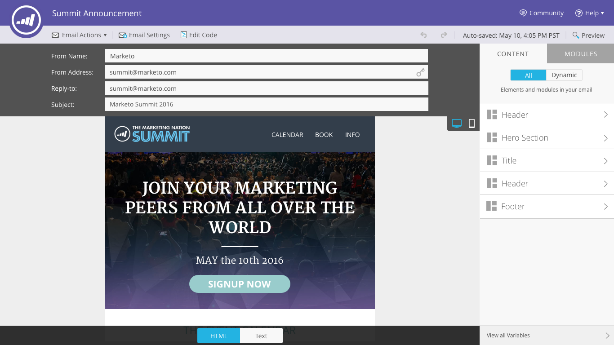
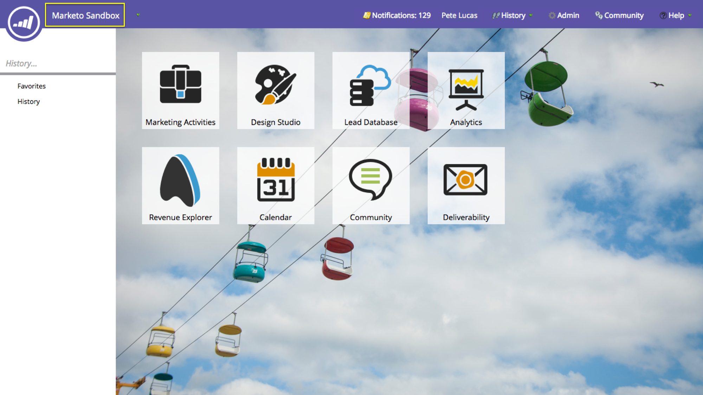

# リリースノート：春&#39;16 {#release-notes-spring}

Spring &#39;16リリースには、次の機能が含まれています。 各機能の詳細な記事を表示するには、タイトルリンクをクリックしてください。

## [メールインサイト](/help/marketo/product-docs/reporting/email-insights/email-insights-overview.md) {#email-insights}

Eメールインサイトは、過去の新しい集計データEメール分析エクスペリエンスで、プロジェクトオリオンの一環として、非常に高速なパフォーマンスを実現するためにエンドツーエンドで再設計されました。 Eメールマーケターのニーズやワークフローに合わせて最適化された、まったく新しいユーザーインターフェイスデザインが特徴です。

>[!NOTE]
>
>6月3日から、顧客に対する電子メールインサイトを一括で開始します。 私たちの目標は、今後数ヶ月間でこれを完了することです。 有効になると、メールで通知します。

## [メールテンプレート選択ツール](/help/marketo/product-docs/email-marketing/general/email-editor-2/email-template-picker-overview.md) {#email-template-picker}

新しいスターターテンプレートを使用して、美しいEメールを作成します。 また、ライブサムネールからテンプレートをすばやく見つけます。

>[!NOTE]
>
>Eメールエディター2.0（テンプレートピッカーを使用）は、6月3日から徐々に展開されます。 6月30日までに公開を完了します。 電子メールインサイトとは異なり、にアクセスできると通知されません。 確認するには、[この記事](/help/marketo/product-docs/email-marketing/general/email-editor-2/transitioning-to-email-editor-2-0.md)の手順に従ってください。

## [Eメール編集 — Re-imagined](/help/marketo/product-docs/email-marketing/general/email-editor-2/email-editor-v2-0-overview.md) {#email-editing-re-imagined}

そう、新しいEメール編集者だ！ 軽量のドラッグ&amp;ドロップ機能を使用して、コンテンツを追加および並べ替えます。 画像、ビデオ、変数、モジュールなどの新しい要素は、必ず編集操作を強化します。 更新されたコードエディター、プレビューア、プレヘッダーのサポートもご確認ください。

## [モバイルアプリ内メッセージ](/help/marketo/product-docs/mobile-marketing/in-app-messages/understanding-in-app-messages.md) {#mobile-in-app-messages}

Marketo内で、アプリに最適なアプリ内メッセージを作成できます。 アプリ内メッセージプログラムで、誰にいつ表示するかを正確に定義します。 プログラムダッシュボードを使用して、パフォーマンスを簡単に監視できます。

## [ドラフトスニペットなし](/help/marketo/product-docs/administration/users-and-roles/managing-user-roles-and-permissions/enable-no-draft-for-snippets.md) {#no-draft-snippets}

スニペットが更新されるたびに、すべてを再承認する必要がある日はなくなりました。 ドラフトなしの場合、スニペットを使用するすべてのEメールとランディングページがスニペットの更新を受け取り、以前のステータスを維持します。 スニペットを承認するたびに、No-Draftを実行してすべてを更新するか、ドラフトを作成するかを選択できます。 君次第だ！ ドラフトなしは、すべてのお客様が利用でき、管理者の新しい権限で管理されます。

## [ランディングページ、ランディングページテンプレートおよびフォームAPI](https://developers.marketo.com/blog/spring-2016-updates/) {#landing-page-landing-page-template-and-form-apis}

Marketo REST APIで、Marketoのランディングページ、ランディングページテンプレートおよびフォームの制御がサポートされるようになりました。 ユーザーは、Marketo REST APIを使用して、これらのアセットの作成、更新、承認および削除を直接おこなえるようになりました。

## [APIアクセス用のIP許可リストに加える](/help/marketo/product-docs/administration/additional-integrations/create-an-allowlist-for-ip-based-api-access.md) {#ip-allowlisting-for-api-access}

MarketoユーザーログインのIP許可リストに加える機能と同様に、Marketo管理者は、Marketo SOAPおよびREST APIにアクセスできるIPアドレスのを設定できるようになりました許可リスト。その結果、権限のないIPアドレスからのアクセスがブロックされます。 これにより、Marketoインスタンスにセキュリティの強化層が提供され、APIへのアクセスは組織のネットワーク内からのみ可能になります。 この設定方法の詳細については、[Marketoのドキュメントサイト](/help/marketo/product-docs/administration/additional-integrations/create-an-allowlist-for-ip-based-api-access.md)を参照してください。

## [新しい高速Microsoft Dynamics Syncコネクタ](/help/marketo/product-docs/crm-sync/microsoft-dynamics-sync/microsoft-dynamics-sync-details/sync-status.md) {#new-high-speed-microsoft-dynamics-sync-connector}

Orionアーキテクチャの上に構築された新しい高速Dynamicsコネクタは、初期同期の場合は最大20倍、増分同期の場合は最大5倍の速さを提供します。 新規のお客様はすべて、リリース日にこのコネクタにオンボーディングし、夏のリリース期間中に既存のお客様に徐々に展開します。

**新しいフィールドのデータを更新する**:これで、任意の時点で新しい同期フィールドを有効にでき、そのフィールドのすべてのデータ値がDynamics CRMからMarketoに更新されます。初回セットアップ時にすべてのフィールドを選択する必要が生じる心配はなくなりました。 既存の同期フィールドを無効にし、後で再度有効にすると、そのフィールドのすべてのデータ値がDynamics CRMからMarketoに更新されます。

**リードを連絡先と同期**:「リードをMicrosoftに同期」フローアクションには、リードまたは連絡先として同期する新しいオプションが追加されました。

**「同期エラー管理」タブ**:操作、方向、エラーコード、エラーメッセージなどの詳細との同期に失敗したリード（およびその他のオブジェクト）の参照、検索、書き出し。

**Microsoft Dynamics 2016**:コネクタは、Dynamics 2016オンラインバージョンおよびオンプレミスバージョンに対して完全に認定されています。

**プラグインのアップデートに関するドキュメントが追加されました。** プラグインのアップデ [ートに関するドキュメントの記事を参照してください](/help/marketo/product-docs/crm-sync/microsoft-dynamics-sync/marketo-plugin-releases-for-microsoft-dynamics.md)。

## [わかりやすいインスタンス名](/help/marketo/product-docs/administration/settings/edit-subscription-settings.md) {#friendly-instance-name}

現在、Marketoインスタンスと実稼動インスタンスを区別するのは困難です。 この機能を使用すると、現在作業中のインスタンスを把握できます。

## [サブスクリプションの時間制限アクセス](/help/marketo/product-docs/administration/users-and-roles/managing-marketo-users.md) {#limited-time-access-for-subscriptions}

現在、ユーザーはMarketoのサブスクリプションに無期限に招待されています。 この機能を使用すると、管理者は、2週間や1ヶ月など、期間限定の購読をユーザーに招待できます。

## [カスタムオブジェクトグリッド](/help/marketo/product-docs/administration/marketo-custom-objects/understanding-marketo-custom-objects.md) {#custom-objects-grid}

これで、すべての公開済みカスタムオブジェクトのレコード数とフィールド数を表示できます。

## カスタムアクティビティ {#custom-activities}

Marketo管理者は、Marketo Custom Activity Definitionモデラーを使用して、カスタムアクティビティタイプを定義および管理できるようになりました。 Marketo Custom Object Modelerと同様（およびとも）、管理者は、ビジネスニーズに合わせてデータモデルを拡張できるようになりました。 この機能の使用方法の詳細については、[Marketoのドキュメントサイト](/help/marketo/product-docs/administration/marketo-custom-activities/understanding-custom-activities.md)を参照してください。
