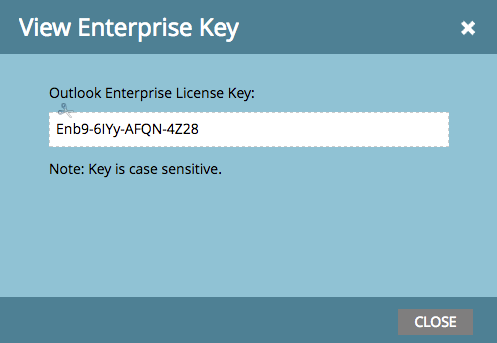

# リリースノート：2016 年夏 {#release-notes-summer}

2016 年夏リリースには、次の機能が含まれています。お客様のご契約により、制限やオプションの契約が必要なものがあります。詳細は担当の営業にお問い合わせください。各機能の詳細な記事を表示するには、タイトルリンクをクリックしてください。

## [アカウントベースドマーケティング](https://docs.marketo.com/display/docs/account+based+marketing) {#account-based-marketing}

Marketo のアカウントベースドマーケティングは、1 つの統合プラットフォームですべての基本事項を提供します。

* **ターゲット** - 顧客検出、リードから顧客への照合、アカウントリスト
* **エンゲージ** - アカウントベースのパーソナライゼーション、クロスチャネルのエンゲージメント、アカウント固有のワークフロー
* **測定** — 顧客とリストレベルのインサイト、顧客のエンゲージメントスコア、パイプラインと売上高への影響

>[!NOTE]
>
>ABM は Marketo サブスクリプションのアドオンとして利用できるので、実装するには営業担当にお問い合わせください。

## [監査証跡](/help/marketo/product-docs/administration/audit-trail/audit-trail-overview.md) {#audit-trail}

監査証跡は、Marketo サブスクリプション内でおこなわれた変更の包括的な履歴を提供します。これにより、ユーザーや管理者間で説明責任を作成し、予期しない行動の原因を特定し、誰がいつ何をしているかを知るセキュリティが確保されます。この情報は、いつでも使用可能で、次のような質問に回答するために使用できます。

* このアセットまたは設定に何が起きたか、最後に更新したのは誰か。
* ユーザー X は何をしているのか。
* アカウントにログインしているのは誰か。

## [Marketo-Vibes SMS LaunchPoint の統合](/help/marketo/product-docs/mobile-marketing/vibes-sms-messages/create-a-vibes-sms-message.md) {#marketo-vibes-sms-launchpoint-integration}

Marketo 内で SMS メッセージを簡単に作成できます。リッチ Marketo データを使用してメッセージをパーソナライズおよびターゲット設定し、SMS メッセージダッシュボードを使用してパフォーマンスを簡単に監視します。

>[!NOTE]
>
>この機能を使用するには、既存の Vibes SMS アカウントが必要です。

## [Email 2.0 の強化](/help/marketo/product-docs/email-marketing/general/email-editor-2/email-editor-v2-0-overview.md) {#email-enhancements}

**モジュールレベルの変数**

以前は、メール 2.0 テンプレートで指定されたすべての変数の範囲は「グローバル」でした。モジュール内で変数を使用する場合、これはモジュールの複数のインスタンスを使用する予定があるときには必ずしも望ましいとは限りません。このリリースでは、変数を「モジュールレベル」として指定できるようになり、使用するモジュールごとに一意の値を設定できるようになります。

**構文の更新**

* メール 2.0 テンプレートで指定されたモジュールで「mktoAddByDefault」を使用して、新しいメールにデフォルトで表示するモジュールを指定できるようになりました。これは、多数のモジュールを含むメールテンプレートを作成する場合に、はるかに便利です。
* 画像要素で、基になる ``HTML 要素の「height」および「width」プロパティは、エンドユーザーに対してロックダウンまたは編集可能にする必要があります。「mktoLockImgSize=“true”」を指定すると、画像が変更された場合でも高さと幅がロックされます。同様に、「mktoLockImgStyle=“true”」を指定すると、「style」プロパティがロックされます。

**コード検索**

新しい検索機能を使用して、メールコード内のコンテンツを効率的に検索および置換できます。この機能は、メールテンプレートエディターでも使用できます。

**画像要素でのトークンのサポート**

トークンを画像挿入エクスペリエンスの「外部 URL」領域で使用できるようになりました。画像を `{{my.tokens}}` で指定すると、これらのトークンをメールエディター 2.0 内で参照できるようになりました。メールエディター 2.0 キャンバスには、画像が壊れて表示されます。ただし、メールを送信する前に、プレビューとサンプルの送信でレンダリングされているのが確認できます。

## 複数のブランディングドメイン {#multiple-branding-domains}

メールトラッキングリンクを複数のブランディングドメインでブランディングできるようになりました。複数のブランディングドメインを追加して、消費者の信頼感を高め、より合理化された外観を作成してブランドに焦点を当て、メールの配信品質を向上させ、メール単位で選択して、各メールのトラッキングリンクに使用できるようになりました。

## [プログラムトークン](/help/marketo/product-docs/demand-generation/landing-pages/personalizing-landing-pages/tokens-overview.md) {#program-tokens}

プログラムの新しいトークンの種類が作成されました。アセットとスマートキャンペーンのフローステップで、プログラム名、説明および ID をレンダリングできるようになりました。

## [エンタープライズキー](/help/marketo/product-docs/marketo-sales-insight/msi-outlook-plugin/authorize-the-marketo-outlook-plugin.md) {#enterprise-key}

Outlook 用の Sales Insight をインストールするようにセールスチームの各メンバーに要求するのは、面倒な場合があります。エンタープライズキーを使用して Outlook 用のプラグインをリモートでインストールする新しい方法が導入されました。管理者の Marketo Sales Insight セクションにある固有のキーを IT チームに送信し、残りの作業をおこなってもらいます。

## [ウェブパーソナライズキャンペーン](/help/marketo/product-docs/web-personalization/working-with-web-campaigns/create-a-new-dialog-web-campaign.md) {#web-personalization-campaigns}

ウェブサイト上で web キャンペーンが反応するまでの時間を指定します。

## [コンテンツ分析＆レコメンデーションのエクスポート](/help/marketo/product-docs/web-personalization/understanding-web-personalization/understanding-content-analytics.md) {#content-analytics-and-recommendations-export}

コンテンツ分析＆レコメンデーションデータをオンラインで表示.

## [Email Editor 2.0 用の API サポート](https://developers.marketo.com/documentation/asset-api/) {#api-support-for-email-editor}

以前は v1.0 のメールとテンプレートとのみ互換性があった、既存の Asset API が v2.0 のメールアセットで有効になりました。

## [Marketo デベロッパーサイト](https://developers.marketo.com/) {#marketo-developers-site}

デベロッパーサイトをリニューアル

## [プライバシー設定](/help/marketo/product-docs/administration/settings/understanding-privacy-settings.md) {#privacy-settings}

マーケターは、プライバシー設定を使用して、Munchkin とウェブパーソナライズ機能を使用して訪問者を追跡するかどうかを決定できます。トラッキングレベルは、ブラウザーの「Do Not Track」設定、オプトアウト Cookie、特定でない IP を使用して制御します。これらの方法は、特定の分野での Marketo の価値や機能に影響を与える可能性がありますが、マーケターが何も変更しない場合、Marketo の機能は変わりません。

この機能は、6 週間の間に徐々にリリースされます。すぐに必要な場合は、Marketo サポートにお問い合わせください。
