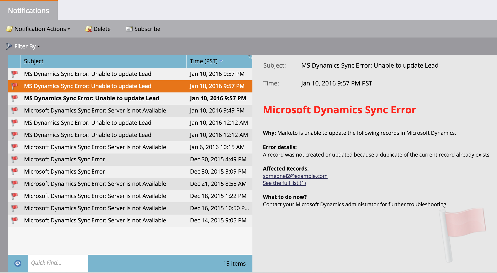
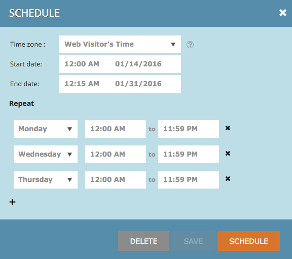

# リリースノート：16年冬 {#release-notes-winter}

16年冬リリースには、次の機能が含まれています。各機能の詳細な記事を表示するには、タイトルリンクをクリックしてください。

## [匿名フィルター](/help/marketo/product-docs/administration/additional-integrations/add-munchkin-tracking-code-to-your-website/next-generation-munchkin-tracking-faq.md) {#is-anonymous-filter}

スマートリストの匿名フィルターが削除されました。 詳しくは、[次世代マンチキントラッキングのFAQ](/help/marketo/product-docs/administration/additional-integrations/add-munchkin-tracking-code-to-your-website/next-generation-munchkin-tracking-faq.md)ドキュメントを参照してください。 この変更は、匿名のWeb訪問者と既知のWeb訪問者を引き続き識別し、これらの訪問者に対してリアルタイムでコンテンツをパーソナライズするWebパーソナライゼーション(RTP)には影響しません。

## [データベースダッシュボード](/help/marketo/product-docs/core-marketo-concepts/smart-lists-and-static-lists/managing-people-in-smart-lists/database-dashboard.md) {#database-dashboard}

リードデータベースには、合計人物データベースのサイズ、マーケティング可能なリードの数、上位5つのソースによるリードの分類を含む、更新されたサマリダッシュボードがあります。

## [Microsoft Edge ブラウザ](/help/marketo/product-docs/administration/setup-administration/supported-browsers.md) {#microsoft-edge-browser}

Marketoでサポートされているブラウザー](https://docs.marketo.com/display/public/DOCS/Supported+Browsers)の[リストにMicrosoft Edgeを追加しました。

## [Microsoft Outlook 2016](/help/marketo/product-docs/marketo-sales-insight/msi-outlook-plugin/install-the-marketo-email-add-in-for-outlook-with-a-registration-code.md) {#microsoft-outlook}

[Microsoft Outlook 2016](/help/marketo/product-docs/marketo-sales-insight/msi-outlook-plugin/install-the-marketo-email-add-in-for-outlook-with-a-registration-code.md) がサポートされるようになりました。

## [メールプログラム優先スタート](/help/marketo/product-docs/email-marketing/email-programs/email-program-actions/head-start-for-email-programs.md) {#email-program-head-start}

「ヘッドスタート」を使用して、送信の処理を事前におこなう必要があることを示します。 ヘッドスタートでは、プログラムの予定時刻にリードの資格を得てEメールを準備する代わりに、これらのタスクが事前に実行されていることを確認します。 これにより、オーディエンスはスケジュールされた時刻にEメールの受信を開始します。

この機能を使用するには、電子メールプログラムを12時間以上前にスケジュールし、スマートリストは送信の12時間前にロックされる必要があります。

>[!NOTE]
>
>この機能は、16年冬のリリース以降、1週間徐々に公開される予定です。 スマートキャンペーンまたはAPIでは使用できません。

## [モバイルマーケティングの強化](/help/marketo/product-docs/mobile-marketing/admin/add-a-mobile-app.md) {#mobile-marketing-enhancements}

**PhoneGapのサポート：** モバイルアプリのPhoneGapサポートを提供するようになりました。[詳細情報](https://developers.marketo.com/documentation/mobile/phonegap-plugin/)

**サンドボックスアプリのサポート**:

## [プログラム API](https://developers.marketo.com/documentation/programs/) {#program-api}

REST API を介したプログラムの作成、更新、複製. これには、プログラム内でのスマートリストおよびスマートキャンペーンの作成または更新は含まれません。

## [Microsoft Dynamics の強化](/help/marketo/product-docs/crm-sync/microsoft-dynamics-sync/microsoft-dynamics-sync-details/sync-status.md) {#microsoft-dynamics-enhancements}

**[同期ステータス](/help/marketo/product-docs/crm-sync/microsoft-dynamics-sync/microsoft-dynamics-sync-details/sync-status.md)**:同期プロセスの現在のスループットとバックログをタブに保持します。挿入数で分類し、オブジェクト別に更新します。

**[通知](/help/marketo/product-docs/core-marketo-concepts/miscellaneous/understanding-notifications/notification-types.md)**:一般的な同期エラーの通知と、そのエラーを持つリードのリストを取得します。

## [カスタムオブジェクトの強化](/help/marketo/product-docs/administration/marketo-custom-objects/create-marketo-custom-objects.md) {#custom-objects-enhancements}

複数のリンクフィールドを持つ中間オブジェクトを使用して、リード/アカウントとカスタムオブジェクトの間に多対多の関係を作成できるようになりました。

## [Facebook リード広告](/help/marketo/product-docs/demand-generation/facebook/set-up-facebook-lead-ads.md) {#facebook-lead-ads}

[Facebookのリ](https://www.facebook.com/business/a/lead-ads) ードアドザアは、Facebookでリードジェネレーションキャンペーンを実行する、より直接的な方法です。人々は製品やサービスに対する関心を表すフォームに記入し、ビジネスをフォローアップできます。 MarketoとFacebook Lead Adsの統合により、リードがリード広告フォーム内で提供する情報が自動的に取り込まれます。 その後、新しい「Facebookリード広告を記入」トリガーを使用して、フォローアップのアクションと通知を自動化できます。

## [Web（リアルタイムパーソナライゼーション）キャンペーンスケジューラー](/help/marketo/product-docs/web-personalization/working-with-web-campaigns/schedule-a-web-campaign.md) {#web-real-time-personalization-campaign-scheduler}

事前にキャンペーンのスケジュールを設定します。 パーソナライズされたWebコンテンツの開始日と終了日を設定し、特定の日時にキャンペーンを繰り返します。 Web訪問者の時間または選択したタイムゾーンに従ってキャンペーンを表示するスケジュールをパーソナライズします。

