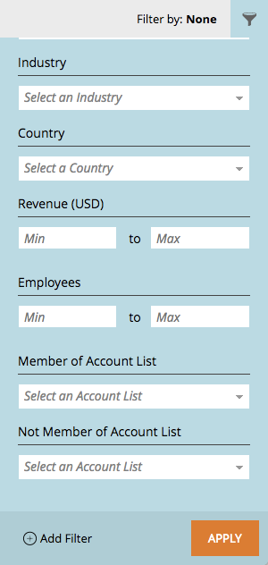

# リリースノート：2017 年 4 月 ABM の機能強化 {#release-notes-april-abm-enhancements}

2017 年 4 月の ABM 機能強化リリースには、次の機能が含まれています。機能の可用性についてはお使いの Marketo のエディションをご確認ください。

## CRM にマッピングされた標準フィールドの同期 {#synching-of-crm-mapped-standard-fields}

Marketo ABM は CRM に関連する動作を変更しています。今後、Marketo ABM は、ABM アカウントと CRM のアカウントの間に 1 対 1 の関係を確立し、維持します。これにより、Marketo がマッピングされたアカウントフィールドを CRM と同期し続けることができます。

## CRM 検出用のカスタムフィールド {#custom-fields-for-crm-discovery}

カスタムフィールドをアカウントに追加し、CRM にマッピングして、Marketo での CRM アカウント検出に使用できるようになりました。

## 重点顧客グリッドの顧客ベースフィルター {#account-based-filters-in-the-named-account-grid}

顧客リストに基づいて重点顧客を簡単にフィルタリングできるようになりました。

