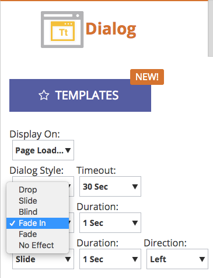

# リリースノート：2017年春 {#release-notes-spring}

17 年春リリースには、次の機能が含まれています。利用可能な機能についてはお使いの Marketo のエディションをご確認ください。

各機能の詳細な記事を表示するには、タイトルリンクをクリックしてください。**メモ**：トピックに複数のサブ見出しが含まれる場合、リンクはそこに配置されます。

## [LinkedIn リードジェネレーションフォーム](/help/marketo/product-docs/demand-generation/social/social-functions/set-up-linkedin-lead-gen-forms.md) {#linkedin-lead-gen-forms}

[[!UICONTROL LinkedIn Lead Gen]Forms](https://business.linkedin.com/marketing-solutions/native-advertising/lead-gen-ads) は、企業が [!DNL LinkedIn] でリードジェネレーションキャンペーンを実行するためのより直接的な方法です。 リードが製品やサービスに対する関心を表すフォームに入力し、ビジネスは個人の詳細を取得し、Marketo に同期できます。この場合、自動フォローアッププロセスやリードルーティングアクティビティが発生します。

Marketoと [!UICONTROL LinkedIn リード生成 ] の統合により、Formsはリードがリード生成フォーム内で提供する情報を自動的にキャプチャします。 その後、新しい **フォームへの入力**&#x200B;トリガーとフィルターを使用して、フォローアップの操作 [!DNL LinkedIn Lead Gen] 通知を自動化できます。

## [MSI テンプレートの有効期限設定](/help/marketo/product-docs/marketo-sales-insight/msi-for-salesforce/features/actions-in-the-msi-panel/send-marketo-email/publish-an-email-to-sales-insight.md) {#expire-msi-template}

[!DNL Sales Insight] で古いテンプレートをクリーンアップする時代は終わりました。 メールを公開する際に有効期限を設定します。有効期限が切れると、自動的に非公開になります。

>[!NOTE]
>
>有効期限を 2017 年 5 月 31 日に設定すると、2017 年 5 月 31 日の終わりにテンプレートが [!DNL Sales Insight] から削除されます。

## [リードとアクティビティを API で一括抽出](https://developers.marketo.com/rest-api/bulk-extract/) {#bulk-extract-apis-for-people-and-activities}

Marketo から外部システムに、大量のリードおよびアクティビティデータを簡単に転送できます。

## ABM の機能拡張 {#abm-enhancements}

**[ABM 重点顧客のカスタムフィールド](https://docs.marketo.com/x/1wnG)**

Marketo ABM で、重点顧客に最大 10 個のカスタムフィールドを作成できるようになりました。これらのカスタムフィールドを CRM アカウントオブジェクトのフィールドにマップすると、Marketo ABM がデータを同期し、ABM 重点顧客を拡張してマーケティングを促進できます。

**[ABM 重点顧客のパーセンタイル値](https://docs.marketo.com/display/docs/assets/abmpercentiles.png)**

重点顧客のスコアは大きく異なる場合があります。Marketo ABM は各スコアのパーセンタイルを自動的に計算するようになり、重点顧客に対する各重点顧客のランク付けを一目で確認できます。

**[ABM 顧客リスト API](https://developers.marketo.com/rest-api/lead-database/named-account-lists/)**

重点顧客用に強化された API サポートを備えた豊富で堅牢な ABM パートナー統合を活用してください。

## ウェブパーソナライズの機能拡張 {#web-personalization-enhancements}

**[スクロール後の web キャンペーン](/help/marketo/product-docs/web-personalization/working-with-web-campaigns/set-how-your-web-campaign-displays.md)**

新しい web キャンペーンの効果により、web 訪問者に対して、よりパーソナライズされたエクスペリエンスを提供します。Web 訪問者が Web ページを下にスクロールした場合にのみ表示されるように、パーソナライズした [!UICONTROL Web キャンペーン ] を設定します。 スクロール時に表示するダイアログ [!UICONTROL Web キャンペーン ] を、以下に基づいて設定できます。

* スクロールされたページの割合
* 到達したピクセル
* ページのフォールドの下にスクロール

**[エグジットインテント後の web キャンペーン](/help/marketo/product-docs/web-personalization/working-with-web-campaigns/set-how-your-web-campaign-displays.md)**

訪問者がページを閉じる前に、訪問者の注意を引きます。パーソナライズした [!UICONTROL Web キャンペーン ] を、マウスジェスチャーで訪問者がページから移動していることを示す場合にのみ表示するように設定します。

**[Web キャンペーンのアニメーションエフェクト [!UICONTROL Web キャンペーン]](/help/marketo/product-docs/web-personalization/working-with-web-campaigns/create-a-new-dialog-web-campaign.md)**

ダイアログ web キャンペーンのアニメーション効果を設定して、web ページの開始時または終了時にキャンペーンがどのように表示されるかをカスタマイズします。6 つの異なる効果から選択し、ダイアログのタイミングと方向を制御できます。

**[ダイアログクローズボタンのカスタマイズ](/help/marketo/product-docs/web-personalization/working-with-web-campaigns/create-a-new-dialog-web-campaign.md)**

ダイアログボックスの「閉じる」ボタンをカスタマイズします。透明ダイアログスタイル [!UICONTROL Web キャンペーン ] で使用される様々なオプションから選択します。 「閉じる」ボタンのアイコン、色、位置を選択します。独自のボタン画像を追加することもできます。

**[ウェブキャンペーンのアーカイブ](/help/marketo/product-docs/web-personalization/working-with-web-campaigns/archive-a-web-campaign.md)**

アーカイブは、（Web キャンペーン [!UICONTROL  をアーカイブし、デフォルトの Web キャンペーン ビューから非表示にすることができ ] 新しい Web キャンペーン ステータスです。 これにより、最も関連性の高いアクティブなキャンペーンに焦点を当て、古いアーカイブされたキャンペーンをオンデマンドで取得できます。

**[ローカリゼーション](/help/marketo/product-docs/administration/settings/select-your-language-locale-and-time-zone.md)**

Marketo でサポートされているすべての言語（英語、日本語、ドイツ語、スペイン語、フランス語、ポルトガル語）でウェブパーソナライズを利用できるようになりました。

## 予測機能の強化 {#predictive-enhancements}

**[ローカリゼーション](/help/marketo/product-docs/administration/settings/select-your-language-locale-and-time-zone.md)**

Marketo でサポートされているすべての言語（英語、日本語、ドイツ語、スペイン語、フランス語、ポルトガル語）で予測コンテンツを利用できるようになりました。

## [レガシーリッチテキストエディターおよびフォームエディター 1.0 の廃止](https://nation.marketo.com/docs/DOC-4315) {#legacy-rich-text-editor-and-form-editor-deprecation}

2017年8月1日以降、従来のリッチテキストエディターとフォームエディター 1.0 をまだ使用しているお客様は、新しいエクスペリエンスに自動的に移行されます。
