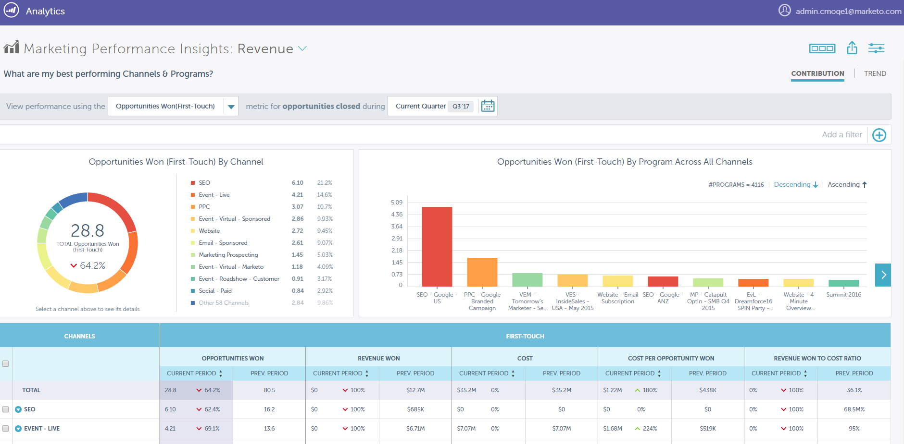

# リリースノート：2018年冬 {#release-notes-winter}

2018年冬リリースには、次の機能が含まれています。 機能の可用性についてはお使いの Marketo のエディションをご確認ください。

各機能の詳細な記事を表示するには、タイトルリンクをクリックしてください。 **注意**：このリリースに含まれる機能の一部には、関連記事がありません。 トピックに複数のサブ見出しが含まれる場合、リンクはそこに配置されます。

## キャンペーンのパフォーマンスおよびスループットの強化 {#campaign-performance-and-throughput-enhancements}

Marketo は、ビッグデータアーキテクチャを活用して、トリガーキャンペーンのスループットを向上させ、web アクティビティの処理を改善して、オーディエンスのアクションに迅速に対応できるようにしています。

## Marketo の [!DNL Salesforce] CRM 統合の強化 {#enhancements-to-marketo-s-salesforce-crm-integration}

[!DNL Salesforce] CRM 統合に対して、次の 2 つの機能強化が行われました。

* 特定の CRM 同期エラー（資格情報の期限切れ、API 制限に達したなど）についての [Marketo 管理者への通知](/help/marketo/product-docs/core-marketo-concepts/miscellaneous/understanding-notifications/notification-types.md)

* リード割り当て時にリード所有者への[メール通知をオフにする機能](/help/marketo/product-docs/crm-sync/salesforce-sync/setup/optional-steps/turn-off-email-notifications-to-lead-owner.md)

これらの改善点は、2018年以降に公開される予定です。

## [Marketo パフォーマンスインサイト](/help/marketo/product-docs/reporting/performance-insights/performance-insights-overview.md) {#marketo-performance-insights}

>[!AVAILABILITY]
>
>[!UICONTROL パフォーマンスインサイト]は、アドオン製品です。 見積もりについては、Marketo カスタマーサクセスマネージャーまたはアカウント担当者にお問い合わせください。

アトリビューション分析、インタラクティブなビジュアライゼーション、詳細なデータテーブルを使用して、キャンペーンとチャネルがビジネス成果に与える影響を調べます。

## アカウントベースのマーケティングの強化 {#account-based-marketing-enhancements}

**[ABM 階層](/help/marketo/product-docs/target-account-management/target/named-accounts/tam-hierarchies.md)**

[!DNL Salesforce] または [!DNL Microsoft Dynamics] を使用する ABM の顧客の場合、ABM は CRM で確立された親子関係を自動的に継承（および表示）するようになります。 これらの関係は、ロールアップレポートとキャンペーン実行の両方で使用できます。

## メールマーケティング {#email-marketing}

**[動的メールスクリプト](/help/marketo/product-docs/email-marketing/general/using-tokens/create-an-email-script-token.md)**

Velocity のスクリプト記述が、動的コンテンツを使用するメールでサポートされました。 Velocity とセグメント化ベースの動的コンテンツを組み合わせて、高度にパーソナライズされたメールを作成します。

**受信者タイムゾーン**

* **[月別育成ケイデンス](/help/marketo/product-docs/email-marketing/email-programs/email-program-actions/scheduling-with-recipient-time-zone/schedule-email-programs-with-recipient-time-zone.md)**:月次ケイデンスで育成プログラムをスケジュールする機能が追加されました。

* **[配信を停止](/help/marketo/product-docs/email-marketing/email-programs/email-program-actions/scheduling-with-recipient-time-zone/abort-delivery-of-email-programs-scheduled-with-recipient-time-zone.md)**：実行中に残りの送信を停止できるようになりました。

## 広告ネットワーク統合 {#ad-network-integrations}

**[Google カスタマーマッチ統合](/help/marketo/product-docs/demand-generation/ad-network-integrations/add-google-customer-match-as-a-launchpoint-service.md)**

この統合により、Marketo のオーディエンスを Google に送信して [!DNL Google AdWords] を使用してターゲットにしたり、[!DNL YouTube]、検索、[!DNL Gmail] を通じてオーディエンスをリターゲティングしたりすることができます。

**[[!DNL LinkedIn] Matched Audiences API の強化](/help/marketo/product-docs/demand-generation/ad-network-integrations/add-linkedin-matched-audiences-as-a-launchpoint-service.md)**

新しい [!DNL LinkedIn] API により、複数の [!DNL LinkedIn] Campaign Manager アカウントにわたって Marketo データベース内のユーザをリターゲットできるようになりました。

## Web パーソナライゼーション {#web-personalization}

**Web パーソナライゼーション用の日本語データソース**

Marketo では、web 訪問者の識別（逆引き IP 参照）や、日本からの訪問者のパーソナライゼーションを改善するために、web パーソナライゼーション用の日本語データソースを追加しています。 組織名は日本語で表示されます。

**[静的リストを使用した web セグメントの作成](/help/marketo/product-docs/web-personalization/using-web-segments/create-a-segment-using-a-static-list.md)**

Web パーソナライゼーションで、マーケティングアクティビティ（MLM）で定義された静的リストに含まれる既知の web 訪問者に対して、コンテンツをパーソナライズできるようになりました。 この機能強化により、様々なチャネルにわたって静的リストをマーケティングし、web サイト上のパーソナライズされたコンテンツを使用して、これらのリスト上の人をターゲットにできるようになりました。

## ContentAI {#contentai}

**予測アルゴリズムの改善**

Marketo で最適化された ContentAI アルゴリズムを通じて推奨されるコンテンツは、ランダムコンテンツの最大 2 倍のクリック数を生成します。

## 統合 {#integration}

**[キャンペーン API の有効化／無効化](https://developers.marketo.com/rest-api/assets/smart-campaigns/)**

この新しい API を使用すると、トリガーキャンペーンをリモートでアクティブ化および非アクティブ化できるので、完全に自動化されたプログラムテンプレートを作成できます。 プログラムテンプレートを 1 回作成すると、複製、マーケティング資料の更新を自動化し、スマートキャンペーンの有効化／スケジュール設定を自動化できます。

## [!DNL ToutApp] {#toutapp}

**購読解除のアップデート**

2018年3月1日（PT）以降、[ToutApp.com](https://ToutApp.com) から送信されるすべてのメール（また、[!DNL Salesforce] の「[!DNL Tout] とメール」ボタンを使用すると）購読解除リンクが下部に追加されます。

**ライブフィードのアップデート**

「エンゲージメント」タブと「タスク」タブの外観と操作性が更新され、セールスメンバーがライブフィードから直接顧客のアクティビティに簡単かつ迅速に対応できるようになりました。

**人物詳細ビューのアップデート**

改善された人物詳細表示（PDV）では、[!DNL Tout] と [!DNL Salesforce] CRM の取引先責任者詳細を統合し、取引先責任者の包括的な表示を提供します。
