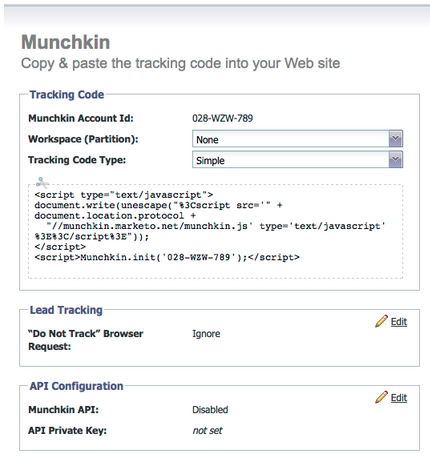
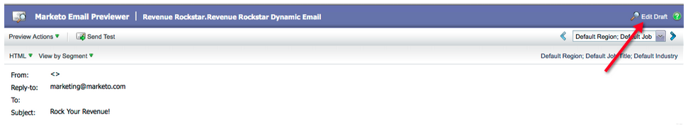
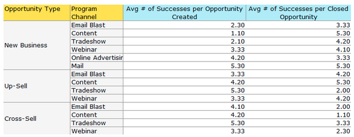
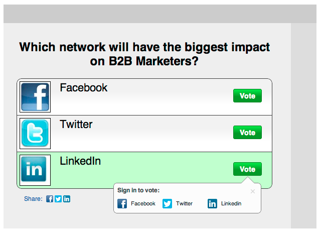

# 2012

## 2012年1/2月 {#january-february}

1 月／2 月のリリースには、次の機能が含まれています。 お客様のご契約により、制限やオプションの契約が必要なものがあります。詳細は担当の営業にお問い合わせください。 リリース後に、機能に関する詳細なドキュメントへのリンクを参照してください。

## 高度な動的コンテンツ {#advanced-dynamic-content}

_Pro および Enterprise バージョンで利用可能_

高度な動的コンテンツを使用すると、同じメッセージに対して複数のアセットを作成することなく、オーディエンスに関連した魅力的なメール通信やランディングページを作成できます。 アップグレードされたプレビューアでは、一意の各バージョンを 1 つの画面に表示できます。

## セグメンテーション  {#segmentation}

_Pro および Enterprise バージョンで利用可能_

セグメント化とは、マーケティング対象となる個人のターゲットグループである、セグメントのグループのことです。 スマートリストと同様に、セグメントはフィルター条件によって駆動されるルールで定義されます。 セグメントは、役職や業種などの人口統計データや、訪問した web ページやリンクをクリックした web ページなどの行動に基づいて作成できます。

## スニペット {#snippets}

_Pro および Enterprise バージョンで利用可能_

リッチコンテンツを保存し、静的または動的なメールとランディングページの作成に何度も使用できます。

## PURL {#purls}

_Pro および Enterprise バージョンで利用可能_

ダイレクトメールとメールキャンペーンの両方で、マルチタッチマーケティングプログラムのパーソナライズ、測定、上昇率の反応を促進するために、パーソナライズされた URL（PURL）を使用して、連絡先固有の URL を作成できるようになりました。

## EU 電子プライバシー指令に対応 {#eu-privacy-directive-support}

ブラウザーの「トラッキング不可」設定を尊重するための新機能には、匿名リードのトラッキングを無効にする機能が含まれます。これにより、EUの厳格なプライバシー追跡規制への準拠が簡単になります。

## シングルサインオン {#single-sign-on}

SAML 2.0 シングルサインオンにより、企業ポータルから Marketo アプリケーションへのシームレスなログインをサポートできるようになりました。

## 電子メールおよびランディングページエディターのアップデート {#updated-email-and-landing-page-editors}

電子メールおよびランディングページエディターは、より魅力的なインターフェイス、直観的なナビゲーション、大幅に向上したユーザーエクスペリエンスで再設計されました。アップデートには次の機能が含まれます。

HTML とテキストビューを並べて表示

「差出人名」、「差出人メール」、「返信先」（新規）、「件名」がエディターに表示されます。 その他の設定は、「設定を編集」ボタンからアクセスできます。

## サポート対象ブラウザー {#browser-support}

* [!DNL Mozilla Firefox] 9.0
* [!DNL Google Chrome] 16
* [!DNL Microsoft Internet Explorer] 8＆9
* **メモ**：[!DNL Internet Explorer] 7 のサポートは終了しました

## プログラム管理 {#program-management}

プログラム管理の簡素化により、トークンの削除と、プログラムの削除が容易になり、使いやすさが向上します。

## サブスクリプションレポートの配信停止 {#unsubscribe-from-subscription-report}

レポートから直接配信停止できるようになりました。

## Munchkin の更新 {#munchkin-updates}

新しい Munchkin 呼び出し機能により、web ページの読み込みに要する時間が短縮され、リンクのクリックイベントで安定した効果を発揮します。

## プログラム商談分析（RCA のみ） {#program-opportunity-analysis-rca-only}

個々の商談の売上高に対するマーケティング貢献度を理解します

## プログラム売上高ステージ分析 {#program-revenue-stage-analysis}

高速で移動するリードを獲得したプログラムを把握して、プログラムのリードベロシティを把握します

## 2012年3月 {#march}

## マイトークンの解決 {#resolve-my-tokens}

マイトークン（プログラムトークン）は、メールのプレビュー、テストメールの送信、単一のフローアクションでローカルメールを送信するときに解決されるようになります。 マイトークンをテストするために、プログラム内にスマートキャンペーンを作成する必要はなくなりました。

## メールとランディングページのプレビューアとエディターの切り替え {#toggle-between-previewer-and-editor-in-emails-and-landing-pages}

1 回のクリックで、エディターとプレビューアの間を簡単に行き来できます。

エディターからプレビューアに切り替え：

プレビューアからエディターに切り替え：

## スニペットプレビューア {#snippet-previewer}

メニューから「スニペットのプレビュー」を選択すると、スニペットをドラフトにすることなく表示できます。 さらに、共有スニペットへの読み取り専用アクセス（ワークスペース経由）がある場合は、このアクションを使用してスニペットを表示できます。

## 複数のテストメールの送信 {#send-multiple-test-emails}

動的コンテンツを追加すると、リードに送信される可能性のあるメールのバリエーションをすべてプレビューしてテストすることが、さらに重要になります。 「リードの詳細別に表示」を使用してプレビューする場合は、リードリストのバリエーションをテスト送信するオプションがあります（テストメールは最大 100 件）。

## URL パラメーターに基づく動的ランディングページ {#dynamic-landing-pages-based-on-url-parameter}

匿名リードは、ランディングページの大量の訪問者で構成されます。 動的コンテンツと、セグメント化をパラメーターとして URL に組み込む機能が追加されたことにより、匿名または既知のリードがリンクをクリックしたときに、ランディングページコンテンツが動的に表示されます。

## 2012年4月 {#april}

## セグメントフィルターとトリガー {#segmentation-filters-and-triggers}

同じリードのグループを一貫してターゲットしますか？ その場合、スマートリストのセグメント化を利用してターゲティングしたリードを特定します。 セグメント化を使用すると、リードデータベース全体が常にセグメント化され、一貫性を保つためにプログラム全体で再利用できます。 セグメント化の結果は、リクエスト時にスマートリストを実行する必要がないので、すばやく取り込まれます。

## 拡張された API 機能を使用した、メールコンテンツへの外部値の挿入およびその他のフローステップ {#insert-external-values-into-email-content-and-other-flow-steps-through-expanded-api-capabilities}

* Request Campaign API で、キャンペーンの特定の実行のマイトークンの値を送信できるようになりました。これは、API を使用してメールコンテンツを入力する場合に特に便利です。
* 新しい Upload To List API および Schedule Campaign API では、リードのリストとバッチキャンペーンで上記の機能がサポートされます。

## [!DNL GoToWebinar] と [!DNL WebEx] の確認メールの簡略化（Adobe Connect と [!DNL ON24] は近日リリース予定） {#easier-confirmation-emails-for-gotowebinar-and-webex-adobe-connect-and-on-coming-soon}

リードごとに一意の登録確認URLを表示するメンバートークンを作成することで、確認URLを簡素化しました。 別のトークンを使用してこの URL を作成する必要はなくなります。 現在は、[!DNL GoToWebinar] および [!DNL WebEx] のお客様が利用でき、次回のリリースで Adobe Connect と [!DNL ON24] で利用できるようになります。

## シングルクリックで複数の画像やファイルを一度にアップロードできます。 {#upload-multiple-images-and-files-with-a-single-click}

画像やファイルを Marketo に読み込む際に、時間を節約し、より効率的に作業を行うことができます。 [!DNL Firefox] または [!DNL Google Chrome] を使用している場合は、複数のファイルを選択して一度にアップロードできます。 アップロードできるファイルの数に制限はありませんが、ファイルごとの個々のサイズの上限は 50 MB です。

メモ：現時点では、ブラウザーの制限により、この機能は [!DNL Internet Explorer] ではサポートされていません。

## メール内のテキストの移動 {#move-text-in-an-email}

メール内のテキストブロックの順序を変更できます。 テキストエディター内で、テキストブロックを選択します。編集アイコンをクリックすると、ブロックを上下に移動するオプションが表示されます。

## [!DNL Salesforce] 以外のユーザの [!DNL Salesforce] 参照を削除 {#salesforce-references-removed-for-non-salesforce-users}

[!DNL Salesforce] とサブスクリプションを同期していない場合は、[!DNL Salesforce] を参照するすべてのフォルダーとフローアクションが削除されます。

## Marketo 収益サイクル分析 {#marketo-revenue-cycle-analytics}

**売上高サイクルモデラーでのゲートステージの機能強化**

ユーザーは、トランジションルールの順序を定義できます。

## 2012年5月 {#may}

## メール効果レポートのデザイン変更 {#email-performance-report-redesign}

注意：これは、5 月のリリースから始まる段階的なロールアウトです

メール効果レポートとキャンペーンメール効果レポートの実行をスピードアップしました。 また、特定の指標の定義を改善し、「メッセージ送信済み」および「リード送信済み」指標を単一の指標「送信済み」に統合しました。 「配信済みメッセージ」と「配信済みリード」を「配信済み」に統合しました。

## 待機ステップの強化 {#wait-step-enhancements}

新しい高度な待機プロパティを使用すると、スマートキャンペーンフローアクションの待機ステップを、特定の曜日、次の営業日、特定の日時まで「待機」するように設定できます。 これらの機能強化により、業務時間中にナーチャリングメールを確実に受信ボックスに届けることができます。

図 1. 営業日に終了する待機ステップの指定

## 非表示のアーカイブ済みアセット {#archived-assets-hidden}

アーカイブされたアセットは、自動提案、ドロップダウン、レポートから自動的にフィルタリングされ、探しているものを見つけやすくなります。

図 2. アーカイブ済みメールフィルターの例

## iPad 用の新規イベントチェックインアプリ {#new-event-check-in-app-for-ipad}

新しい iPad アプリを使用して、イベントのチェックインプロセスを簡素化します。 イベントチェックインアプリは、Marketo プログラムと同期し、イベントに登録者を簡単にチェックインし、その場で新しいリードを追加できます。

iOS 5.1 以降が必要。iPad のみ。

図 3. イベントチェックインホームページ

図 4. イベントチェックイン：イベントを選択します。

図 5. チェックイン

## オンラインセミナー確認 URL の機能強化 {#enhanced-webinar-confirmation-url}

[!DNL ON24] と Adobe Connect で利用可能 新しい `{{member.webinar URL}}` トークンを使用して、登録した各出席者の確認メールに一意のリンクを含めます。 Adobe Connect の機能強化には、ユーザーのログイン ID とパスワードを含む Adobe アカウント情報メールのオン／オフを切り替える機能も含まれます。

図 6. ウェビナーにユーザーを招待する

## テンプレートのプレビュー {#template-preview}

電子メールまたはランディングページの作成中に特定のテンプレートを探しているが、どのように表示されるかわからない場合、 新しいテンプレートプレビュー機能を使用すると、新しいアセットを保存する前に、選択したテンプレートを確認できます。

図 7. 選択したテンプレートのプレビュー

## 設定可能なフォームの事前入力 {#configurable-form-prefill}

サブスクリプションレベルでフォームデータの事前入力を制御し、ランディングページレベルで上書きします。 事前入力を設定しない場合、リードの最新情報を確実に取得できます。

図 8. 管理でのフォーム事前入力設定

図 9. ランディングページのフォーム事前入力設定の編集

## Marketo アイデアスペース {#marketo-treasure-chest}

Marketo エンジニアが開発した実験機能にアクセスして、ユーザーエクスペリエンスを強化します。 このリリースには、電子メールの取り消し機能に加え、ランディングページでのコメント入力や他のユーザーとの共同作業が含まれます。

\

図 10. 管理でのマネージャーアイデアスペース機能

## [!DNL Microsoft Dynamics]® CRM 統合 {#microsoft-dynamics-crm-integration}

新しい事前定義済み統合機能を使用して、Marketo と [!DNL Microsoft Dynamics] CRM Online との間でアカウント、取引先責任者、リードを同期します。

図 11. [!DNL Microsoft Dynamics] 設定

## Marketo [!DNL Sales Insight] の機能強化 {#marketo-sales-insight-enhancements}

**購読解除フッターオプション**

[!DNL Sales Insight] を通じて送信されるメールに対して、購読解除フッターを表示するかどうか、いつ表示するかを設定します。

図表12. [!DNL Sales Insight] 管理者の設定

## セールスメールテンプレートのフォルダー {#folders-for-sales-email-templates}

Marketo [!DNL Sales Insight] と共有するメールテンプレートを指定したフォルダーに整理できるようになり、セールス担当が適切なメールを簡単に見つけられるようになりました。

図 13. メールのフォルダーを選択

## [!DNL Sales Insight] から商談アナライザーへのアクセス {#access-opportunity-analyzer-from-sales-insight}

Marketo [!DNL Sales Insight] から商談アナライザーへの直接アクセスを可能にし、どのマーケティング活動がエンゲージメントを促進しているかについてのインサイトをセールス担当に提供します。 注意. 収益サイクル分析ライセンスが必要です。

## 連絡先ステータスのカスタムフィールド {#custom-field-for-contact-status}

[!DNL Salesforce]でカスタムフィールドをマッピングして、My Best Bets、My TeamのBest Bets、およびカスタムビューで連絡先のStatus フィールドに入力できるようになりました。

図 14. カスタムフィールドの連絡先へのマッピング

匿名リードが訪問したページを参照

[!UICONTROL 匿名 web アクティビティ]ビューから、匿名リードが閲覧したページにドリルダウンします。

図 15. 匿名 web アクティビティを参照してください。

## リードと連絡先の購読の強化 {#enhanced-lead-and-contact-subscribe}

レコードの詳細ページの新しい「購読」ボタンを使用して、いつでもリードや連絡先をフォローできます。

## 2012年6月 {#june}

## Marketo リード管理の機能強化 {#marketo-lead-management-enhancements}

### 名前変更 {#rename}

スマートリスト、静的リストおよびキャンペーンの名前を変更できます。 これらのアセットをフィルター、トリガー、フローで使用している場合は、その名前も自動的に更新されます。 電子メール、フォーム、フォルダーの名前は常に変更できます。

さらに、アセットの説明テキストの入力と表示が向上しました。

## フィールドマッピングのインポート {#import-field-mapping}

Marketo へのリストインポートがはるかに簡単になりました。 インポート処理中に、Marketo フィールドの名前をインポートファイルの列ヘッダー名にマッピングできます。 さらに、[!UICONTROL 管理者]では、Marketo でフィールド名にマッピングされるエイリアス名を設定し、ユーザが毎回正しいフィールドを選択するようにできます。

引き続きフィールドのインポートとマッピングを行うと、Marketo はインポート時にマッピングを記憶して表示するので、使いやすくなります。 さらに、「サンプル値」ヘッダーをクリックすると、フィールドに入力される様々な値を確認できます。 これは、毎回正しいフィールドをマッピングするのに役立ちます。

## スマートリストおよび静的リストの[!UICONTROL 概要]ページ {#summary-page-for-smart-lists-and-static-lists}

リストがどこに使われているのか、 誰がリストを作成したのか、または誰が最後に変更したのだろうと思ったことはありますか？ スマートリストおよび静的リストで使用できる新しい概要ページに、次の重要な詳細が表示されます。

既存のプログラムおよびキャンペーンの概要ページに、作成日／ユーザーおよび最終変更日／ユーザー情報も追加しました。

## アセットの[!UICONTROL 使用者] {#used-by-for-assets}

アセットの[!UICONTROL 概要]ページに、「[!UICONTROL 使用者]」という新しいタブが追加されました。

例：静的リストの[!UICONTROL 使用者]

## ランディングページのグリッド線 {#landing-page-gridlines}

ランディングページのグリッド線を追加すると、ランディングページ上でテキスト、グラフィック、フォームを簡単に整列できます。 任意のランディングページに対してオン／オフを切り替え、線間の幅も調整します。

## メーリングからブロックされたリード {#leads-blocked-from-mailings}

キャンペーンのスケジュールを設定するときに、リンクをクリックすると、メールからブロックされたリードのリストが表示されます。

## [!UICONTROL 待機]ステップ - リードトークンとマイトークン {#wait-step-lead-token-and-my-token}

5月のリリースでは、[!UICONTROL 待機]フローステップに高度なオプションが追加されました。 これらの変更を使用して、営業日、日付、時刻を指定できます。 このリリースでは、待機ステップでトークンを使用する機能が追加されました。 例えば、`{{lead.Birthday}}` を使用して誕生日にメールを送信したり、`{{my.Event Date}}` を使用して最終的なウェビナーリマインダーを送信したりできます。

## デザインスタジオで[!UICONTROL サムネール]として[!UICONTROL 表示] {#view-as-thumbnails-in-design-studio}

画像リストからサムネールビューに表示を切り替えます。

注意：このリリース時点では、スマートリストグリッドでの以前の並べ替えは、次に表示するスマートリストには適用されません。 例えば、スマートリストを会社名で並べ替えた場合、同じフィールドで表示される次のスマートリストでは自動的に並べ替えられません。

注意：メール効果レポートのアップグレードが進行中です。

## Marketo 収益サイクル分析の機能強化 {#marketo-revenue-cycle-analytics-enhancements}

### プログラム商談分析の新しい指標  {#new-metrics-in-program-opportunity-analysis}

商談が創出またはクローズされる前のマーケティングタッチの平均数と、マーケティングタッチの平均値に関するインサイトを取得できるようになりました。

## 複数グラフの表示 {#displaying-multi-charts}

複数グラフ機能を使用すると、1 つの売上高サイクルエクスプローラーレポートに複数のグラフを表示できます。 例えば、異なる月に同じデータを表示する場合に、この機能を使用できます。 また、この機能を使用すると、フィルターとレポートを個別に作成する必要がなくなります。

## ヒートグリッドグラフタイプ  {#heat-grid-chart-type}

ヒートグリッドを使用すると、データを視覚化でき、マーケティングパフォーマンスのパターンを識別できます。 このビジュアライゼーションタイプでは、結果が色分けされるので、複雑なビジネス分析をわかりやすく視覚化できます。

## 散布図タイプ  {#scatter-chart-type}

散布図を使用すると、複数のディメンションのデータを 1 つのグラフで視覚化できます。 このビジュアライゼーションタイプでは、使用されている属性に基づいて、グラフにバブルがプロットされます。 その後、測定を使用してバブルに色分けしたり、測定を使用してバブルのサイズを指定したりできます。

## 2012年9月 {#september}

このリリースには、待望の統合されたソーシャル機能とリード管理機能が含まれています。 注意：ソーシャル機能は、アドオンとして、または選択したバンドルの一部として使用できます。

## ソーシャル共有を使用した YouTube ビデオの公開 {#publish-a-youtube-video-with-social-sharing}

ランディングページ上の新しいビデオ共有を使用して、訪問者がソーシャルメディアにビデオを共有するよう促すことで、ビデオのオーディエンスを増やします。

## 「共有」ボタンの追加 {#add-a-share-button}

共有メッセージと新しいソーシャル共有ボタンの外観を完全にカスタマイズできます。 さらに、リードがコンテンツを共有するときに、ソーシャルプロファイルデータを取得できます。

## ソーシャルサインオン {#social-sign-on}

リードがソーシャルネットワークからの情報を事前に入力できるようにすることでインサイトを獲得し、リードのストレスを軽減します。

## ランディングページの [!DNL Facebook] への公開 {#publish-landing-pages-to-facebook}

ソーシャルアプリ、フォーム、Marketoのランディングページ全機能を備えた[!DNL Facebook]に直接公開することで、ランディングページのリーチを広げることができます。

## [!DNL ReadyTalk] イベントアダプター {#readytalk-event-adapter}

Marketo イベントを [!DNL ReadyTalk] ミーティングにシームレスに接続できます。 Marketo フォームを使用して登録者を取り込み、[!DNL ReadyTalk] に自動的に登録します。 双方向同期を使用すると、Marketo に出席情報を入力できます。

## Microsoft [!DNL Dynamics] オンプレミス {#microsoft-dynamics-on-premise}

Microsoft [!DNL Dynamics] 2011 オンプレミスとインターネットに接続するデプロイメントがサポートされるようになりました。

## Webhooks（アイデアスペース） {#webhooks-treasure-chest}

Webhook は、ユーザー定義の HTTP コールバックです。 これは、Marketoから他のサービスにデータをプッシュする優れた方法です。 この機能は現在アイデアスペースで使用可能で、現時点ではトリガーキャンペーンでのみサポートされています。

Webhooks の使用例として、ユーザー名とパスワード情報を別のシステムに送信して体験版アカウントを作成したり、新しいリードを獲得したら SMS テキストメッセージを送信したりすることが考えられます。

## getMultipleLeads API のアップデート {#update-to-getmultipleleads-api}

getMultipleLeads API呼び出しに新しいフィルタリング条件を追加しました。 日付によるフィルターに加えて、次の条件が追加でサポートされるようになりました。

* 日付範囲
* 静的リスト名
* リードキーの配列

## 2012年10月 {#october}

10 月リリースには、よりエキサイティングな新機能が含まれています。 ソーシャル機能は、アドオンとして、または選択したバンドルの一部として使用できます。

## プログラムのインポートとプログラム交換 {#import-programs-and-program-exchange}

プログラムは、ある Marketo サブスクリプションから別のサブスクリプションにインポートできます。 例えば、サンドボックスでプログラムを作成し、ライブサブスクリプションにインポートできます。 また、事前定義済みプログラムを Marketo プログラムライブラリからインポートすることもできます。

>[!NOTE]
>
>Marketo の管理者ユーザーから権限を付与された Marketo ユーザーのみがプログラムをインポートできます。
>
>サンドボックスアカウントをライブサブスクリプションに接続するには、Marketo サポートにご連絡ください。

## 通知 {#notifications}

通知を使用すると、Marketo のサブスクリプションで発生するシステムイベントを常に把握できます。 例えば、キャンペーンが失敗した場合や、CRM 同期に注意が必要な場合は、システムから自動的に通知されます。 通知は「マイ Marketo」タブで使用できます。 さらに、通知をリアルタイムでメールで受け取れるように配信登録することもできます。

## 投票 {#polls}

投票を作成して、コンテンツにリードを引き付けましょう。 好きなネットワークや映画に投票し、ソーシャルネットワークを通じて友達と投票を共有することができます。 リードが何に投票したかに関する豊富な分析を収集できます。

## ソーシャルアクティビティのトラック {#track-social-activities}

特定のソーシャルアクティビティに基づいてスマートリストを作成することで、コンテンツを共有したリードや投票したリードを見つけ出します。 例えば、最もコンテンツを共有しているリードのスコアを増やすスマートキャンペーンを作成します。

## ソーシャルプロファイル {#social-profiles}

リードがコンテンツを共有したり、ソーシャルプロファイルを使用してフォームに入力したりするときに、リードに関する情報を収集できるようになりました。 これには、[!DNL Facebook]、[!DNL LinkedIn]、[!DNL Twitter] のハンドル名、友達の数などが含まれます。

## [!UICONTROL 収益エクスプローラー]レポートのサブスクリプション {#revenue-explorer-report-subscriptions}

レポートのサブスクリプションを作成し、Marketo 以外のユーザを含む主要な関係者に対して、定期的に[!UICONTROL 収益エクスプローラー]レポートを送信します。 このメールには、レポートデータの表またはグラフのプレビューと、すべてのレポートデータを含む [!DNL Excel] スプレッドシートが含まれます。

>[!NOTE]
>
>Enterprise または Select Edition で収益サイクル分析を購入し、[!UICONTROL 収益エクスプローラー]を所有するユーザのみが利用できます。

## （2012年12月） {#december}

12 月のリリースには、待望の&#x200B;**友だちに転送**&#x200B;機能のほか、いくつかの機能が含まれています。 アスタリスク（&#42;）が付いた機能は、Select Edition および RCA（収益サイクル分析）でのみ使用できます。

## 友達に転送 {#forward-to-friend}

メールに「**友達に転送**」リンクを含めて、他のユーザーとのコンテンツの共有を有効にします。 新しいフィルターとトリガーが追加されたことで、メールを転送したユーザーと転送されたメールを受信したユーザーを識別できるので、インフルエンサーを特定できます。

メールに&#x200B;**友だちに転送**&#x200B;の招待を含めるには、エディターでメールを開き、`{{system.forwardToFriendLink}}` トークンを挿入します。

対応するトリガーとフィルターを使用して、「**友達に転送**」リンクを使用したユーザーと、メールを受信したユーザーを特定します。

## 詳細な管理権限 {#granular-admin-permissions}

最新リリースでは、各ロールの Marketo [!UICONTROL 管理]領域の様々な機能へのアクセスを制御することで、[!UICONTROL 管理者]のロールに対するアクセスと制御を強化できます。 新しいロールを作成するときに、ロールがアクセスできる特定の[!UICONTROL 管理]機能を割り当てることができます。

>[!NOTE]
>
>デフォルトでは、&#39;[!UICONTROL &#x200B; アクセス管理者]&#39;権限を持つ既存の役割は、変更されるまで、および変更されない限り、すべての[!UICONTROL 管理者]機能にアクセスできます。

## [!UICONTROL BrightTALK] アダプター {#brighttalk-adapter}

Marketo [!UICONTROL BrightTALK] アダプターを使用すると、ライブまたはオンデマンドの web キャストから Marketo イベントに直接出席情報を取り込むことができます。

## [!DNL Microsoft Dynamics] 向け Marketo [!DNL Sales Insight] {#marketo-sales-insight-for-microsoft-dynamics}

[!DNL Microsoft Dynamics] のお客様が [!DNL Sales Insight] を利用できるようになりました。

## [!DNL Dynamics] との間で商談を同期 {#dynamics-opportunity-sync}

Marketo と [!DNL Microsoft Dynamics] との間で商談データを同期します。

## マーケティングが影響を与えた商談レポート&#42; {#marketing-influenced-opportunities-report}

パイプラインと売上がマーケティングプログラムの影響を受けた割合を確認します。 **[!UICONTROL 収益エクスプローラー]**&#x200B;で、商談分析の新しい「マーケティングに影響を与えた商談」黄色のドットを含むカスタムレポートを作成できるようになりました。 次の 2 つのレポートを Standard フォルダーで使用することもできます。

* 創出された商談に対するマーケティングの影響
* 商談のクローズ成立に対するマーケティングの影響

## プログラム商談分析のカスタム商談フィールド&#42; {#custom-opportunity-fields-in-program-opportunity-analysis}

カスタム商談フィールドを追加し、[!UICONTROL 収益エクスプローラー]でプログラム商談分析レポートを強化します。

## キャンペーンインスペクター {#campaign-inspector}

[!UICONTROL 変更スコア]や[!UICONTROL キャンペーンをリクエスト]など、特定のフローアクションをどのキャンペーンが使用しているのか、 または、特定のフィルターがどこで使用されているのか疑問に思ったことはありますか？ 新しい[!UICONTROL キャンペーンインスペクター]（アイデアスペースから利用可能）を使用すると、そのようなキャンペーン、アクティブなキャンペーン、エラーが発生したキャンペーンを特定できます。

**[!UICONTROL 管理者]**／**[!UICONTROL アイデアスペース]**&#x200B;に移動して、**[!UICONTROL キャンペーンインスペクター]**&#x200B;を有効にします。

