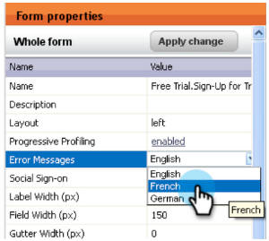
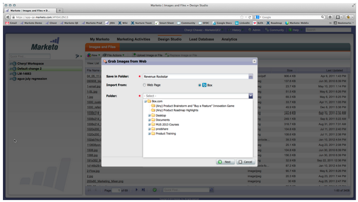
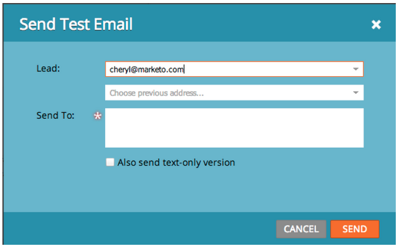

# 2013

## （2013年1月） {#january}

1 月のリリースでは、ソーシャルオファーが&#x200B;**紹介オファー**&#x200B;で拡張されます。 また、[!DNL Marketo Lead Management] のユーザは、自分のタイムゾーン、言語およびロケールの設定を行うことができます。 &#42; が付いた機能は、Select Edition でのみ使用できます。

## 紹介オファー {#referral-offers}

**紹介オファー**&#x200B;は、リードに友達を紹介するインセンティブを与えるものです。 成功した紹介に対して目標と報酬を作成します。 ランディングページ、ウェブサイト、さらには Facebook でも使用できます。

## タイムゾーンの環境設定 {#time-zone-preference}

個人の Marketo アカウントのデフォルトのタイムゾーンを変更できます。 例えば、サブスクリプションのデフォルトが「太平洋時間」の場合でも、独自のアカウントで「東部時間」に変更できます。

## [!DNL Marketo Lead Management] 言語の選択 {#select-your-marketo-lead-management-language}

Marketo ユーザーアカウントのデフォルト言語を変更できます。 サブスクリプションのデフォルトが英語の場合でも、独自に使用するためにドイツ語またはフランス語に変更できます。

## 多言語フォームのエラーメッセージ {#multi-lingual-form-error-messages}

リードが Marketo フォームに入力すると、一部の検証メッセージが自動的に組み込まれます。 これらのエラーメッセージに対して、別の表示言語を選択することもできます。 現在、英語、ドイツ語、フランス語をサポートしています。

フランス語のフォームの例を次に示します。

## [!DNL Sales Insight] 言語の選択（[!DNL Salesforce] のみ） {#select-your-sales-insight-language-salesforce-only}

[!DNL Salesforce] の言語設定がフランス語またはドイツ語に設定されている場合は、Marketo [!DNL Sales Insight] はその設定に従います。 この機能を入手するには、最新の MSI パッケージをダウンロードしてください（1月14日の週に入手可能）。

## フィールド表示名 {#field-display-name}

フィールド表示名は、異なる言語でテキストを表示できます（例：マルチバイト文字はサポートされています）。

## プログラムデータの変更 {#change-program-data}

[!UICONTROL プログラムデータの変更]フローステップを使用すると、キャンペーンを通じて、プログラムメンバーの[!UICONTROL 成功]ステータスと[!UICONTROL 成功日]を手動で変更できます。 このフローステップを使用して、誤りを修正したり、意図したとおりにプログラムに参加していない可能性のあるメンバーを手動で変更したりできます。

## （2013年2月） {#february}

2月のリリースには、要望が多かった機能、[!DNL Apple Safari] のサポートおよびその他の小規模な機能強化が含まれています。

## [!DNL Apple Safari] の公式サポート {#official-support-for-apple-safari}

Mac 版 [!DNL Apple Safari] および [!DNL Windows] 版の最新バージョンでは、Marketo リード管理での使用が完全にサポートされています。 メモ：iOS 上の [!DNL Safari] には完全には対応していません。

## Web フックの機能強化 {#webhooks-enhancements}

Web フックは、URL／ペイロード内のトークンをエスケープするように拡張され、サードパーティシステムからの XML／JSON 応答を解析することで、Marketo リードフィールドを更新することもできます（[!DNL Spark SMB Edition] では利用できません）。

## SOAP API エンドポイントのアップデート {#updated-soap-api-endpoint}

優先する SOAP API エンドポイントがアップデートされました（[!UICONTROL 管理者]／SOAP API に表示されます）。 この新しいエンドポイントを使用するには、呼び出しを更新してください。 古いエンドポイントに対する API 呼び出しは非推奨ですが、引き続き機能します。 （SOAP API は [!DNL Spark SMB Edition] では使用できません）

## [!DNL Facebook] タブのモバイルサポート {#mobile-support-for-facebook-tabs}

Marketo から公開された [!DNL Facebook] タブは、モバイルデバイスを検出してランディングページにルーティングします。 これにより、[!DNL Facebook] タブがサポートされていない（[!DNL Spark]、[!DNL Standard]、[!DNL Select SMB Editions]、[!DNL Marketo Social Marketing] で利用可能な）モバイルデバイスでユーザが適切なコンテンツを取得できるようになります。

## 準備中：複数モデルのサポート {#coming-soon-support-for-multiple-models}

今後のリリースでは、コミュニティにおけるRCAのアイデアに投票し#1複数の収益サイクルモデルをサポートする基盤を構築しています。 このリリースでは、モデルとステージの選択をサポートするために、スマートリストフィルターやフローステップでの選択肢の追加など、いくつかの変更が見られます。 また、「スマート・リスト・リード・グリッド」タブの「リード収益ステージ」フィールドと「リード収益サイクル・モデル」フィールドも移動します。

## 2013年3月 {#march}

3 月のリリースには、次の機能が含まれています。

## Marketo カレンダーファイル {#marketo-calendar-files}

イベント確認電子メールとリマインダー電子メールで使用する&#x200B;**マイトークン**&#x200B;としてカレンダーファイルを作成します。 この統合カレンダーファイル（.ics ファイルなど）は、マイトークンと `{{member.webinar URL}}` トークンを含むすべてのトークンをレンダリングします。

## 待機 +/- {#wait-until}

日付トークンの前または後に指定した日数を実行できる待機ステップを作成します。 例えば、イベントの日付の 3 日前に待機し、リマインダーを送信する待機手順を作成できます。

リードの誕生日の14日前まで待機する待機ステップを作成できます。 「この日付の次の記念日を使用」を選択すると、日付に関連付けられている年が自動的に無視され、代わりに現在または次の暦年が使用されます。

## ソーシャル懸賞 {#social-sweepstakes}

懸賞は、リードが賞を獲得し、あなたのことを友人に広めてくれる機会を与えるものです。 参加者からランダムに勝者を選択し、メールを送信します。

## 追加フォーム [!UICONTROL エラーメッセージ] 言語 {#additional-form-error-message-languages}

12 以上の言語がフォームエラーメッセージに追加されました。

## サポートのニュースとアラート {#support-news-and-alerts}

P1 アラートのサポートに関するニュースとアラート、既知の問題、サポートエキスパートからのヒント、Marketo カスタマーサポートの更新を購読して、Marketo カスタマーサポートとつながりを保ちましょう。

## 2013年4月 {#april}

4 月のリリースには、次の機能が含まれています。

## [!DNL Box] 統合 {#box-integration}

Marketo を [!DNL Box] アカウントで接続して、ファイルをデザインスタジオに簡単にコピーできます。

## [!DNL Gmail] プラグイン {#gmail-plugin}

Marketo [!DNL Sales Insight] および [!DNL Gmail] を使用している場合は、[!DNL Chrome] ストアを通じて新しい [!DNL Gmail] プラグインをインストールできます。 このプラグインを使用すると、Marketo でのメッセージのログ記録、Marketo のメールテンプレートの読み込み、Marketo のトラッキング機能を使用したメッセージの送信が可能になります。

## メール分析 {#email-analysis}

クリックアクティビティのヒートグリッドレポートなど、[!UICONTROL 収益エクスプローラー]で高度なメールレポートを作成します。 このレポートは、ユーザーがメール内のリンクをクリックした日時に対するインサイトを提供します。

2012 年および 2013 年のメールデータを移行する 4 月から 5 月中に、メール分析機能が段階的に有効になります。 つまり、一部のお客様は、他のお客様よりも早くこの機能にアクセスできます。

## プログラム API {#program-apis}

SOAP API 呼び出しでのプログラムのサポート（プログラムの会員数、取得者、成功、設定、チャネル、タグ、トークン、コストなどのプログラムデータへの読み取り専用アクセスを含みます）。 詳しくは、SOAP API のドキュメントを参照してください。

## [!DNL ON24] の機能強化 {#on-enhancement}

「役職」と「会社名」は、Marketo の登録フォームから [!DNL ON24] に同期されます。

## 2013年5月 {#may}

5 月のリリースには、次の機能が含まれています。

## ランディングページのカレンダーファイル {#calendar-files-for-landing-pages}

ランディングページに追加できるマイトークンとしてカレンダーファイルを作成します。 この統合カレンダーファイル（例：.ics ファイル）は、ローカルアセットのランディングページのマイトークンを含む、すべてのトークンをレンダリングします。

## 「モデルメンバーシップ」タブ {#model-membership-tab}

すべてのモデルメンバーデータをまとめて表示して、モデルメンバーを用意に監視し、トラブルシューティングを行います。 新しい「[!UICONTROL メンバー]」タブは、承認済みの収益サイクルモデルを選択した場合に使用できる読み取り専用ビューです。

## フローアクションツリーの再編成 {#reorganized-flow-action-tree}

新しく再編成されたフローアクションツリーで、フローアクションを素早く見つけます。

## 名前が変更されたフローアクション {#renamed-flow-actions}

「進行状況のステータスを変更」が「[!UICONTROL プログラムステータスを変更]」に変わりました。 「プログラムデータを変更」が「[!UICONTROL プログラムの成功を変更]」に変わりました。

## 2013年6月 {#june}

6 月のリリースには、次の機能が含まれています。

## その他のユーザー言語 {#additional-user-languages}

希望の言語で Marketo リード管理インターフェイスを表示できます。スペイン語とポルトガル語がサポートされました。

## Cobalt ユーザーインターフェイス {#cobalt-user-interface}

向こう数か月のうちに、アプリケーションの様々な部分の新規テーマが公開され、例えばモーダルウィンドウに影響を与えることになります。

## サブフォルダーの複製 {#subfolder-cloning}

アセットをサブフォルダーに複製します。

## 複数のモデル {#multiple-models}

コミュニティの売上高サイクル分析（RCA）の主なアイデアです。この機能を使用すると、複数のモデルを作成して、製品ライン、事業部門、地域ごとに売上高ファネルをより詳細に把握できます。 売上高ステージ別のリード、成功パスアナライザー、プログラムアナライザーおよび売上高エクスプローラーのレポートでこの機能がサポートされ、レポート用の特定のモデルを選択できるようになりました。

デフォルトでは、Select SMB Edition では 2 つのモデル、Enterprise Edition では 15 モデルを使用できます。 また、追加のモデルを購入することもできます。

## 2013年7月 {#july}

7月のリリースには、7月26日（金）（PT）のロールアウトに予定されている次の機能が含まれています。

## ダッシュボードのコンテンツ消費済みウィジェット {#exhausted-content-widget-on-the-dashboard}

リードのストリーム内のコンテンツがいつ消費済みになるかに関する情報を提供します。 コンテンツ消費済みに到達するリード数や、リードが消費済みに到達してからどのくらい経過しているかに関する情報がシステムから提供されます。

## 通信制限 {#communication-limits}

リードに対する過剰なメール送信を止めたいとお考えですか？ 現在では、各個人に自動的に頻度を制限することが容易です。 日／週ごとの通信限度を設定すると、後はシステムが自動的に処理します。 Select と Enterprise、Standard のお客様向けアドオンパッケージで利用できます。

## Cobalt ユーザーインターフェイス {#cobalt-user-interface-july}

向こう数か月のうちに、アプリケーションの様々な部分の新規テーマがさらに公開される予定です。 機能は移動も削除もされません。

## プログラムメンバーの日付列 {#program-member-date-column}

リードが追加された日付でメンバーグリッドを表示および並べ替えます。

## WYSIWYG エディターのスペルチェックに関する変更 {#changes-to-spell-check-in-wysiwyg-editor}

WYSIWYG エディターでスペルチェックに使用されるサービスが終了しました。 別のサービスに置き換えるまで、「スペルチェック」ボタンをエディターから削除しました。

## （2013年8月） {#august}

2013年8月リリースには、次の機能が含まれます。

**テキストのみのメール**

[テキスト版](/help/marketo/product-docs/email-marketing/general/creating-an-email/create-a-text-only-email.md)だけの電子メールを送ることができます。 このオプションを使用する場合、リンクは装飾されません。

## カスタマーエンゲージメントエンジンの強化 {#customer-engagement-engine-enhancements}

### コンテンツ消費済みを無視 {#ignore-exhausted-content}

エンゲージメントプログラムが、すべての通知の抑制を含め、[コンテンツ消費済み](/help/marketo/product-docs/email-marketing/drip-nurturing/using-engagement-programs/disable-and-enable-exhausted-content-notifications.md)を無視するように設定します。

## エンゲージメントストリームのテスト {#engagement-stream-testing}

[新しいテスト機能](/help/marketo/product-docs/email-marketing/drip-nurturing/engagement-program-streams/test-an-engagement-stream.md)を使ってキャストをシミュレートし、ライブストリームに新たに追加されたコンテンツをテストします。

## パーソナライズ送信テスト {#personalized-send-test}

メールテストを送信する際に、リードの名前を選択して、テストメールをパーソナライズできます。

## 「メールをWeb ページとして表示」および「購読解除」システムトークン {#view-email-as-web-page-and-unsubscribe-system-tokens}

これらの[新しいトークン](/help/marketo/product-docs/email-marketing/general/using-tokens/system-tokens-glossary.md)を利用して、メール内の配置をより詳細に制御します。

## 自動トリガーキャンペーンクリーンアップ {#automatic-trigger-campaign-cleanup}

Marketo は、過去 6 か月間実行されていない[トリガーキャンペーンを定期的にお客様に通知し、自動的に無効化します](/help/marketo/product-docs/core-marketo-concepts/smart-campaigns/using-smart-campaigns/automatic-trigger-campaign-cleanup.md)。

## Marketo 財務管理の機能強化 {#marketo-financial-management-enhancement}

### プログラムコストのアップデート  {#program-cost-update}

プログラムコストの同期を使用すると、複数のプラットフォーム間でプログラムコストをトラックできます。

### Cobalt ユーザーインターフェイス {#cobalt-user-interface-august}

新しい Cobalt インターフェイスのロールアウトを継続しています。 このプロジェクトによって Marketo の動作が素早くなります。 アップグレードは今年の終わりにかけて継続します。

## 2013年9月 {#september}

9 月のリリースには、次の機能が含まれています。

## URL の短縮 {#shorter-urls}

メールの URL は受信者がクリックしやすいように短縮されました。トラッキング機能はすべて保持されています

>[!CAUTION]
>
>短縮 URL に切り替えると、9 月のリリースより前に送信された電子メール内のリンクは、このリリースから 90 日で期限が切れます。

Marketo のカスタムオブジェクトのデータを使用するか、Velocity テンプレート言語を使用してメールコンテンツに条件ロジックを追加します。

## テスト送信をサンプル送信に変更 {#change-send-test-to-send-sample}

テストを送信アクションの名前を、サンプルを送信に変更しました。

## パーソナライズされた[!UICONTROL サンプルメールの送信] {#personalized-send-sample-email}

メールサンプルを送信するときに、リード名を選択してサンプルメールをパーソナライズすることができます。

## [!DNL GoToWebinar] の追加フィールドの同期 {#additional-field-sync-for-gotowebinar}

Marketo フォームの会社名と役職を [!DNL GoToWebinar] に同期できます。 これらの追加フィールドを有効にするには、「イベントパートナー」に移動し、「追加フィールドを有効にする」をオンにします。

## ユーザーログインを SSO のみに制限 {#restrict-user-login-to-sso-only}

Marketo ユーザーが通常のログイン画面ではなく、SSO のみを使用してログインするようにサブスクリプションを設定します

## アップロード済みファイルのウィルススキャン {#virus-scan-of-uploaded-files}

デザインスタジオにアップロードされたファイルが自動的にスキャンされ、ファイルにウィルスが含まれている場合はブロックされます

## 商談の影響アナライザーの書き出し {#export-opportunity-influence-analyzer}

商談の影響アナライザーのデータを [!DNL Excel] に書き出せるようになりました。 書き出された各 [!DNL Excel] ファイルには、すべてのリード（商談で役割を持たないリードを含む）のマーケティングインタラクションと、分析で選択したアカウントのすべての商談が含まれます。 商談の行は緑色でハイライト表示されます。 特定のリードやマーケティング活動に注力する必要がある場合は、[!DNL Excel]のネイティブデータフィルタリング機能を使用できます。

## プログラムの属性設定 {#program-attribution-settings}

アカウントベースの属性付けを行う機能を含め、最初のタッチとマルチタッチの属性指標で、Marketo が連絡先と商談を連携する方法を変更できます。 これらの設定は、プログラム商談分析領域および商談分析領域の[!UICONTROL 収益エクスプローラー]レポートの属性指標に影響を与えます。 また、プログラムアナライザーの属性指標にも影響します。

プログラムの属性設定は、3 つの選択肢の中から 1 つに変更できます。 この設定を変更しても、Marketo または CRM データは変更されません。単にレポートの実行方法が変更され、いつでも元に戻すことができます。

「明示」設定では、役割を持つ連絡先のみを調べます（現在の動作）。 「暗黙」設定では、役割に関係なく、アカウントに関連付けられたすべての連絡先を調べます。 可能であれば、「明示」モードを使用することを強くお勧めします。 「暗黙」を使用すると、商談に実際の影響を与えないにもかかわらず、商談に対してクレジットを持つ人という偽陽性を生み出す可能性があります。

## [!UICONTROL セールスインサイト]をフランス語およびドイツ語で利用可能（[!DNL Salesforce] のみ） {#sales-insight-available-in-french-and-german-salesforce-only}

フランス語およびドイツ語を母語とするセールスチームが希望の言語で[!UICONTROL セールスインサイト]のコンテンツを参照できるように、[!DNL AppExchange] から最新の Marketo リード管理と Marketo [!UICONTROL セールスインサイト]をダウンロードします。

## Cobalt ユーザーインターフェイス {#cobalt-user-interface-september}

向こう数か月のうちに、アプリケーションの様々な部分の新規テーマが公開される予定です。 今月は、新しい青いモーダルウィンドウがさらに表示される場合があります。

## 2013年10月 {#october}

2013年10月リリースには以下の新機能が含まれています。

## templates.marketo.com {#templates-marketo-com}

[Templates.marketo.com](/help/marketo/product-docs/demand-generation/landing-pages/landing-page-templates/guided-landing-page-template-list.md) で、メールとランディングページのテンプレート（レスポンシブモバイルメールテンプレートを含む）を、[!DNL Marketo Program Library] からダウンロードできます。 毎月テンプレートを追加するので、頻繁にチェックしてみてください。

## developers.marketo.com {#developers-marketo-com}

[Developer.adobe.com](https://experienceleague.adobe.com/ja/docs/marketo-developer/marketo/home) は、Marketo への統合を構築する開発者を対象にしています。 Munchkin JavaScript API や SOAP API のサンプルコード、Webhook、メールスクリプトを含む様々な統合オプションを参照できます。 また [GitHub](https://github.com/Marketo/SOAP-API-Java-Client) では Java SDK もご利用いただけます。

## [!DNL BrightTALK] イベントアダプターのアップデート {#updated-brighttalk-event-adapter}

[!DNL BrightTALK] から、会社名や役職、業界、会社サイズを含む多数のフィールドを Market に同期できます。

## Android タブレットイベントチェックインアプリ {#android-tablet-event-check-in-app}

Google Play で入手可能な、新しい Android 対応のチェックインアプリを使ってイベントの登録者を確認できます。

## （2013年12月） {#december}

12 月リリースには、次の機能が含まれています。

リリース後は、コミュニティの「新しいリリース」タブを確認して、各機能に関するナレッジベースの詳細な記事を参照してください。

## メールプログラム {#email-program}

メールの送信がこれまで以上に簡単になりました。 新しい[メールプログラム](/help/marketo/product-docs/email-marketing/email-programs/creating-an-email-program/understanding-email-programs.md)を使用して、デフォルトプログラムの代わりにバッチメールを送信します。 スマートリスト、メール、送信スケジュールを設定すれば準備完了です。

また、新しい[メール指標ダッシュボード](/help/marketo/product-docs/email-marketing/email-programs/email-program-data/view-the-email-program-dashboard.md)を参照して、メールの効果を確認できます。

## メール A/B テスト {#email-a-b-testing}

新しいメールプログラムで、メール送信母集団全体の割合に対して [A/B テスト](/help/marketo/product-docs/email-marketing/email-programs/email-program-actions/email-test-a-b-test/add-an-a-b-test.md)を実行します。 件名、差出人アドレス、日時、メール全体の 4 種類のテストから選択します。 また、手動で勝者を昇格させたり、事前に定義した勝者条件に基づいてシステムで昇格させたりすることもできます。 A/B テストを含む新しいメールプログラムをイベントとデフォルトのプログラムにネストして、メールを簡単に送信できます。

## チャンピオン／挑戦者のメールテスト {#email-champion-challenger-testing}

[ チャンピオン/チャレンジャーテスト ](/help/marketo/product-docs/email-marketing/general/functions-in-the-editor/email-tests-champion-challenger/add-an-email-champion-challenger.md)はA/B テストと似ていますが、違いは、トリガーメールに使用され、自動的に勝者を送信しないことです。 このテストでは、チャンピオンと呼ばれる確立された方法に対して、挑戦者を導入することでチャンピオンがまだ最適な方法かどうかをテストします。 さらに、チャンピオン／挑戦者メールテストは、エンゲージメントプログラムストリーム内で使用できます。

## [!UICONTROL メール分析]でのリードの詳細 {#lead-details-in-email-analysis}

[!UICONTROL メール分析]に、追加のリード属性と会社属性を導入しました。 [!UICONTROL 業種]や[!UICONTROL リードソース]などの新しい属性別にメール統計をグループ化して表示できるようになりました。

## [!DNL BrightTALK] イベントアダプターの機能強化 {#enhanced-brighttalk-event-adapter}

[!DNL BrightTALK] チャネルやイベントから Marketo へ登録者を抽出できます。 この情報を使用して、他のマーケティングキャンペーンに通知できます。
