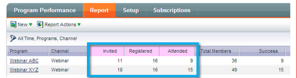
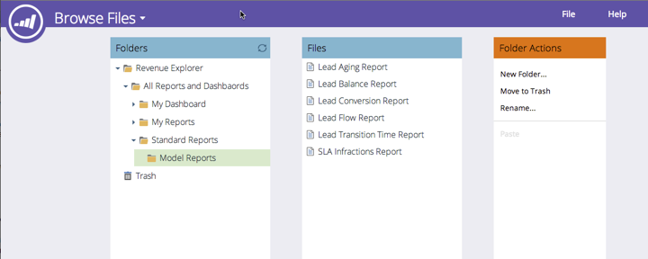

# 2014

## （2014年1月） {#january}

2014年1月リリースには、次の機能が含まれています。 [お客様のご契約により](https://www.marketo.com/pricing/)、制限やオプションの契約が必要なものがあります。詳細は担当の営業にお問い合わせください。

## Forms 2.0 {#forms}

注目：Forms 2.0 のドキュメントは、近日公開予定です。

フォーム作成プロセスを制御し、web 開発者の手を煩わせません。 Forms 2.0 は、プログラミングに関する知識を必要とせずに、マーケターが視覚的および機能的に堅牢なフォームを作成できるように設計されています。

**フォームのビジュアルをイメージチェンジ：**

テーマデザイン、ボタンのカスタマイズ、柔軟性の高いレイアウトなど、サイトのルックアンドフィールに合わせてモダンなデザインのフォームを作成できます。

**条件付き表示およびフォローアップページロジック：**

ユーザーが米国を「国」として選択した場合にのみ「州」が表示されるようにしますか？ フォーム上の質問に対する回答に基づいて、様々なホワイトペーパーを顧客に提示する場合、 エディターから直接フォームに条件ロジックを作成できます。 [!DNL javascript] は不要です。

**独自のランディングページへのフォームの容易な埋め込み：**

Marketo のランディングページに配置されたフォームから html コードを掘り起こして [!DNL iFrame] にドロップする必要はなくなります。 埋め込みコードを取得し、フォームをレンダリングするランディングページに配置するだけです。 通常と Lightbox の 2 つのモードにより、サイト上で Marketo フォームをより柔軟に使用できます。

## メールプログラムの通信制限 {#communication-limits-for-email-program}

[データベースとの過剰な通信を防ぐ](/help/marketo/product-docs/email-marketing/email-programs/email-program-actions/enable-disable-communication-limits-in-an-email-program.md)ために、メールプログラムに通信制限を設定します。 定義された制限を超えたリードはメールを受け取りません。

## プログラムメンバーシップ分析の追加フィールド {#additional-fields-in-program-membership-analysis}

リードおよび企業属性ごとに、プログラムメンバーシップ分析指標を追加してグループ化できます。 例えば、「業種」フィールドを追加して、プログラムメンバーと成功の分割を表示できます。

## （2014年2月） {#february}

2014年2月リリースには、以下の機能が含まれています。 お客様のご契約により、制限やオプションの契約が必要なものがあります。詳しくは、担当の営業にお問い合わせください。 リリース後は、各機能に関するナレッジベースの詳細記事へのリンクを必ず参照してください。

## 勝者条件の[!UICONTROL エンゲージメントスコア] {#engagement-score-as-winning-criteria}

[エンゲージメントスコアを使用](/help/marketo/product-docs/email-marketing/email-programs/email-program-actions/email-test-a-b-test/define-the-a-b-test-winner-criteria.md)して、A/B 分割テストまたはチャンピオン／挑戦者テストの勝者バリアントを決定します。 適切なエンゲージメントスコアを得るには、テストを 24 時間以上実行する必要があります。

## 「メールプログラム[!UICONTROL 結果]」タブ {#email-program-results-tab}

メールプログラムに記録された[結果とアクティビティを表示](/help/marketo/product-docs/email-marketing/email-programs/email-program-data/view-email-program-results.md)します。

## メーリングからブロックされたユーザ／[!UICONTROL リード] {#people-leads-blocked-from-mailing}

[メーリング番号からブロックされたリードをクリックして](/help/marketo/product-docs/email-marketing/email-programs/managing-people-in-email-programs/define-an-audience-with-a-smart-list.md)、登録解除、ブロックリストへの登録、無効なメールアドレスや空白のメールアドレス、またはマーケティングの中断が原因でメールを受信しないユーザーを確認します。

## メールプログラムデータのエクスポート {#export-email-program-data}

[AB テストバリアントデータを含むメール指標を  [!DNL Excel]](/help/marketo/product-docs/email-marketing/email-programs/email-program-data/export-email-program-dashboard-to-excel.md) にエクスポートします。

## [!UICONTROL エンゲージメントストリームの効果]レポートの[!UICONTROL エンゲージメントスコア] {#engagement-score-in-engagement-stream-performance-report}

エンゲージメントプログラム内のコンテンツの効果を確認できるように、エンゲージメントスコアを[[!UICONTROL エンゲージメントストリームの効果]レポート](/help/marketo/product-docs/email-marketing/drip-nurturing/reports-and-notifications/engagement-stream-performance-report.md)に追加しました。

## メールプログラムの詳細分析 {#program-details-in-email-analysis}

プログラム名、チャネル、タグでメール指標をグループ化できるようになりました。 電子メールがプログラムのローカルアセットの場合、プログラム名が「電子メール名」フィールドに追加されます。 新しい「プログラム名」フィールドに、メールを送信したスマートキャンペーンのプログラム名が表示されます。 このプログラム名は、電子メールが別のプログラムのローカルアセットである場合、「電子メール名」フィールドのプログラムとは異なる可能性があります。

## 「リンクをクリック」フィルターとトリガーのアップデート {#update-to-clicks-link-filters-and-trigger}

以下のフィルター名とトリガー名がアップデートされました。

* 「リンクをクリック」から「[!UICONTROL web ページのリンクをクリック]」に更新
* 「クリック済みリンク」から「[!UICONTROL web ページのクリック済みリンク]」に更新
* 「クリック済みリンクでない」から「[!UICONTROL web ページのクリック済みリンクでない]」に更新

## Forms 2.0 の強化 {#forms-enhancements}

このリリースでは、Forms 2.0 の品質まわりのアップデートをいくつか行いました。 埋め込みフォームでプログレッシブプロファイリングを有効にするほか、[表示ルール](/help/marketo/product-docs/demand-generation/forms/form-fields/dynamically-toggle-visibility-of-a-form-field.md)、高度な「ありがとうございます」ページ、非表示フィールドなど、エディターの高度な機能を使いやすくするワークフローと UX の変更を加えました。

## 2014年3月 {#march}

2014年3月リリースには、次の機能が含まれています。 お客様のご契約により、制限やオプションの契約が必要なものがあります。詳細は担当の営業にお問い合わせください。 リリース後は、各機能に関するナレッジベース記事へのリンクを必ず参照してください。

## メールプログラムダッシュボードの更新ボタン {#email-program-dashboard-refresh-button}

[更新ボタン](/help/marketo/product-docs/email-marketing/email-programs/email-program-data/use-the-email-program-dashboard.md)を使用して、メール送信や AB テストに関するメール指標を即座に取得します。

## メールエディターとスニペットエディターでの取り消し／やり直し {#undo-redo-in-the-email-editor-and-snippet-editor}

現在のセッションに対して、最大 50 のアクションを[取り消しまたはやり直します](/help/marketo/product-docs/email-marketing/general/email-editor-2/edit-elements-in-an-email.md)。

## プログラム効果レポートのプログラムステータス列 {#program-status-columns-in-program-performance-report}

[プログラム効果レポート](/help/marketo/product-docs/core-marketo-concepts/programs/program-performance-report/add-program-status-columns-to-a-program-report.md)を使用しているときに、どのプログラムステータスにどのくらいのリードがいるのかを確認できるようになりました。

## 分析のためのプログラムの「包む」および「オペレーショナル」設定 {#inclusive-and-operational-programs-for-analytics}

プログラムチャネルを編集する際に、「Analyticsの動作」オプションを「包含」に設定することで、[!UICONTROL Revenue Explorer]およびAnalyzersに期間費用なしでプログラムを含めることができるようになりました。 また、「運用中」を選択すると、運用プログラムをすべてレポートから除外することもできます。

## リードコンバージョンのハイブリッドおよび暗黙的オプション {#hybrid-and-implicit-options-for-lead-conversion}

リード分析のリードコンバージョン指標で、Marketo が連絡先と商談を結び付ける方法を変更できます。 [属性設定は、3 つの選択肢の中から 1 つに変更できます](/help/marketo/product-docs/administration/settings/change-attribution-settings-for-analytics.md)。 この設定を変更しても、Marketo または CRM データは変更されません。単にレポートの実行方法が変更され、いつでも元に戻すことができます。

「明示」設定では、商談内の役割を持つ連絡先は、コンバージョンされたリードとしてのみ扱われます（デフォルトの動作）。 「暗黙」設定では、役割に関係なく、商談のアカウントに関連付けられているすべての連絡先をコンバージョン済みとして扱います。 ハイブリッドは、使用可能な場合、変換された役割を持つ連絡先を処理します。ない場合は、アカウント内のすべての連絡先はコンバージョン済みとして扱われます。

リマインダーとして、この設定はプログラムの属性指標も変更します。

## 追加のユーザー言語 {#additional-user-language}

[Marketo アプリケーションの言語](/help/marketo/product-docs/administration/settings/change-time-zone.md)を選択します。 希望の言語で Marketo リード管理インターフェイスを表示できます。日本語がサポートされました。

## Marketo デベロッパーブログ {#marketo-developer-blog}

[Marketo デベロッパーブログ](https://developers.marketo.com/blog/)は、近年のマーケターの急速に進化するニーズをサポートする、web 開発者やソフトウェアエンジニアを対象としています。 配信登録して、新しい統合オプションや API バージョンの更新、コードサンプルを含む新しいハウツー記事、Marketo プラットフォームへの統合に関するベストプラクティスに関するお知らせをご確認ください。

このシリーズの[最初の記事](https://developers.marketo.com/blog/retrieving-customer-and-prospect-information-from-marketo-using-the-api/)では、API を使用して、Marketo 内に保存されている人々（顧客、連絡先、リード）の情報を効率的に取得する方法について説明します。

## 2014年5月 {#may}

2014年5月リリースには、次の機能が含まれています。 お客様のご契約により、制限やオプションの契約が必要なものがあります。詳しくは、担当の営業にお問い合わせください。 リリース後は、各機能に関するナレッジベースの詳細記事へのリンクを必ず参照してください。

## ワークスペースの削除 {#delete-workspace}

[未使用のワークスペースを削除](/help/marketo/product-docs/administration/workspaces-and-person-partitions/delete-a-workspace.md)できるようになりました。 ワークスペースを削除する前に、必ずすべてのアセットを別のワークスペースに移動してください。

## 最初のキャストのスケジュール {#schedule-first-cast}

エンゲージメントプログラムでは、[最初のキャストで実行する](/help/marketo/product-docs/email-marketing/drip-nurturing/engagement-program-streams/set-stream-cadence.md)日付をスケジュールできます。 例えば、2 週間ごとにサイクルを指定し、最初のキャストの日付を選択します。

## エンゲージメントプログラムの強化機能 {#enhanced-engagement-programs}

すべての人が複数のプログラムやストリーム通信制限を取得できるようになりました.

## テキストメールでのリンクトラッキング {#link-tracking-in-text-emails}

テキスト版の電子メールに[二重角括弧で囲まれた URL を追加](/help/marketo/product-docs/email-marketing/general/functions-in-the-editor/add-tracked-links-to-a-text-email.md)して、リンクをリダイレクト Marketo トラッキングリンクに変換するタイミングを示します

>[!NOTE]
>
>**例**
>
>`[[https://www.marketo.com]]`

デフォルトでは、テキスト版の電子メールではリンクはトラックされません。 リンクをトラッキングリンクに変換するタイミングを示す新しい構文を追加します。 HTML リンクの動作は変わりません。  トラック対象のリンクをメールに追加するには：

* **HTML 版：**&#x200B;リンクを挿入するだけです。 デフォルトでトラックされます。
* **テキスト版：** URL を角括弧で囲んで入力します。

トラック対象外のリンクをメールに追加するには：

* **HTML バージョン：** リンクを挿入し、リンクに「mktNoTrack」クラスを追加します。
* **テキスト版：** URL を入力します。 デフォルトではトラックされません。

## サンプルメールでのリンクマークアップ {#link-markup-in-sample-emails}

メール内でのリンクの動作を事前に確認します。 サンプルメールに、リードに対して表示されるリンクが正確に表示されるようになりました。 トラッキングリンクに変換されたリンクをプレビューし、受信者に対する実際のメッセージ表示をより詳しく把握できます。

## [!UICONTROL キャンペーンの中止] {#abort-campaign}

慌てないでください！ 間違いが見つかった場合は、新しい「[キャンペーンの中止](/help/marketo/product-docs/core-marketo-concepts/smart-campaigns/using-smart-campaigns/abort-a-smart-campaign.md)」ボタンを使用して、キャンペーンのトラックを直ちに停止します。 キャンペーンが停止した際に、各フローステップでどれだけのリードが保留中であったかを示す通知が届きます。

## 日本語、ポルトガル語、スペイン語の[!UICONTROL セールスインサイト] {#sales-insight-in-japanese-portuguese-and-spanish}

日本語、ポルトガル語およびスペイン語を母語とする販売員が希望の言語で[!UICONTROL セールスインサイト]を表示できるように、AppExchange から最新の[!UICONTROL セールスインサイト]をダウンロードします。

## プログラムメンバーシップ分析のプログラムステータスと成功期間 {#program-status-and-success-timeframe-in-program-membership-analysis}

各プログラムステータスのメンバー数と、各ステータスに変更されたメンバーの日付（プログラムの成功に達した日付など）を表示します。

## [!UICONTROL メール分析]での A/B テストメール {#a-b-test-emails-in-email-analysis}

[!UICONTROL &#x200B; メール分析]の各A/B テスト メール バリエーションについてレポートします。

## 分析パッケージの変更点 {#analytics-packaging-changes}

売上高サイクルモデラーと成功パスアナライザーが、MA Standard Edition に含まれるようになりました。

## モバイルプラットフォーム情報 {#mobile-platform-info}

[リードのセグメントとトリガーオフ](/help/marketo/product-docs/reporting/basic-reporting/report-activity/build-a-people-performance-report-with-mobile-platform-columns.md)：モバイル機器からのメール開封とクリック。

## 2014年6月 {#june}

2014年6月リリースには、次の機能が含まれています。 利用可能な機能についてはお使いの Marketo のエディションをご確認ください。

## UI のアップデート - 近日公開 {#updated-ui-coming-soon}

[!DNL Marketo Lead Management] のナビゲーションが含まれる新しいルックアンドフィールが、今後のリリースでまもなく利用可能になります。

## [!DNL Outlook] 2013 用 [!DNL Sales Insight] プラグイン {#sales-insight-plugin-for-outlook}

新しいプラグインをダウンロードする必要があります。 [こちら](/help/marketo/product-docs/marketo-sales-insight/msi-outlook-plugin/install-the-marketo-email-add-in-for-outlook-with-a-registration-code.md)からダウンロードできます。

## トークンの解決 {#token-resolution}

[!DNL Sales Insight] からテストメールを送信すると、メール内のトークンは解決されず、デフォルト値が送信されます。 この改善により、テストメールのトークンが解決されます。

## 評価用の星と炎のパーセンテージのカスタマイズ {#customize-percentages-for-stars-and-flames}

[1、2、3 星／炎を獲得したリードのパーセンテージを設定します。](/help/marketo/product-docs/marketo-sales-insight/msi-for-salesforce/features/stars-and-flames/customize-stars-and-flames.md)

## リード REST API {#lead-rest-api}

新しい ReST API を使ってリードをプログラムで作成、読み取り、更新します。 ReST の使用を開始するには、Marketo で[カスタムサービスを作成](/help/marketo/product-docs/administration/additional-integrations/create-a-custom-service-for-use-with-rest-api.md)する必要があります。 次に、[開発者向けサイト](https://experienceleague.adobe.com/ja/docs/marketo-developer/marketo/rest/rest-api)にアクセスし、この API の使用に関する詳細を確認してください。

## Marketo リアルタイムパーソナライズ（RTP）キャンペーンページのアップデート {#marketo-real-time-personalization-rtp-campaigns-page-update}

RTP キャンペーンには、サムネールビューやキャンペーンパフォーマンスの新しいデザインが含まれています。 さらに、日付やトップパフォーマンスに応じて[キャンペーンを整理](/help/marketo/product-docs/web-personalization/working-with-web-campaigns/sort-web-campaigns-by-latest-or-top-performing.md)できます。

## Web 分析の統合 {#web-analytics-integrations}

すべての RTP データを web 分析プラットフォームに追加します。

[Google Analytics](/help/marketo/product-docs/web-personalization/reporting-for-web-personalization/web-analytics-integrations/integrate-rtp-with-google-analytics.md)（GA）との統合はデフォルトで有効になっているため、アカウント設定から GA カスタム変数とイベントを介して、送信するデータを切り替えることができます。

また、[Adobe SiteCatalyst](/help/marketo/product-docs/web-personalization/reporting-for-web-personalization/web-analytics-integrations/integrate-with-adobe-analytics.md) との統合も完了しました。

## 2014年7月 {#july}

2014年7月リリースには、次の機能が含まれています。 利用可能な機能についてはお使いの Marketo のエディションをご確認ください。 リリース後に、機能に関する詳細なドキュメントへのリンクを参照してください。

## マーケティングカレンダー {#marketing-calendar}

イベント、メール、プログラム全体のその他の項目が一目で確認できます。 [この新しい製品](/help/marketo/product-docs/core-marketo-concepts/marketing-calendar/understanding-the-calendar/navigating-the-marketing-calendar.md)は、[!DNL Marketo Lead Management] またはダイアログのユーザが 10 人以下のお客様に対し、無料で提供されます。

マーケティングカレンダーのドキュメントは、リリース時に利用できます。

## 新しい外観と機能 {#new-look-and-feel}

[!DNL Marketo Lead Management] は、近代的で洗練された新しいルックアンドフィールにアップデートされ、ナビゲーションが新しくなります。

## 日付演算子 {#date-operators}

「[!UICONTROL これより以前の過去]」、「[!UICONTROL 将来]」、「[!UICONTROL これより先の将来]」の[高度なフィルター](/help/marketo/product-docs/core-marketo-concepts/smart-lists-and-static-lists/creating-a-smart-list/smart-list-filter-operators-glossary.md)。 例えば、3 か月後に生年月日があるリードや、6 か月後に期限が切れる契約を検索します。

## プログラムスケジュールビュー {#program-schedule-view}

イベントとデフォルトプログラムを管理するマーケティングカレンダーに加えて、プログラムに関する新しいスケジュールビューが追加されました。

* すべての日付を一度に再スケジュール
* 新しい暫定的日付 - 予定の書き込み
* カスタムエントリの種類 - ToDo、プレスリリース、任意の項目

## REST API のリスト操作 {#list-operations-in-the-rest-api}

ReST のリスト操作に関連する以下の呼び出しを追加しました。 完全なドキュメントについては、[https://experienceleague.adobe.com/ja/docs/marketo-developer/marketo/rest/rest-api](https://experienceleague.adobe.com/ja/docs/marketo-developer/marketo/rest/rest-api) を参照してください。

* ID によるリストの取得
* 複数のリストの取得
* リストにインポート
* リストステータスへのインポートの取得

## 高速リストインポート {#fast-list-import}

**50 倍の速さで**、ファイルが Marketo にズームインします。 従来の「通常」および「新規リード用に最適化」のインポートオプションは、「デフォルト（高速インポート）」に置き換えられました。

「新規リードと更新をスキップ」オプションは変更されません。

## 新たに向上した Munchkin {#new-improved-munchkin}

ロールアウトは 7 月中旬に開始し、今後数か月間続きます。

* 完全な互換性と将来の互換性のために [!DNL jQuery] 依存関係を削除
* サイト上の他の JavaScript との互換性の向上
* 過去 1 年間に多くのサイトで十分にテストされました。

## RTP：リアルタイムパーソナライゼーションキャンペーンテンプレート {#rtp-real-time-personalization-campaign-templates}

RTP 設定キャンペーンページに、[既製のテンプレートが含まれるようになりました](/help/marketo/product-docs/web-personalization/using-templates/using-templates-to-create-web-campaigns.md)。 ウェビナー、ケーススタディ、ebook など、様々なスタイルから選択できます。

## RTP：JavaScript API の機能強化 {#rtp-javascript-api-enhancements}

組織、業界、場所、セグメントコードの一致など、リアルタイムの訪問者データを取得する、新しい RTP API 呼び出し。 さらに、セグメントページでセグメント名の上にカーソルを置くと、セグメントコードを示すツールチップが表示されます。 詳細なドキュメントについては、[開発者向けサイト](https://experienceleague.adobe.com/ja/docs/marketo-developer/marketo/javascriptapi/rich-media-recommendation)を参照してください。

## RTP：キャンペーンコンテンツエディターの HTML5 サポート {#rtp-html-support-in-campaign-content-editor}

キャンペーンを設定ページのコンテンツ WYSIWYG エディターが、HTML5 との完全な互換性を持つようになりました。 エディター内の「HTML」アイコンをクリックして、HTML5 コードを挿入します。

## （2014年8月） {#august}

2014年8月リリースには、次の機能が含まれています。 お客様のご契約により、制限やオプションの契約が必要なものがあります。詳細は担当の営業にお問い合わせください。 リリース後に、機能に関する詳細なドキュメントへのリンクを参照してください。

## マーケティングカレンダーのライセンス {#marketing-calendar-licenses}

2014年9月5日（PT）以降、マーケティングカレンダーに自由にアクセスできるのは、5 人のユーザーのみになります。 アクセスが中断しないように、あらかじめ、選択したユーザーに対して[マーケティングカレンダーのライセンスの発行／取り消し](/help/marketo/product-docs/core-marketo-concepts/marketing-calendar/understanding-the-calendar/issue-revoke-a-marketing-calendar-license.md)を必ず行ってください。

## 新規ユーザー権限 {#new-user-permissions}

次の新しいユーザー権限が追加されました。

| 権限 | 説明 |
|---|---|
| 売上高エクスプローラーにアクセス | RCA を購入した場合は、誰がアクセスできるかを制御できます。 |
| リストのインポート | リストをリードデータベースにインポートするユーザーを制限します。 |
| リストのインポート | マーケティングアクティビティのプログラムを使用してリストをインポートするユーザーを制限します。 |
| トリガーキャンペーンのアクティブ化 | トリガーキャンペーンをアクティブ化できるユーザーとできないユーザーを制御します。 |
| バッチキャンペーンのスケジュール | バッチキャンペーンの実行をスケジュールできるユーザーとできないユーザーを制御します。 |

## [!UICONTROL 管理]からのユーザ＆ロールの書き出し {#export-users-and-roles-from-admin}

Marketo から[ユーザーと役割のリストをエクスポート](/help/marketo/product-docs/administration/users-and-roles/export-a-list-of-users-and-roles.md)できるようになりました。 エクスポートに含める「最終ログイン」タイムスタンプを含めることもできます。

## チャネルとタグの削除 {#delete-channels-and-tags}

未使用のチャネルとステータスを削除できるようになりました。 これまでと同様に、現在使用中のものをただ非表示にすることもできます。

## 自動 [!DNL DKIM] {#automated-dkim}

配信品質を向上させるために、送信されるすべてのメールは [!DNL DKIM]（DomainKeys Identified Mail）署名が付加されます。 デフォルトでは、メールは Marketo の共有 [!DNL DKIM] 署名を使用します。 この署名をカスタマイズするオプションがあります。

>[!NOTE]
>
>[!DNL DKIM] は徐々に展開されるため、数週間表示されない場合があります。

## リアルタイムパーソナライゼーションの更新 {#real-time-personalization-updates}

キャンペーンページにラベルを追加し、好きなだけタグ付けできるようにしました。

## モバイルのターゲティング {#mobile-targeting}

コミュニティで質問を受け、機能の実現に至りました。 モバイルユーザーやタブレットユーザー向けに、特定のコールトゥアクションを含めたり、除外したり、設定したりできるようになりました。

## 拡張1:1 セグメント化とターゲティング {#enhanced-segmentation-and-targeting}

既知の訪問者をターゲティングするために、詳細フィルター演算子を使用できるようになりました。

## キャンペーン共有 {#campaign-sharing}

RTP キャンペーンプレビューリンクを素早く簡単に共有できるようになりました。

## コンテンツレコメンデーションエンジンレポート {#content-recommendation-engine-report}

新しいコンテンツレコメンデーションエンジンレポートが追加され、便利な概要が表示されます。

## ユーザー管理の強化 {#enhanced-user-administration}

管理者ユーザーは、複数回のログイン試行に失敗したユーザーをロックできるようになりました。 必要に応じて、これらのユーザーのロックを解除することもできます。

## トラッキングの制御 {#tracking-control}

リアルタイムパーソナライゼーションのすべてのトラッキングおよびレポートから特定の IP を除外できるようになりました。

## 2014年10月 {#october}

利用可能な機能についてはお使いの Marketo のエディションをご確認ください。 ドキュメントはリリース時に提供されます。

## マーケティングカレンダーのプログラムフォーカス {#program-focus-in-marketing-calendar}

マーケティングカレンダーから直接[エントリーを作成および編集します](/help/marketo/product-docs/core-marketo-concepts/marketing-calendar/understanding-the-calendar/understand-enable-program-focus.md)。

## 新規 REST API 呼び出し {#new-rest-api-calls}

API を使用して、リードへの新しいアクティビティや変更を抽出します。

* リードの変更の取得
* リードアクティビティの取得
* アクティビティタイプの取得
* ページトークンの取得

詳細は、リリース後に [https://experienceleague.adobe.com/ja/docs/marketo-developer/marketo/rest/rest-api](https://experienceleague.adobe.com/ja/docs/marketo-developer/marketo/rest/rest-api) で確認できます。

## MSI - [!DNL Microsoft Dynamics] への Marketo メールの送信 {#msi-send-marketo-email-for-microsoft-dynamics}

[!DNL Microsoft Dynamics] からリードと連絡先に[セールスメールを送信してトラック](/help/marketo/product-docs/marketo-sales-insight/msi-for-microsoft-dynamics/setting-up-and-using/send-a-marketo-sales-email-from-microsoft-dynamics.md)します。

## MSI - [!DNL Microsoft Dynamics] の Marketo キャンペーンに追加 {#msi-add-to-marketo-campaigns-for-microsoft-dynamics}

[!DNL Microsoft Dynamics] 内から直接 [Marketo スマートキャンペーンにリードと取引先責任者を追加](/help/marketo/product-docs/marketo-sales-insight/msi-for-microsoft-dynamics/setting-up-and-using/add-a-lead-contact-to-a-marketo-campaign-from-microsoft-dynamics.md)します。 マーケティングでは、セールスが使用可能な Marketo キャンペーンを選択できます。

## [!DNL Microsoft Dynamics] Sync のカスタムエンティティサポート {#custom-entity-support-for-microsoft-dynamics-sync}

スマートリスト、スマートキャンペーン、プログラムでのフィルタリングとトリガーに、[!DNL Microsoft Dynamics] の[カスタムオブジェクトデータを使用](/help/marketo/product-docs/crm-sync/microsoft-dynamics-sync/microsoft-dynamics-sync-details/enable-sync-for-a-custom-entity.md)します。

## [!DNL Microsoft Dynamics] Sync の株主サポート {#shareholder-support-for-microsoft-dynamics-sync}

[!DNL Dynamics] から商談の株主データを同期します。 また、「プライマリアカウント」フィールドを使用してアカウントに接続された商談と、「プライマリ連絡先」同期を使用して連絡を取る商談もサポートされます。

## RTP - ダッシュボードの機能強化 {#rtp-dashboard-enhancements}

ダッシュボードが強化され、一目でわかるデータがさらに含まれるようになりました。

* 組織訪問回数合計
* 上位 5 業種
* エンゲージした訪問者数合計

## RTP - キャンペーン用の新しいモバイルテンプレート {#rtp-new-mobile-templates-for-campaigns}

これらの新しいテンプレートを使用して、[モバイルキャンペーンを素早く簡単に作成できます](/help/marketo/product-docs/web-personalization/using-templates/using-templates-to-create-web-campaigns.md)。

## RTP - ユーザーコンテキスト API {#rtp-user-context-api}

訪問者の過去の訪問履歴をトラックする新しいコールを使用します。 訪問者の以下の条件に基づいてキャンペーンをパーソナライズします。

* 過去に閲覧したページ
* 関心のある製品
* 閲覧した RTP キャンペーンの内容

詳しくは、[https://experienceleague.adobe.com/ja/docs/marketo-developer/marketo/javascriptapi/rich-media-recommendation](https://experienceleague.adobe.com/ja/docs/marketo-developer/marketo/javascriptapi/rich-media-recommendation) を参照してください。

## 2014年12月 {#december}

2014年12月リリースには、次の機能が含まれています。 利用可能な機能についてはお使いの Marketo のエディションをご確認ください。 リリース後は、各機能に関する詳細な記事へのリンクを必ずご確認ください。

## [!DNL Sales Insight] レポート {#sales-insight-reports}

[[!DNL Sales Insight]  メールパフォーマンスレポート](/help/marketo/product-docs/marketo-sales-insight/msi-for-salesforce/features/performance-reports/sales-insight-email-performance-report.md)では、メールおよびセールス担当者別にメール指標を確認できます。 [!DNL Salesforce]、[!DNL Microsoft Dynamics]、[!DNL Outlook] プラグインおよび [!DNL Gmail] プラグインを通じて送信されるメールをサポートします。

## [!DNL Facebook] カスタムオーディエンス {#facebook-custom-audiences}

Marketo 管理者が、[!UICONTROL 管理]／[!UICONTROL Launchpoint][&#128279;](/help/marketo/product-docs/demand-generation/ad-network-integrations/add-facebook-custom-audiences-as-a-launchpoint-service.md) で [!DNL Facebook]  を追加したら、[&#x200B; [!DNL Facebook]  カスタムオーディエンスを Marketo の静的またはスマートリストのリードで簡単に作成、更新、または置き換えることができます](/help/marketo/product-docs/demand-generation/facebook/create-a-custom-audience-in-facebook.md)。 静的またはスマートリストのリードグリッドの下部にある新しい [!DNL Facebook] アイコンを探します。

## ワークスペース間での複製の向上  {#improved-cloning-across-workspaces}

別のワークスペースへの[プログラム複製](/help/marketo/product-docs/core-marketo-concepts/programs/working-with-programs/clone-a-program.md)が、これまで以上に簡単になりました。 「複製」をクリックして、複製先のワークスペースを選択します。 フォルダーに複製を作成してからフォルダーを移動する必要はありません。

>[!NOTE]
>
>この新しい複製機能は、現時点ではプログラムでのみ使用できます。

## スマートリストの参照 {#reference-smart-list}

スマートリストまたはフローの作成時に、[別のワークスペースと共有されているスマートリストを参照できます](/help/marketo/product-docs/core-marketo-concepts/smart-lists-and-static-lists/using-smart-lists/reference-a-list-or-smart-list-across-workspaces.md)。

## リストのインポートの向上 {#list-import-improvements}

UTF-16、Shift-JIS、EUC-JP でエンコードされた[ファイルをインポート](/help/marketo/getting-started/quick-wins/import-a-list-of-people.md)します。 UTF-8 でエンコードされたファイルも引き続きサポートします。

## メールスクリプティングでのリンクトラッキング {#link-tracking-in-email-scripting}

メールスクリプト内のリンクがトラックされ、メールリンクの効果レポート内で使用できるようになりました。

## トークンエンコーディング設定 {#token-encoding-setting}

自動 HTML エンコードトークンに対する新しいセキュリティ機能をロールアウトしました。これは 2015年3月にデフォルトで有効になります。 それまでは、フィールド管理でこの機能を切り替えて、事前に動作をテストします。 リードと会社のトークンはすべて、メールやランディングページに挿入するときにエンコードされます。 個々のフィールドに対してもオプションが使用できます。

## 新規 REST API 呼び出し {#new-rest-api-calls-december}

リードおよびアクティビティ REST API の 3 つの新しい呼び出し：

リードパーティションの取得

リードの関連付け

リードの結合

詳細は、リリース後に [https://experienceleague.adobe.com/ja/docs/marketo-developer/marketo/home](https://experienceleague.adobe.com/ja/docs/marketo-developer/marketo/home) で確認できます

## [!DNL Munchkin Javascript] 互換性の機能拡張 {#munchkin-javascript-compatibility-enhancements}

[!DNL Munchkin] に対して、ページ上の他の JavaScript を使用した場合に、引き続き素早く読み込み、必要に応じて機能するように、小規模な機能強化をいくつか行いました。

ロールアウトは 12 月中旬に開始し、その後数か月間継続します。

## [!UICONTROL 収益エクスプローラー]のルックアンドフィールをアップグレード {#revenue-explorer-upgraded-look-and-feel}

## RTP：アカウントリストモジュール {#rtp-named-account-list-module}

新しい[!UICONTROL 重点顧客]ページで、利益率の高い主要なアカウントを管理およびモニターします。 これらの組織を特定し、ターゲットにするには、アカウントリストをアップロードします。 アカウントベースのマーケティングプランを実装し、様々なチャネル（web および広告）をまたいで主要アカウントをターゲットにする、より高い制御性と柔軟性を提供するプロセスを自動化しました。

## RTP：ゾーン内キャンペーンのスライド効果 {#rtp-sliding-effect-for-in-zone-campaigns}

ページ読み込み時にパーソナライズされたコンテンツをスライドして配置できるように、ゾーン内キャンペーンのスライド効果が新たに追加されました。

