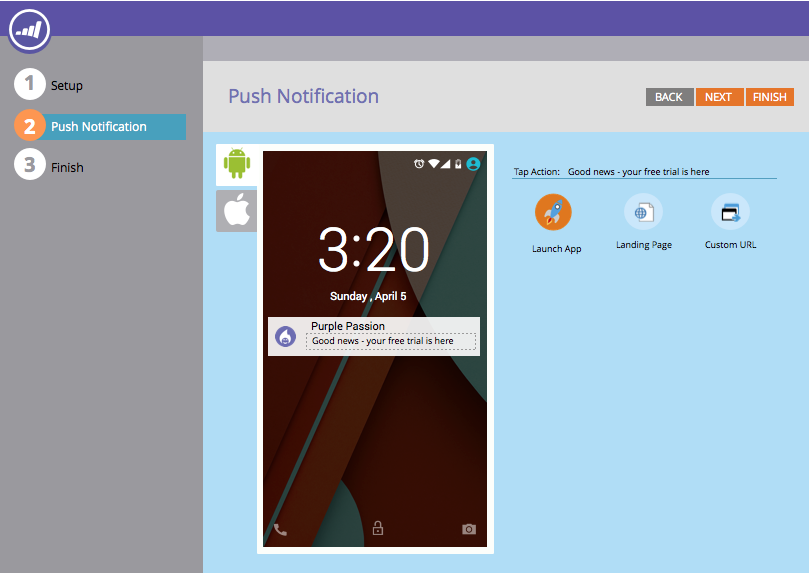
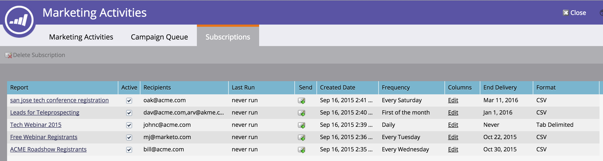

# 2015

## （2015年1月） {#january}

2015 年 1 月リリースには、次の機能が含まれています。 利用可能な機能についてはお使いの Marketo のエディションをご確認ください。 リリース後は、各機能に関する詳細な記事へのリンクを必ずご確認ください。

## マーケティングオートメーションの更新 {#marketing-automation-updates}

**モバイル対応のランディングページ**

ランディングページエディターから[ランディングページ用のモバイルビューの作成](/help/marketo/product-docs/demand-generation/landing-pages/free-form-landing-pages/add-a-mobile-view-for-your-free-form-landing-page.md)をおこなうことができます。 デバイスに関係なく効果的にメッセージを配信し、コンテンツを調整して、外出先で簡単に使えるようにすることで、エンゲージメントを高めます。 この機能は、リリース後の週を通じて徐々に展開されます。

[ – ランディングページのチュートリアル動画 – ](https://youtu.be/aPQHlG2X6c0)

**新規 REST API 呼び出し**

リードおよびアクティビティ REST API の 3 つの新しい呼び出し：

* リードの削除
* プログラム ID でリードを取得
* 削除済みリードの取得

また、「リードを同期」には、より高速な API 呼び出しでリード変更を非同期で書き込む新しいオプションが追加されました。 詳細は、リリース後に [https://experienceleague.adobe.com/ja/docs/marketo-developer/marketo/home](https://experienceleague.adobe.com/ja/docs/marketo-developer/marketo/home) で確認できます

**メールスクリプトのカスタムオブジェクトサポート**

メールスクリプト内でアカウントオブジェクトに関連付けられたカスタムオブジェクトにアクセスできるようになりました

## リアルタイムパーソナライズ {#real-time-personalization}

**Google および[!DNL Facebook]** 向けパーソナライズドリマーケティング

リマーケティングでは、web サイトを訪問した人に広告を表示します。 [Google](/help/marketo/product-docs/web-personalization/website-retargeting/personalized-remarketing-in-google.md) および [[!DNL Facebook]](/help/marketo/product-docs/web-personalization/website-retargeting/personalized-remarketing-in-facebook.md) でリアルタイムパーソナライゼーションのデータを使用してリマーケティングキャンペーンをパーソナライズできるようになりました。 様々な業界のオーディエンス、アカウントリスト、企業規模、または既知のリードからの任意のデータにリマーケティングします。

[アカウントリストモジュール](/help/marketo/product-docs/web-personalization/account-based-web-marketing/create-a-new-account-list.md)

重点顧客モジュールの機能強化により、ユーザーの一致率と検証が向上します。 次の追加が含まれます。

* リードのメールアドレスを使用して指定アカウントリストから組織を照合（RTP のみの顧客も対象）
* 顧客あたり最大 100,000 件のレコードをサポート
* 表示およびダウンロードする CSV ファイルテンプレート


**RTP タグオプションを更新しました**

「アカウント設定」の「RTP タグ」オプションが更新され、次の項目が含まれるようになりました。

1. CDN と非同期（推奨タグ）
1. CDN と同期（高速）
1. CDN を使用しない非同期タグ
1. CDN を使用しない同期タグ

最高のパフォーマンスを得るには、web ページのヘッダーの上部の、`<head>` の後にタグを配置することをお勧めします。 すべてのタグで [RTP API](https://experienceleague.adobe.com/ja/docs/marketo-developer/marketo/javascriptapi/rich-media-recommendation) を使用することができます。 RTP タグの配備方法については、[こちら](/help/marketo/product-docs/web-personalization/rtp-tag-implementation/deploy-the-rtp-javascript.md)を参照してください。


## 2015年2月 {#february}

2015年2月リリースには、次の機能が含まれています。 お客様のご契約により、制限やオプションの契約が必要なものがあります。詳細は担当の営業にお問い合わせください。 リリース後は、各機能に関する詳細な記事へのリンクを必ずご確認ください。 お待たせしました。

## マーケティングオートメーションの強化 {#marketing-automation-enhancements}

**[スマートキャンペーンの移動](/help/marketo/product-docs/core-marketo-concepts/smart-campaigns/using-smart-campaigns/move-a-smart-campaign.md)**

朗報です! ドラッグアンドドロップまたはツリー内の移動機能を使ってプログラムからスマートキャンペーンが移動できるようになりました。

**[[!DNL Dynamics] 2015（オンライン）](https://docs.marketo.com/display/docs/microsoft+dynamics+2013+on-premises)** - サポートされています。

**HTTPS 証明書の変更**

顧客データおよび SaaS サービスの機密性と整合性を保護するため、Marketo は SaaS 業界のベストプラクティスに従い、

次のドメインで、現在使用されているセキュリティプロトコル（SHA-1 および SSL）をより安全なバージョン（SHA-2（SHA-256）および TLS）に置き換えます。

* marketo.net（暗号化された [!DNL Munchkin] トラフィック）

* [marketo.com](https://marketo.com)（主な SaaS アプリケーション）

これは、このリリースの直後に発生します。 SHA-1 プロトコルは、2015 年 12 月まで [mktoapi.com](https://mktoapi.com) のドメインで一時的にサポートされ、レガシーシステムおよびアプリケーションの所有者が SHA-2 互換でシステムを更新できるようにします。

**セキュリティで保護される[!DNL Munchkin]**

SSL3 のサポートを削除します。 古い web ブラウザーのサポートを維持するために、これまで SSL3 を維持してきましたが、2015 年には、これらのブラウザーからの大量の web トラフィックは見られなくなりました。 サポート終了の影響を受けるのは、[!DNL Munchkin] をセキュアなページで使用した場合のみであり、2 月のリリース以降に徐々に展開される予定です。

## リアルタイムパーソナライズ機能の強化 {#real-time-personalization-enhancements}

**[キャンペーンのターゲット URL](/help/marketo/product-docs/web-personalization/working-with-web-campaigns/adding-a-target-url-to-a-web-campaign.md)**

「ターゲット URL を追加」を使って、リアルタイムキャンペーンを表示したいページを選択してください。 この機能は、すべてのキャンペーンタイプ（ダイアログ、ゾーン内、ウィジェット）で機能しますが、選択したターゲット URL のみのゾーン ID でキャンペーンがレンダリングされるゾーン内キャンペーンで特に役立ちます。 異なる web ページをターゲットにする複数の URL の追加をサポートします。


**アカウントベースターゲティングへの国と都道府県の追加**

ネームドアカウントリストに国と都道府県が追加できます。 特定のロケーションからのキーアカウントを絞りこめます。

## 2015年3月 {#march}

2015年3月リリースには、次の機能が含まれています。 利用可能な機能についてはお使いの Marketo のエディションをご確認ください。 リリース後は、各機能に関する詳細な記事へのリンクを必ずご確認ください。

## カレンダー HD {#calendar-hd}

チームのマーケティング活動をカレンダーの新しいプレゼンテーションモードで表示します。 これらは、オフィスの周りのテレビや巨大なモニターに最適です。 スマートリストまたはカスタム指標に基づいて目標を設定して表示します。

>[!NOTE]
>
>この機能は、Spark エディションと [!DNL Standard] エディションでは使用できません。


## [!DNL Google Adwords] 統合 {#google-adwords-integration}

[[!DNL Google AdWords]  アカウントを Marketo にリンクして、](/help/marketo/product-docs/administration/additional-integrations/add-google-adwords-as-a-launchpoint-service.md)オフラインのコンバージョンデータを Marketo から [!DNL Google AdWords] に自動的にアップロードします。 これが完了すれば、[!DNL AdWords] UI を使って、どのクリックが適格なリード、商談、新規顧客（またはトラックする収益ステージ）につながったかを簡単に確認できるようになります。


## [!UICONTROL 収益エクスプローラー]のデザイン変更 {#revenue-explorer-redesign}

[!UICONTROL 収益エクスプローラー]のルックアンドフィールが一新され、さらに新たなサンバーストグラフタイプも追加されました。 このアップデートは 4 月頭から 2 週間にわたり展開されます。

## 新しいアセット REST API {#new-asset-rest-apis}

[新しいアセット REST API](https://experienceleague.adobe.com/ja/docs/marketo-developer/marketo/rest/assets/assets)

[API による](https://developer.adobe.com/marketo-apis/api/asset/)メールやテンプレート、マイトークン、ファイル、スニペットの作成および編集のサポートを追加しました。

## [!DNL Microsoft Dynamics] 2015 オンプレミス {#microsoft-dynamics-on-premise}

[アプリケーションからアクセス可能](/help/marketo/product-docs/crm-sync/microsoft-dynamics-sync/sync-setup/update-the-marketo-solution-for-microsoft-dynamics.md)な最新のインストーラーでサポートされます。


## RTP - リードデータでパーソナライズされた web エンゲージメント {#rtp-personalized-web-engagement-with-lead-data}

Marketo のリードデータベースにある[リードデータフィールド](/help/marketo/product-docs/web-personalization/using-web-segments/manage-person-data.md)を活用して、リアルタイムのセグメント化とパーソナライズされたコンテンツキャンペーンを作成します。 RTP でリードデータフィールドを管理し、関連するリードフィールドを追加または削除します。

## RTP - メールまたはプログラムキャンペーン名で Web コンテンツをパーソナライズ {#rtp-personalize-web-content-by-email-or-program-campaign-name}

メールから web へとチャネルをまたいで、リードとの会話を続行します。 Marketo のマーケティングアクティビティで使用される[メールキャンペーンまたはプログラム名に基づいて、インバウンドコンテンツをパーソナライズ](/help/marketo/product-docs/web-personalization/using-web-segments/web-segments.md)します。

## 2015年4月 {#april}

2015 年 4 月リリースには、次の機能が含まれています。 利用可能な機能についてはお使いの Marketo のエディションをご確認ください。 リリース後は、各機能に関する詳細な記事へのリンクを必ずご確認ください。

## 分析ホームの再設計

[分析ホームの再設計](/help/marketo/product-docs/reporting/basic-reporting/creating-reports/navigating-the-analytics-home-page.md)

>[!NOTE]
>
>この機能は、4月28日（火）にリリースされます。

新しい[[!UICONTROL 分析]ホームページ](/help/marketo/product-docs/reporting/basic-reporting/creating-reports/navigating-the-analytics-home-page.md)では、使用可能なレポートタイプ間でアドホックレポートを実行するクイックアクセスが有効になります。


また、非公開または共有のレポート組織も使用できるようになりました。 レポートを作成するか[!UICONTROL マイレポート]フォルダーにドラッグして、他のユーザによる表示、編集、削除を禁止します。 [!UICONTROL グループレポート]は、すべてのユーザで共有されます。

## Marketo モバイルエンゲージメント {#marketo-mobile-engagement}

**Marketo モバイルエンゲージメント**

Marketo モバイルエンゲージメントを使用すれば、魅力的なモバイルエクスペリエンスを簡単に提供できます。 アプリ開発チームに頼ることなく、パーソナライズされた高度にパーソナライズされたキャンペーンを作成し、説得力のあるコンテンツを提供します。 新しいフィルターおよびトリガーを使用すると、プッシュ通知を通じてモバイルチャネルをリッスンし、応答できます。



## [!DNL LinkedIn] Lead Accelerator の統合

[[!DNL LinkedIn] Lead Accelerator の統合](/help/marketo/product-docs/demand-generation/social/social-functions/use-a-marketo-list-or-smart-list-as-a-linkedin-audience-segment.md)

リード育成戦略を有料ディスプレイ広告とソーシャル広告に拡張します。 [!DNL LinkedIn] Lead Accelerator との[広告ネットワーク統合](/help/marketo/product-docs/demand-generation/ad-network-integrations/add-linkedin-matched-audiences-as-a-launchpoint-service.md)を使用すると、任意のスマートリストまたは静的リストのメンバーに基づいて、[!DNL LinkedIn] 内でオーディエンスセグメントを安全に作成できます。 その後、[!DNL LinkedIn] のオーディエンスセグメント内のメンバーを、関連する一連の広告を使用して育成できます。


## [!DNL Salesforce1] 向け Marketo [!DNL Sales Insight] {#marketo-sales-insight-for-salesforce}

人気のある [!DNL Sales Insight] 機能（リードフィード、最有望見込客、注目のアクション、Marketo Campaign に追加）は、[!DNL Salesforce1] アプリですべて利用できます。

 

## RTP - アカウントベースドマーケティング分析 {#rtp-account-based-marketing-analytics}

**RTP - アカウントベースドマーケティング分析**

アカウントリストの新しい効果グラフを使用して、購入サイクルの各段階に基づく主要アカウントリストの効果を即座に表示できます。 グラフは、主要な組織からの訪問のステージを、訪問者数と訪問者のステータスに基づいて、意識から行動に移すまでのあらゆる段階で表示します。

## 2015年5月 {#may}

2015年5月リリースには、次の機能が含まれています。 利用可能な機能についてはお使いの Marketo のエディションをご確認ください。 リリース後は、各機能に関する詳細な記事へのリンクを必ずご確認ください。

## 完全レスポンシブランディングページ

[完全レスポンシブランディングページ](/help/marketo/product-docs/demand-generation/landing-pages/guided-landing-pages/create-a-guided-landing-page.md)

新しいランディングページ編集モードとテンプレート構文がリリースされます。 アドビの「フリーフォーム」ランディングページエディターとは異なり、新しい「ガイド付き」ランディングページエディターは、完全レスポンシブランディングページを編集するための構造化された編集エクスペリエンスを提供します。


## メールプログラムの中止

[メールプログラムの中止](/help/marketo/product-docs/email-marketing/email-programs/email-program-actions/abort-email-program.md)

メールプログラムを開始する前に「送信」を押しましたか？ 新しい「メールプログラムを中止」ボタンを押してストップすることができます。 これは、実行中のメールプログラムを途中で停止するものです。

## メール配信  {#email-deliverability}

Marketo は、追加されたドメインに対して、自動化された [!DNL SPF] および [!DNL DKIM] チェックを毎週実行します。 通知を確認して、常にこの状態に保ちます。

## メールテンプレート動作の変更 {#email-template-behavior-change}

このリリース以降、新しいメールを作成する際に、有効な HTML コメントが許可され、削除されなくなりました。

## RTP：セグメントエディターのドラッグアンドドロップ {#rtp-drag-and-drop-segment-editor}

RTP：[セグメントエディターのドラッグアンドドロップ](/help/marketo/product-docs/web-personalization/using-web-segments/web-segments.md)

基準をセグメントビルダーにドラッグ&amp;ドロップして値を定義し、リアルタイムのセグメントを作成する準備が整います。

## RTP：予想コンテンツのレコメンデーション {#rtp-predictive-content-recommendations}

[予想コンテンツのレコメンデーション](/help/marketo/product-docs/predictive-content/enabling-predictive-content/enable-predictive-content-for-web-rich-media.md)

RTPのマシンラーニング（機械学習）と予測分析アルゴリズムを利用して、適切なコンテンツを的確な見込み顧客にレコメンドできます。 画像とテキストの説明を使用してコンテンツアセットを視覚的に拡張し、複数のコンテンツアセットをレコメンデーションします。

## 2015年6月 {#june}

2015 年 6 月リリースには、次の機能が含まれています。 利用可能な機能についてはお使いの Marketo のエディションをご確認ください。 リリース後は、各機能に関する詳細な記事へのリンクを必ずご確認ください。

## [属性電子メール レポート](/help/marketo/product-docs/web-personalization/reporting-for-web-personalization/email-reports.md) {#attribution-email-report}

マーケティング活動に提供される価値のパーソナライゼーションと推奨コンテンツを参照します。 [ アトリビューションメールレポート ](/help/marketo/product-docs/web-personalization/reporting-for-web-personalization/email-reports.md)には、RTPのパーソナライゼーションと推奨コンテンツキャンペーンから関連付けられた、直接および支援されたリードが表示されます。 RTPの「ユーザー設定とメールレポート」で、アトリビューションメールレポートを追加して、月単位または四半期単位のメールを受信します。

## 2015年7月 {#july}

## [!DNL Marketo Moments] {#marketo-moments}

昼休憩での外出中、メールのスケジュールを変更する必要がある場合 App Store または [!DNL Google Play] から入手できる [!DNL Marketo Moments] アプリを使用すると、iPhone、iPad、Android の携帯電話からメールやイベントキャンペーンのリアルタイムの状況や、今後の予定を確認できます。


## リッチテキストエディターのアップデート {#rich-text-editor-update}

合理化されたテキスト書式設定、画像編集、リンク挿入、HTML編集など、最新のルックアンドフィールを備えたテキストエディターが更新されました。HTML エディターの検証が最小限に抑えられ、コード編集の制限が少なくなりました。
`<iframe width="420" height="315" src="https://www.youtube.com/embed/LmmBN6IQrII" frameborder="0" allowfullscreen></iframe>`この更新プログラムは、7月のリリースから数日以内に自動的に展開されます。その後、**[!UICONTROL 管理者] > [!UICONTROL 電子メール ] > [!UICONTROL  エディター設定の編集]**&#x200B;から、エディターの新しいバージョンと従来のバージョンを切り替えることができます。


リンクダイアログと画像ダイアログを更新しました。


テキストエディターのバージョンを切り替えます。


## メール配信シングルサインオン {#email-deliverability-single-sign-on}

「メール配信」タイルをクリックすると、ログイン資格情報を入力する必要がなくなります。

## キャンペーン優先度の設定 {#campaign-prioritization}

パーソナライズされた RTP キャンペーンをいくつか設定し、一部が他のキャンペーンと重複する可能性があることに気付いた場合は、 先に進み、キャンペーンの RTP を他のキャンペーンよりも優先するように設定します。


## 会社 API {#company-api}

**REST API を介した会社オブジェクトアクセス**：REST APIで、Marketo 会社（別名「アカウント」）オブジェクトにアクセスできるようになりました。 つまり、Marketo で作成した会社オブジェクトの読み取り、更新、削除を行い、更新された[!DNL Lead] API を使用して、それらの会社にリードを関連付けることができます。

会社APIのリファレンスガイドで[more]<https://developer.adobe.com/marketo-apis/api/mapi/#tag/Companies>）を学びましょう。

## メール配信へのアクセス {#access-email-deliverability}

**メール配信ツールへのアクセス**：この新しい権限を使うと、管理者はユーザーにメール配信ツールへのアクセス権を付与できます。

## 2015年秋 {#fall}

2015年秋リリースには、次の機能が含まれています。 お客様のご契約により、制限やオプションの契約が必要なものがあります。詳細は担当の営業にお問い合わせください。

## スマートリストの購読 {#subscribe-to-a-smart-list}

[スマートリストの購読](/help/marketo/product-docs/reporting/basic-reporting/report-subscriptions/subscribe-to-a-smart-list.md)

スマートリストを購読すると、マーケターはスマートリストを書き出し、Marketo を使用していない関係者（セールスチームやテレマーケティングチームなど）にメールで送信できます。

エクスポートは、毎日、毎週または毎月にスケジュールでき、配信終了日を設定でき、限られた数の列を共有するようにカスタマイズできます。


スマートリストでは複数の購読を作成できます。 1 サブスクリプションあたり 100,000 名のリードを含む 100 件のサブスクリプションに制限されています。ワークスペース全体で、Marketo インスタンスごとに 100,000 件のリードが存在します。



## Marketo カスタムオブジェクト {#marketo-custom-objects}

[Marketo カスタムオブジェクト](/help/marketo/product-docs/administration/marketo-custom-objects/understanding-marketo-custom-objects.md)

管理 UI からカスタムオブジェクトを簡単に作成できます。 現在、Marketoで1:N カスタムオブジェクトを作成し、リードまたは会社に接続する機能をサポートしています。

>[!NOTE]
>
>Marketo カスタムオブジェクトは、Spark では使用できません。


## [!DNL Google Chrome] 用 Marketo Insights {#marketo-insights-for-google-chrome}

[ [!DNL Google Chrome] 用 Marketo Insights](/help/marketo/product-docs/marketo-sales-insight/msi-chrome-plugin/using-marketo-insights-for-google-chrome.md)

[!DNL Google Mail] [!DNL Sales Insight]拡張機能の更新プログラムのリリースをお知らせします。 [[!DNL Chrome Store]](https://chrome.google.com/webstore/detail/marketo-insights-for-goog/jjkfbhajlmoeegbjgjipliamplidmbjb) で確認できます。

この更新には、次の新機能が多数含まれています。

* セールス担当者は、顧客とのエンゲージメントの前に、役職、Twitter プロファイル、会社情報、写真など、見込み客に関する情報を [!DNL Google Mail] の中で直接確認できます。
* セールス担当者は、開封またはクリックされたメール、参加したオンラインイベントや対面イベント、訪問した web ページ、ダウンロードした eBook など、チャネルをまたいで見込み客が関与しているコンテンツをリアルタイムで確認できます。
* [!DNL Google Mail] で送信されたメールは、Marketo のログに記録され、リアルタイムで追跡されます。 これにより、セールス担当者は見込み客がいつメールを閲覧しているかを確認できるので、適切なタイミングでフォローアップを行うことができます。 [!DNL Google Mail] 用 Marketo [!DNL Sales Insight] を使用すると、セールス担当者はマーケティングによって作成されたテンプレートを活用して、見栄えのよい招待状、オファー、その他のタイプのコンテンツを簡単に送信できます。


## Marketo モバイルエンゲージメント - トークン、サンプルの送信およびプレビュー {#marketo-mobile-engagement-tokens-send-sample-preview}

* [トークン](/help/marketo/product-docs/mobile-marketing/push-notifications/configure-mobile-push-notification.md)
* [サンプルの送信](/help/marketo/product-docs/mobile-marketing/push-notifications/send-a-push-notification-sample.md)
* [プレビュー](/help/marketo/product-docs/mobile-marketing/push-notifications/preview-a-push-notification.md)

[トークン](/help/marketo/product-docs/mobile-marketing/push-notifications/configure-mobile-push-notification.md)を使用して、プッシュ通知を簡単にパーソナライズできます。


また、顧客にデプロイする前にプッシュ通知を[プレビュー](/help/marketo/product-docs/mobile-marketing/push-notifications/preview-a-push-notification.md)したり[サンプル](/help/marketo/product-docs/mobile-marketing/push-notifications/send-a-push-notification-sample.md)プッシュ通知を送信したりできます。


## Moments でのスマートキャンペーン {#smart-campaigns-in-moments}

[Moments でのスマートキャンペーン](/help/marketo/product-docs/core-marketo-concepts/mobile-apps/marketo-moments/understanding-moments/understanding-smart-campaign-cards.md)

スマートキャンペーンを通じて送信されたメールに関する統計を、Moments で利用できるようになりました。 このアップグレードの他の機能は次のとおりです。

* スワイプして完了。 ストリームにカードが多すぎる場合は、 スワイプして削除できます。
* サンプルをプレビュー画面から直接送信します
* メールプログラムカードへのスマートリストの詳細を追加しました
* メールプログラムの中止ステータスのサポートを追加しました


## RTP - コンテンツ分析とレコメンデーション {#rtp-content-analytics-and-recommendations}

[コンテンツ分析](/help/marketo/product-docs/web-personalization/understanding-web-personalization/understanding-content-analytics.md)とレコメンデーション

RTP Content Analyticsは、定期的なweb訪問からweb コンテンツアセットのパフォーマンスを表示し、RTPのコンテンツレコメンデーションエンジンから生成された訪問も表示します。

* どのコンテンツが最も効果が高く、最もリードを増やしているかを確認します
* RTPの予測コンテンツエンジンでコンテンツを有効にし、適切な訪問者に最適なコンテンツを自動的に推奨できるようにすることで、コンテンツ消費を大幅に向上できます
* 各コンテンツアセットを詳細に分析し、より詳細な指標、グラフ、効果を確認します

RTPのAssets ページは、Content Analyticsとコンテンツレコメンデーションに分割されました。

* **コンテンツ分析**：検出されたすべての定義済みの web コンテンツのビューとダイレクトリードを表示し、最も効果の高いコンテンツの分析に役立ちます。
* **コンテンツの推奨事項：** RTPの推奨コンテンツおよび関連するリード属性からのインプレッションとクリックを表示します。 このページから、[バー](/help/marketo/product-docs/predictive-content/enabling-predictive-content/enable-the-content-recommendation-bar.md)および[リッチメディア](/help/marketo/product-docs/predictive-content/enabling-predictive-content/enable-predictive-content-for-web-rich-media.md)のコンテンツレコメンデーションを編集して有効にすることもできます。

* これら 2 つのページのすべてのダイレクトリードデータは、今年（2015年）の 1月1日以降、遡及的に更新されています。

## RTP - RTP キャンペーンの複製 {#rtp-clone-an-rtp-campaign}

[RTP - RTP キャンペーンの複製](/help/marketo/product-docs/web-personalization/working-with-web-campaigns/clone-a-web-campaign.md)

RTP キャンペーンを複製すると、より迅速かつ効率的に、よりパーソナライズされた web キャンペーンを作成できます。 RTPのキャンペーンページのクローン機能を使用して、キャンペーン設定をコピーし、スプリットテストの最適化のためにコンテンツを変更するか、同じコンテンツでキャンペーンを複製して別のセグメントにターゲティングします。 数秒でキャンペーンを作成します。


## リッチテキストエディターの改善 {#rich-text-editor-improvements}

リッチテキストエディターに対して、いくつかの改善を加えています。 7月に更新されたエディターをリリースした後で素晴らしいフィードバックを受け取り、このアップグレードに対してこれらの変更をおこなうことができました。 今後の数ヶ月間で、さらに多くのことが予定されています。 第4四半期の新機能のリストを次に示します。

* VML が HTML コード内でサポートされるようになりました。

```
<v:background xmlns:v="urn:schemas-microsoft-com:vml" fill="t">
<v:fill type="tile" src="<a href="https://i.imgur.com/YJOX1PC.png" rel="nofollow">https://i.imgur.com/YJOX1PC.png</a>" color="#7bceeb"/>
</v:background>
```

* 有効な HTML コメントに何でも挿入できるようになりました（以下のような特定の構文は以前は削除されていました）。

`<!--[if gte mso 9]> <![endif]-->`

* 空の表のセルを `&nbsp;` でパッドしない

* 最大化／最小化ボタンを HTML ソースエディターに追加
* 既存のテーブルのプロパティが識別され、テーブルのプロパティダイアログに表示
* ボタンの両方の行をデフォルトで表示
* エディターは、任意の要素（非推奨または非標準の要素も含む）を受け入れるようになりました。

`<myCustomElement>Hello World!</myCustomElement>`

* エディターは、任意の属性（非推奨または非標準の属性も含む）を受け入れるようになりました。

```
<myCustomElement myCustomAttribute="foo">Hello World!</myCustomElement>
<td background="someImage.png">
```

## [!DNL Microsoft Dynamics] - 同期を検証 {#microsoft-dynamics-validate-sync}

[[!DNL Microsoft Dynamics] - 同期を検証](/help/marketo/product-docs/crm-sync/microsoft-dynamics-sync/sync-setup/validate-microsoft-dynamics-sync.md)

この新しい管理ツールは、一連のチェックを実行して、同期設定が正しく設定されているかどうかを確認します。


## CRM カスタムオブジェクト同期にフィールドを追加 {#add-fields-to-crm-custom-object-sync}

[!DNL Salesforce] と [!DNL Dynamics] から同期したカスタムオブジェクトに新しいフィールドを簡単に追加できます。 カスタムオブジェクト全体を無効にして有効にすることなく、カスタムオブジェクト同期に新しいフィールドを追加できるようになりました。

## セキュリティ機能の変更 {#changes-to-security-features}

* パスワードの試行回数は 5 回に制限されています。 5 回目の試行の後、ユーザはロックされます。
* 非アクティブなセッションタイムアウトをサブスクリプション用に設定できるようになりました。


## IE 11 のサポート（および IE 9 のサポートの廃止） {#ie-support-and-deprecating-support-for-ie}

[!DNL Microsoft Internet Explorer] 11 ブラウザーを正式にサポートし、[!DNL Microsoft Internet Explorer] 9 ブラウザーのサポートを削除しています。

## MSI の Lightning UI のサポート {#lightning-ui-support-for-msi}

アプリ交換の最新の MSI パッケージは、[!DNL Salesforce] UI の Lightning バージョンと以前のバージョンの両方で動作します。

## 新しい [!DNL Dynamics] プラグイン {#new-dynamics-plug-in}

この新しいプラグインは、非同期モードで様々なアクションを実行し、パフォーマンスを向上させます。

## Design Studio のランディングページの URL で検索 {#search-by-url-of-landing-page-in-design-studio}

Design Studio のランディングページグリッドで、ページ URL で検索して、ランディングページを見つけることができるようになりました。 これは書き出しも可能です。

