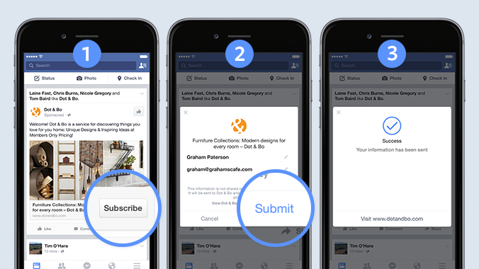
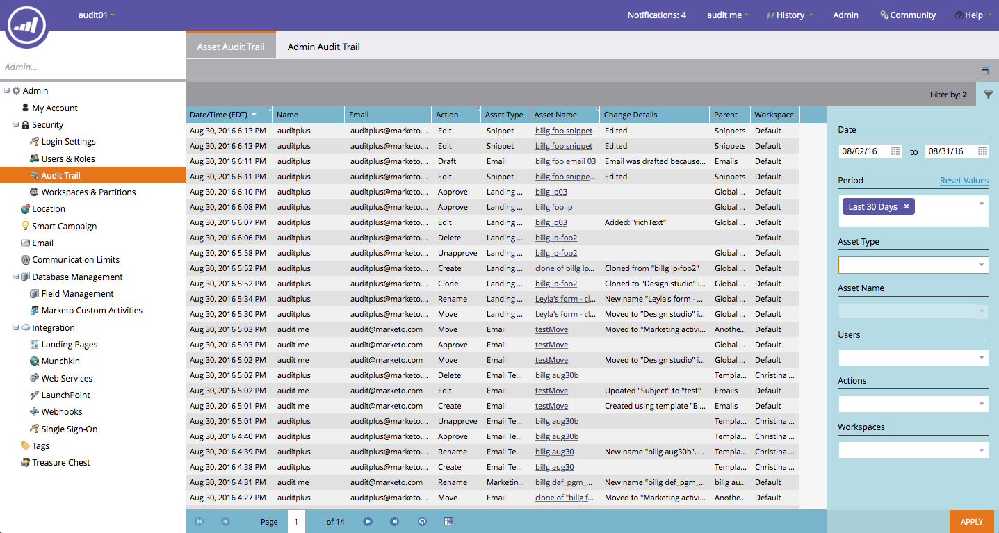

# 2016

## 2016年冬 {#winter}

2016 年冬リリースには、次の機能が含まれています。 各機能の詳細な記事を表示するには、タイトルリンクをクリックしてください。

## [匿名フィルター](/help/marketo/product-docs/administration/additional-integrations/add-munchkin-tracking-code-to-your-website/next-generation-munchkin-tracking-faq.md) {#is-anonymous-filter}

スマートリスト用の Is Anonymous フィルターが削除されました。 詳しくは、[次世代 Munchkin 追跡に関する FAQ](/help/marketo/product-docs/administration/additional-integrations/add-munchkin-tracking-code-to-your-website/next-generation-munchkin-tracking-faq.md) ドキュメントを参照してください。 この変更は、匿名の web 訪問者と既知の web 訪問者を引き続き識別し、これらの訪問者に対してリアルタイムでコンテンツをパーソナライズするweb パーソナライゼーション（RTP）には影響しません。

## [データベースダッシュボード](/help/marketo/product-docs/core-marketo-concepts/smart-lists-and-static-lists/managing-people-in-smart-lists/database-dashboard.md)  {#database-dashboard}

[!UICONTROL リードデータベース]にはアップデートされた概要ダッシュボード（人物データベースの合計サイズ、マーケティング可能なリードの数、上位 5 つのソースによるリードの分類を含む）があります。

## [Microsoft Edge ブラウザー](/help/marketo/product-docs/administration/setup-administration/supported-browsers.md) {#microsoft-edge-browser}

Marketo がサポートする[ブラウザーのリスト](https://docs.marketo.com/display/public/DOCS/Supported+Browsers)に [!DNL Microsoft Edge] を追加しました。

## [Microsoft Outlook 2016](/help/marketo/product-docs/marketo-sales-insight/msi-outlook-plugin/install-the-marketo-email-add-in-for-outlook-with-a-registration-code.md) {#microsoft-outlook}

[[!DNL Microsoft Outlook]  2016](/help/marketo/product-docs/marketo-sales-insight/msi-outlook-plugin/install-the-marketo-email-add-in-for-outlook-with-a-registration-code.md) がサポートされるようになりました。

## [メールプログラム優先スタート](/help/marketo/product-docs/email-marketing/email-programs/email-program-actions/head-start-for-email-programs.md) {#email-program-head-start}

[!UICONTROL 優先スタート]を使用して、事前に送信の処理を行う必要があることを示します。 プログラムのスケジュール時にリードを適格化してメールを準備する代わりに、[!UICONTROL 優先スタート]は、これらのタスクが確実に、事前に実行されるようにします。 これにより、オーディエンスはスケジュールされた時刻にメールの受信を開始します。

この機能を使用するには、メールプログラムが 12 時間以上前にスケジュールされ、スマートリストが送信の 12 時間前にロックされる必要があります。

>[!NOTE]
>
>この機能は、2016 年冬のリリース以降、1 週間徐々に公開される予定です。 スマートキャンペーンや API では使用できません。

## [モバイルマーケティングの強化](/help/marketo/product-docs/mobile-marketing/admin/add-a-mobile-app.md) {#mobile-marketing-enhancements}

**[!DNL PhoneGap]の サポート：**&#x200B;モバイルアプリに [!DNL PhoneGap] サポートを提供するようになりました。 [詳細情報](https://developers.marketo.com/documentation/mobile/phonegap-plugin/)

**サンドボックスアプリのサポート**：

## [プログラム API](https://developers.marketo.com/documentation/programs/) {#program-api}

REST API を介したプログラムの作成、更新、複製. これには、プログラム内でのスマートリストおよびスマートキャンペーンの作成または更新は含まれません。

## [Microsoft Dynamics の強化](/help/marketo/product-docs/crm-sync/microsoft-dynamics-sync/microsoft-dynamics-sync-details/sync-status.md) {#microsoft-dynamics-enhancements}

**[[!UICONTROL 同期ステータス]](/help/marketo/product-docs/crm-sync/microsoft-dynamics-sync/microsoft-dynamics-sync-details/sync-status.md)**：同期プロセスの現在のスループットとバックログのタブを保持します。 挿入の数で分類し、オブジェクトごとに更新します。

**[[!UICONTROL 通知]](/help/marketo/product-docs/core-marketo-concepts/miscellaneous/understanding-notifications/notification-types.md)**：一般的な同期エラーの通知と、そのエラーを持つリードのリストを取得します。

## [カスタムオブジェクトの強化](/help/marketo/product-docs/administration/marketo-custom-objects/create-marketo-custom-objects.md) {#custom-objects-enhancements}

複数のリンクフィールドを持つ中間オブジェクトを使用して、リード／顧客とカスタムオブジェクトとの間に多対多の関係を作成できるようになりました。

## [Facebook リード広告](/help/marketo/product-docs/demand-generation/facebook/set-up-facebook-lead-ads.md) {#facebook-lead-ads}

[[!UICONTROL Facebook リード広告]](https://www.facebook.com/business/a/lead-ads)は、ビジネスが [!DNL Facebook] でリードジェネレーションキャンペーンを実行する際の、より直接的な方法です。 リードは、フォームに入力することで製品やサービスに対する関心を示し、それによってビジネスはフォローアップできます。 Marketo と [!UICONTROL Facebook リード広告]の統合により、リードがリード広告フォーム内で提供する情報が自動的に取り込まれます。 その後、新しい [!UICONTROL Facebook リード広告の入力]トリガーを使用して、フォローアップのアクションと通知を自動化できます。

## [Web（リアルタイムパーソナライズ）キャンペーンスケジューラー](/help/marketo/product-docs/web-personalization/working-with-web-campaigns/schedule-a-web-campaign.md) {#web-real-time-personalization-campaign-scheduler}

キャンペーンを事前にスケジュールします。 パーソナライズされた web コンテンツの開始日と終了日を設定し、特定の日時にキャンペーンを繰り返します。 Web 訪問者の時間または選択したタイムゾーンに従って、キャンペーンを表示するスケジュールをパーソナライズします。

## 2016年春 {#spring}

16 年春リリースには、次の機能が含まれています。 各機能の詳細な記事を表示するには、タイトルリンクをクリックしてください。

## [メールインサイト](/help/marketo/product-docs/reporting/email-insights/email-insights-overview.md) {#email-insights}

メールインサイトは、過去の新しい集計データのメール分析エクスペリエンスです。迅速なパフォーマンスを実現するエンドツーエンドで再設計されました。 メールマーケターのニーズやワークフローに合わせて最適化された、まったく新しいユーザインターフェイスデザインが特徴です。

>[!NOTE]
>
>6月3日から、顧客に対するメールインサイトを一括で開始します。 当社の目標は、今後数か月間でこれを完了することです。 有効になったらメールでお知らせします。

## [メールテンプレート選択ツール](/help/marketo/product-docs/email-marketing/general/email-editor-2/email-template-picker-overview.md) {#email-template-picker}

新しい初期テンプレートで見栄えの良いレスポンシブ対応メールを作成できます。 また、ライブサムネールからテンプレートをすばやく見つけることができます。

>[!NOTE]
>
>メールエディター 2.0（テンプレートピッカーを使用）は、6 月 3 日から徐々に展開されます。 展開は 6 月 30 日までに完了します。 メールインサイトとは異なり、アクセスできるようになっても通知されません。 アクセスできるかどうかを確認するには、[この記事](/help/marketo/product-docs/email-marketing/general/email-editor-2/transitioning-to-email-editor-2-0.md)に従ってください。

## [メール編集 - 再設計](/help/marketo/product-docs/email-marketing/general/email-editor-2/email-editor-v2-0-overview.md) {#email-editing-re-imagined}

メールエディターが完全に新しくなりました。 軽量なドラッグ＆ドロップ機能を使用して、コンテンツを追加し、並べ替えます。 画像、ビデオ、変数、モジュールなどの新しい要素で、編集操作が強化されます。 更新されたコードエディター、プレビューア、プリヘッダーのサポートも確認してください。

## [モバイルアプリ内メッセージ](/help/marketo/product-docs/mobile-marketing/in-app-messages/understanding-in-app-messages.md) {#mobile-in-app-messages}

Marketo 内で、アプリの見事なアプリ内メッセージを作成できます。 アプリ内メッセージプログラムで、誰にいつ表示するかを正確に定義します。 プログラムダッシュボードを使用して、パフォーマンスを簡単に監視できます。

## [ドラフトなしのスニペット](/help/marketo/product-docs/administration/users-and-roles/enable-no-draft-for-snippets.md) {#no-draft-snippets}

スニペットが更新されるたびにすべてを再承認する必要がなくなりました。 No-Draft で、スニペットを使用するすべてのメールとランディングページがスニペットの更新を受け取り、以前のステータスを維持します。 スニペットを承認するたびに、No-Draft を実行してすべてを更新するか、ドラフトを作成するかを選択できます。 それはあなた次第です！ No-Draft は、すべての顧客が利用でき、管理者の新しい権限で管理されます。

## [ランディングページ、ランディングページテンプレート、フォーム API](https://developers.marketo.com/blog/spring-2016-updates/) {#landing-page-landing-page-template-and-form-apis}

Marketo REST API で、Marketo のランディングページ、ランディングページテンプレートおよびフォームの制御がサポートされるようになりました。 Marketo REST API を使用して、これらのアセットの作成、コンテンツの更新、承認、削除を直接おこなえます。

## [API アクセスのために IP を許可リストに追加](/help/marketo/product-docs/administration/additional-integrations/create-an-allowlist-for-ip-based-api-access.md) {#ip-allowlisting-for-api-access}

Marketo ユーザログインの IP 許可リストに追加する機能と同様に、Marketo 管理者は、Marketo SOAP および REST API にアクセスできる IP アドレスの許可リストを設定できるようになりました。これにより、許可されていない IP アドレスからのアクセスをブロックできます。 Marketo インスタンスのセキュリティレイヤーが強化され、API アクセスは組織のネットワーク内からのみ可能になります。 この設定方法の詳細は、[Marketo ドキュメントサイト](/help/marketo/product-docs/administration/additional-integrations/create-an-allowlist-for-ip-based-api-access.md)にあります。

## [新しい高速 Microsoft Dynamics 同期コネクタ](/help/marketo/product-docs/crm-sync/microsoft-dynamics-sync/microsoft-dynamics-sync-details/sync-status.md) {#new-high-speed-microsoft-dynamics-sync-connector}

新しい高速 Dynamics コネクタは、初期同期の場合は最大 20 倍、増分同期の場合は最大 5 倍の速度を提供します。 新規顧客はすべて、リリース日にこのコネクタにオンボーディングされます。既存顧客に対しては、夏のリリース期間中に徐々に展開されます。

**新しいフィールドのデータを更新**：これで、任意の時点で新しい同期フィールドを有効にできます。そのフィールドのすべてのデータ値が [!DNL Dynamics] CRM から Marketo に更新されます。 初期設定時にすべてのフィールドを選択する必要が生じる心配はなくなりました。 既存の同期フィールドを無効にし、後で再度有効にした場合、そのフィールドのすべてのデータ値が [!DNL Dynamics] CRM から Marketo に更新されます。

**リードを取引先責任者として同期**：「[!UICONTROL リードを Microsoft に同期]」フローアクションには、リードまたは取引先責任者として同期する新しいオプションが追加されました。

**同期エラー管理タブ**：操作、方向、エラーコード、エラーメッセージなどの詳細との同期に失敗したリード（およびその他のオブジェクト）の参照、検索、書き出しを行います。

**[!DNL Microsoft Dynamics]2016**：コネクタは、[!DNL Dynamics] 2016 [!DNL Online] および [!DNL On-premise] バージョンで完全に認定されています。

**プラグインのアップデートに関するドキュメントが追加されました。**&#x200B;[プラグインの更新に関するドキュメントの記事](/help/marketo/product-docs/crm-sync/microsoft-dynamics-sync/marketo-plugin-releases-for-microsoft-dynamics.md)を参照してください。

## [わかりやすいインスタンス名](/help/marketo/product-docs/administration/settings/edit-subscription-settings.md) {#friendly-instance-name}

現在、サンドボックスや実稼動インスタンスなど、Marketo インスタンスを区別することは困難です。 この機能を使用すると、現在作業中のインスタンスを把握できます。

## サブスクリプションの期間限定アクセス {#limited-time-access-for-subscriptions}

現在、Marketo サブスクリプションへの招待は無期限です。 この機能を使用すると、管理者は、2 週間や 1 か月など期間限定でサブスクリプションにユーザを招待できます。

## [カスタムオブジェクトグリッド](/help/marketo/product-docs/administration/marketo-custom-objects/understanding-marketo-custom-objects.md) {#custom-objects-grid}

すべての公開済みカスタムオブジェクトのレコードとフィールドの数を表示できるようになりました。

## カスタムアクティビティ {#custom-activities}

Marketo 管理者は、Marketo カスタムアクティビティ定義モデラーを使用して、カスタムアクティビティタイプを定義および管理できるようになりました。 Marketo カスタムオブジェクトモデラーと同様（および併用）、管理者は、ビジネスニーズに合わせてデータモデルを拡張できるようになりました。 この機能の使用方法の詳細は、[Marketo ドキュメントサイト](/help/marketo/product-docs/administration/marketo-custom-activities/understanding-custom-activities.md)にあります。

## 2016年夏 {#summer}

2016 年夏リリースには、次の機能が含まれています。 お客様のご契約により、制限やオプションの契約が必要なものがあります。詳細は担当の営業にお問い合わせください。 各機能の詳細な記事を表示するには、タイトルリンクをクリックしてください。

## [アカウントベースドマーケティング](https://docs.marketo.com/display/docs/account+based+marketing) {#account-based-marketing}

Marketo のアカウントベースドマーケティングは、1 つの統合プラットフォームですべての基本事項を提供します。

* **ターゲット** - 顧客検出、リードから顧客への照合、アカウントリスト
* **エンゲージ** - アカウントベースのパーソナライゼーション、クロスチャネルのエンゲージメント、アカウント固有のワークフロー
* **測定** — 顧客とリストレベルのインサイト、顧客のエンゲージメントスコア、パイプラインと売上高への影響

>[!NOTE]
>
>ABM は Marketo サブスクリプションのアドオンとして利用できるので、実装するには営業担当にお問い合わせください。

## [監査記録](/help/marketo/product-docs/administration/audit-trail/audit-trail-overview.md) {#audit-trail}

監査記録は、Marketo サブスクリプション内でおこなわれた変更の包括的な履歴を提供します。 これにより、ユーザーや管理者間で説明責任を作成し、予期しない行動の原因を特定し、誰がいつ何をしているかを知るセキュリティが確保されます。 この情報は、いつでも使用可能で、次のような質問に回答するために使用できます。

* このアセットまたは設定に何が起きたか、最後に更新したのは誰か。
* ユーザー X は何をしているのか。
* アカウントにログインしているのは誰か。

## Marketo-Vibes SMS LaunchPoint の統合

Marketo 内で SMS メッセージを簡単に作成できます。 リッチ Marketo データを使用してメッセージをパーソナライズおよびターゲット設定し、SMS メッセージダッシュボードを使用してパフォーマンスを簡単に監視します。

>[!NOTE]
>
>この機能を使用するには、既存の [!DNL Vibes SMS] アカウントが必要です。

## [Email 2.0 の強化](/help/marketo/product-docs/email-marketing/general/email-editor-2/email-editor-v2-0-overview.md) {#email-enhancements}

**モジュールレベルの変数**

以前は、メール 2.0 テンプレートで指定されたすべての変数の範囲は「グローバル」でした。 モジュール内で変数を使用する場合、モジュールの複数のインスタンスを使用する予定がある場合は、必ずしも望ましくありません。 このリリースでは、変数を「モジュールレベル」として指定できるようになり、ユーザが使用するモジュールごとに一意の値を設定できるようになります。

**構文の更新**

* メール 2.0 テンプレートで指定されたモジュールで「mktoAddByDefault」を使用して、新しいメールにデフォルトで表示するモジュールを指定できるようになりました。 これは、多数のモジュールを含むメールテンプレートを作成する場合に、はるかに便利です。
* 画像要素で、基になる `` HTML 要素の「height」および「width」プロパティは、エンドユーザに対してロックするまたは編集可能にする必要があります。 「mktoLockImgSize=“true”」を指定すると、画像が変更された場合でも高さと幅がロックされます。 同様に、「mktoLockImgStyle=“true”」を指定すると、「style」プロパティがロックされます。

**コード検索**

新しい検索機能を使用して、メールコード内のコンテンツを効率的に検索および置換できます。 この機能は、メールテンプレートエディターでも使用できます。

**画像要素でのトークンのサポート**

トークンを画像挿入エクスペリエンスの「外部 URL」領域で使用できるようになりました。 `{{my.tokens}}`で画像を指定した場合、メールエディター2.0内でこれらのトークンを参照できるようになりました。 電子メールエディター2.0のキャンバスでは、画像が破損したままになります。 ただし、メールを送信する前に、プレビューとサンプルの送信でレンダリングされているのが確認できます。

## 複数のブランディングドメイン {#multiple-branding-domains}

メールトラッキングリンクを複数のブランディングドメインでブランディングできるようになりました。 複数のブランディングドメインを追加して、消費者の信頼感を高め、より合理化された外観を作成してブランドに焦点を当て、メールの配信品質を向上させ、メール単位で各メールのトラッキングリンクに対してどのブランディングドメインを使用するかを選択できるようになりました。

## [プログラムトークン](/help/marketo/product-docs/demand-generation/landing-pages/personalizing-landing-pages/tokens-overview.md) {#program-tokens}

プログラムの新しいトークンの種類が作成されました。 アセットとスマートキャンペーンのフローステップで、プログラム名、説明および ID をレンダリングできるようになりました。

## [エンタープライズキー](/help/marketo/product-docs/marketo-sales-insight/msi-outlook-plugin/authorize-the-marketo-outlook-plugin.md) {#enterprise-key}

セールスチームの各メンバーに [!DNL Outlook] 用の [!DNL Sales Insight] プラグインをインストールするよう要求するのは、面倒で手間がかかります。 エンタープライズキーを使用して [!DNL Outlook] 用のプラグインをリモートでインストールする新しい方法が導入されました。 [!UICONTROL 管理者]の Marketo [!DNL Sales Insight] セクションにある固有のキーを IT チームに送信し、残りの作業を行ってもらいます。

## [Web パーソナライゼーションキャンペーン](/help/marketo/product-docs/web-personalization/working-with-web-campaigns/create-a-new-dialog-web-campaign.md) {#web-personalization-campaigns}

ウェブサイト上で web キャンペーンが反応するまでの時間を指定します。

## [コンテンツ分析＆レコメンデーションのエクスポート](/help/marketo/product-docs/web-personalization/understanding-web-personalization/understanding-content-analytics.md) {#content-analytics-and-recommendations-export}

コンテンツ分析＆レコメンデーションデータをオンラインで表示.

## [Email Editor 2.0 用の API サポート](https://developers.marketo.com/documentation/asset-api/) {#api-support-for-email-editor}

以前は v1.0 のメールとテンプレートとのみ互換性があった、既存の Asset API が v2.0 のメールアセットで有効になりました。

## [Marketo デベロッパーサイト](https://developers.marketo.com/) {#marketo-developers-site}

デベロッパーサイトをリニューアル

## [プライバシー設定](/help/marketo/product-docs/administration/settings/understanding-privacy-settings.md) {#privacy-settings}

マーケターは、プライバシー設定を使用して、[!DNL Munchkin] と web パーソナライゼーション機能を使用して訪問者を追跡するかどうかを決定できます。 トラッキングレベルは、ブラウザーの「Do Not Track」設定、オプトアウト Cookie、特定でない IP を使用して制御します。 これらの方法は、特定の分野での Marketo の価値や機能に影響を与える可能性がありますが、マーケターが何も変更しない場合、Marketo の機能は変わりません。

この機能は、6 週間の間に徐々にリリースされます。 すぐに必要な場合は、Marketo サポートにお問い合わせください。

## 2016年秋 {#fall}

16年秋リリースには、次の機能が含まれています。 お客様のご契約により、制限やオプションの契約が必要なものがあります。詳細は担当の営業にお問い合わせください。 各機能の詳細な記事を表示するには、タイトルリンクをクリックしてください。

## メール用[!UICONTROL 予測コンテンツ] {#predictive-content-in-email}

[!UICONTROL 予測コンテンツ]アプリケーションでは、web チャネルやメールチャネルをまたいで機械学習や予測アルゴリズムを通じて、コンテンツを追跡、管理、提案する新しいユーザエクスペリエンスが提供されます。

>[!NOTE]
>
>予測モジュールを使用しているすべての顧客に対して 1月10日までに有効になります。

メールに予測コンテンツを追加できるようになりました。 受信者はメールを開くと関連する推奨コンテンツを自動的に受け取るため、コンテンツのエンゲージメントとコンバージョンを高めるのに役立ちます。

## [Facebook オフラインコンバージョン](/help/marketo/product-docs/demand-generation/facebook/understanding-facebook-offline-conversions.md) {#facebook-offline-conversions}

[!DNL Facebook] オフラインコンバージョン統合では、Marketo（リード広告リード用）のコンバージョンデータが [!DNL Facebook] に自動的に送り返されるので、広告チームが広告費用をより最適化できます。 この [!DNL Facebook] Ad Manager レポートでは、オフラインのコンバージョンが強調表示されます。

## ユニバーサル ID {#universal-id}

ユニバーサル ID を使用すると、1 回のログインで複数の Marketo 購読にアクセスし、すばやく購読を切り替えることができます。 1 つのコミュニティプロファイルを、すべてのサブスクリプションで使用できます。

>[!NOTE]
>
>この機能を有効にするには、Marketo サポートにお問い合わせください。

## Marketo アカウントベースドマーケティングの強化 {#marketo-account-based-marketing-enhancements}

アカウント所有者、営業開発担当者、事業開発担当者、顧客サクセスマネージャーなど、アカウントチームをアカウントベースドマーケティング（ABM）の重点顧客に割り当てることができるようになりました。 また、アカウント所有者固有のアカウントリストを作成し、パーソナライズされた週別の ABM レポートをアカウントチームに送信することもできます。

**REST API**

また、このリリースでは、Marketo REST API を使用して、ABM で重点顧客属性とアカウントスコアを管理することもできます。 API 操作の詳細については、[Marketo 開発者 web サイト](https://developers.marketo.com/rest-api/lead-database/named-accounts)にアクセスしてください。

## [監査記録の強化](/help/marketo/product-docs/administration/audit-trail/change-details-in-audit-trail.md) {#audit-trail-enhancements}

監査記録は、Marketo サブスクリプション内でおこなわれた変更の包括的な履歴を提供します。 プログラムの追跡機能を追加し、スマートキャンペーン、スマートリスト、ユーザおよびロールに加えられた変更に関する重要な変更の詳細を提示する機能を追加しました。

## 新しい権限

**メールをオペレーショナルメールにする**

登録解除したユーザに対してトランザクションメールが送信される心配がなくなりました。 どのユーザがメールをオペレーショナルメールにしたり、オペレーショナルメールを編集したりできるかを指定できるようになりました。

**キャンペーン制限の編集**

強制できない[キャンペーン制限](/help/marketo/product-docs/administration/email-setup/enable-person-restrictions-for-smart-campaigns.md)を設定する理由はありません。 キャンペーンの制限を設定して、1 つのキャンペーンでターゲットに設定できるユーザ数をデータベース内で制限する場合、キャンペーンをスケジュールする際に、これらの設定を上書きできるユーザを制限できるようになりました。

## [モバイルプッシュ通知のサウンド](/help/marketo/product-docs/mobile-marketing/push-notifications/configure-mobile-push-notification.md) {#sound-for-mobile-push-notifications}

サウンドを有効にして、iOS のプッシュ通知を充実させます。 この新機能を使用すると、モバイルデバイスにプッシュ通知が表示されたときにサウンドをトリガーできます。

>[!NOTE]
>
>* デバイスの所有者は、デバイス設定でサウンドが再生されるのを防ぐことを選択できます。また、アプリデベロッパーは、アプリ内でデバイスの所有者に対して、サウンドが再生されないようにするオプションを提供できます。
>* Android デバイスにプッシュ通知が表示されると、サウンドが自動的に再生されます。

## [Salesforce 暗号化と互換性のあるセールスインサイト](/help/marketo/product-docs/marketo-sales-insight/msi-for-salesforce/installation/install-marketo-sales-insight-package-in-salesforce-appexchange.md) {#sales-insight-compatible-with-salesforce-encryption}

Market [!DNL Sales Insight] は、[!DNL Salesforce] Shield Encryption と互換性を持つようになりました。 [!DNL Sales Insight] を使用中の顧客は、[&#x200B; [!DNL Appexchange] で利用可能な](https://appexchange.salesforce.com/listingDetail?listingId=a0N30000001SVZmEAO)最新の管理パッケージ（バージョン 1.4359.2）にアップグレードする必要があります。

## [重点顧客 API](https://developers.marketo.com/rest-api/lead-database/named-accounts/) {#named-accounts-apis}

このリリースでは、Marketo ABM ユーザは重点顧客 API を介して重点顧客を管理できます。 重点顧客の作成、更新、削除、ABM 重点顧客スコアの読み取りと更新が可能です。

## [メールエディター v2.0 API のサポート](https://developers.marketo.com/rest-api/assets/emails/) {#email-editor-v-api-support}

Marketo REST API を使用して、v2.0 形式のメールの変数とモジュールを管理します。

## [Marketo Salesforce 同期の変更](https://nation.marketo.com/docs/DOC-3840) {#changes-to-marketo-salesforce-sync}

Marketo の [!DNL Salesforce] 統合は進化し、Marketo フィールドを [!DNL Salesforce] と同期する方法が改善されています。 必要に応じて、大量のフィールドを同期する代わりに、含めるフィールドを選択して選択することができます。 詳細は、[https://nation.marketo.com/docs/DOC-3840](https://nation.marketo.com/docs/DOC-3840) でドキュメントをご覧ください。
